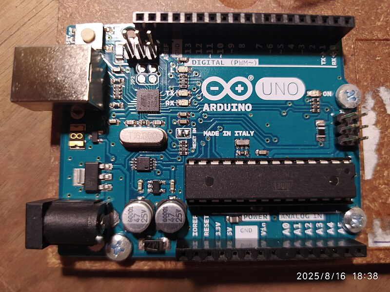

# Řadič Arduino

Arduino není jeden konkrétní mikrokontroleér, ale ekosystém desek, knihoven, příkladů a vývojového prostředí. Když začátečník řekne "Arduino", obvykle myslí Arduino Uno, Nano nebo kompatibilní desku na bázi ATmega328P.

Pro vzdělání je Arduino stále velmi užitečné: lze snadno pochopit GPIO, tlačítka, LED, PWM, analogový vstup, I2C, SPI a jednoduché sensory. Ale pro nové zařízení kolem 3D tiskárny není Arduino Uno/Nano vždy nejlepší volba.

## Proč je Arduino populární

Přednosti Arduina:

- spoustu vzdělávacích materiálů;
- jednoduché Arduino IDE;
- mnoho hotových knihoven;
- srozumitelné příklady jako Blink;
- vhodné pro rychlé testování sensoru na stole;
- snadné najít kompatibilní moduly;
- staré desky jsou dobře zdokumentovány.

Pokud je cílem pochopit základy mikrokontroleérů, Arduino je vhodné. Snižuje bariéru vstupu a umožňuje vidět výsledky rychle.

## Arduino jako vzdělávací deska

Arduino je vhodné pro:

- testování tlačítka, koncového spínače nebo sensoru;
- jednoduché testování termistoru přes dělič napětí;
- testování I2C OLED;
- testování SPI RFID modulu;
- generování PWM pro malý test;
- čtení analogového napětí;
- rychlé experimenty na breadboardu.

V tomto režimu je Arduino vynikajícím laboratorním nástrojem. Nemusíte na něm stavět finální zařízení: nejprve můžete pochopit obvod a senzor, poté přenést řešení na ESP32, RP2040, STM32 nebo desku tiskárny.

## Uno a Nano v kostce

Klasické Arduino Uno a Nano obvykle používají ATmega328P.

Typické charakteristiky:

- `5V` logika;
- 16 MHz hodinový signál;
- 32 KB flash paměti;
- 2 KB SRAM;
- 14 digitálních pinů;
- 6 PWM pinů na třídě Uno/Nano;
- 6 analogových vstupů na Uno, 8 na Nano;
- USB pro nahrávání a napájení desky.

To stačí na vzdělávací skicy a jednoduché samostatné úlohy, ale ne na komplexní logiku, síťování, webové rozhraní, velké knihovny a pohodlnou integraci s moderními systémy.

## Originál, klon a Arduino-kompatibilní

Musíte rozlišovat:

- originální desky Arduino;
- levné klony Uno/Nano;
- Arduino-kompatibilní desky na bázi jiných mikrokontroleérů;
- moderní desky Arduino s Wi-Fi, USB-C, Arm čipy a další logikou.

Klon Nano za pár dolarů může být v pořádku na experimenty, ale kvalita USB-UART, regulátoru, pájení a bootloaderu se může lišit. Někdy pro klon Nano v Arduino IDE musíte vybrat starší bootloader nebo jiný procesor.

Pokud musí zařízení dlouho fungovat bez dozoru, kvalita desky, regulátor, konektory a dokumentace jsou důležitější než nejnižší cena.

## Logika 5V

Staré Arduino Uno/Nano používají logiku `5V`.

To je vhodné s některými starými moduly, ale nebezpečné pro zařízení `3.3V`:

- ESP32 obvykle nemůže tolerovat `5V` na GPIO;
- mnoho OLED, RFID, senzorů a rádiových modulů je navrženo pro `3.3V`;
- pull-up rezistory I2C na `5V` mohou poškodit zařízení `3.3V`;
- některé vstupy modulů jsou kompatibilní s `5V`, ale to musí být ověřeno v dokumentaci.

Pokud je Arduino připojeno k modulu `3.3V`, potřebujete měnič úrovně nebo obvod, kde jsou úrovně známy jako kompatibilní.

## GPIO nenapájí zátěž

Pin Arduino může rozsvítit přes rezistor nebo ovládat signál. Nemělo by se přímo napájet ventilátor, topidlo, servo, relé nebo LED pásku.

Typický obvod:

*Zdroj: [Wikimedia Commons](https://commons.wikimedia.org/wiki/File:Arduino_Uno_Rev3_with_Atmega328P.jpg), HonCode, CC0 Public Domain*

Na zátěž potřebujete:

- MOSFET nebo driver pro DC ventilátor, LED pásku nebo DC topidlo;
- driver tranzistoru a ochrannou diodu pro cívku relé;
- SSR nebo relé pro síťovou zátěž AC;
- oddělené napájení pro servo;
- společnou GND, kde to vyžaduje nízkonapěťový obvod.

GPIO je příkaz, nikoli výstup napájení.

## PWM a analogWrite

V Arduinu `analogWrite()` na Uno/Nano obvykle znamená PWM, nikoli skutečný analogový výstup. Deska rychle přepíná pin zapnuto a vypnuto a mění pracovní cyklus signálu.

To je vhodné pro:

- jas LED;
- vstup řízení driveru;
- jednoduchý PWM pro ventilátor nebo MOSFET modul;
- vzdělávací experimenty.

Ale existují omezení:

- PWM není dostupný na všech pinech;
- PWM frekvence je pevná nebo se mění neobvyklým způsobem;
- `analogWrite()` a `analogRead()` jsou různé věci;
- čtyřpinový PC ventilátor může vyžadovat jinou frekvenci a správný přístup open-collector/open-drain;
- topidla a SSR nemůžou právě tak používat libovolný rychlý PWM bez pochopení sekce napájení.

## Analogové vstupy

Arduino Uno/Nano je vhodné na jednoduché analogové měření:

- potenciometr;
- termistor přes dělič napětí;
- snímač světla;
- jednoduchý senzor napětí přes dělič napětí.

Ale analogový vstup by neměl vidět napětí nad svojí bezpečnou rozsahem. Pro Uno/Nano je to obvykle rozsah vztažený na napájení `5V` nebo vybranou `AREF`. Pokud měříte vyšší napětí, potřebujete dělič a ochranu.

Na přesné měření teploty potřebujete nejen `analogRead()`, ale také:

- správný obvod dělače napětí;
- hodnotu rezistoru;
- termistorovou tabulku nebo parametr Beta;
- stabilní napájení/referenční napětí;
- filtrování šumu;
- mechanický kontakt sensoru s objektem.

## Arduino a Klipper

Některé staré AVR desky se mohou historicky najít blízko 3D tiskáren, ale pro nové zařízení kolem Klipperu není dobré začínat s Uno/Nano.

Důvody:

- omezená paměť;
- slabý výkon;
- logika `5V` může rušit moderní moduly `3.3V`;
- bez síťování bez dodatečných modulů;
- není to nejpraktičtější cesta pro nový MCU Klipperu.

Pokud potřebujete dodatečný MCU pro Klipper, je obvykle praktičtější podívat se na RP2040, STM32 nebo hotovou desku 3D tiskárny. Arduino lze ponechat pro vzdělání, breadboarding a testování jednotlivých senzorů.

## Kdy je Arduino stále vhodné

Arduino je vhodné, pokud:

- potřebujete rychle testovat nápad;
- potřebujete vysvětlit, jak něco funguje;
- zařízení je velmi jednoduché a nepotřebuje síťování;
- již máte pracující skic;
- jasnost je důležitější než kompaktnost a výkon;
- jedná se o vzdělávací pult, nikoli finální silovou elektroniku.

Arduino není dobrá volba, pokud:

- potřebujete Wi-Fi ze startovního balíčku;
- potřebujete těsnou integraci s Klipperem;
- potřebujete spoustu paměti;
- potřebujete mnoho moderních senzorů `3.3V`;
- zařízení musí být kompaktní, dlouhodobé a průmyslově čisté;
- existuje silová sekce s topidlem, kde jsou důležité nezávislé ochrany.

## Co zkontrolovat před nákupem

Před nákupem Arduino-kompatibilní desky zkontrolujte:

- zda je to originál, klon nebo kompatibilní deska;
- který mikrokontroleér je nainstalován;
- logika `5V` nebo `3.3V`;
- který USB-UART čip se používá;
- zda existuje ovladač pro váš počítač;
- který bootloader je potřebný;
- kolik flash a SRAM;
- kolik PWM a analogových vstupů;
- zda existuje schéma a rozložení pinů;
- kvalita regulátoru napájení a konektorů;
- zda je deska vhodná pro finální úkol.

## Běžné chyby

- myšlenka, že Arduino je jedna konkrétní deska;
- přímé připojení Arduino `5V` k modulu `3.3V`;
- napájení zátěže z GPIO;
- napájení serva z pinu `5V` a získání resetů;
- používání `analogWrite()` jako skutečného analogového výstupu;
- výběr špatného bootloaderu pro klon Nano;
- neinstalace ovladače pro USB-UART;
- pokus vytvořit moderní síťované zařízení na Uno bez důvodu;
- převod vzdělávacího breadboardu do uzavřeného silového zařízení bez přepracování napájení, zapojení a ochrany.

## Klíčové body

Arduino je dobrý ekosystém vzdělávání a vhodný nástroj na rychlé testy. Je skvělý na pochopení GPIO, PWM, ADC a senzorů.

Ale klasické Uno/Nano jsou staré desky `5V` s omezenou pamětí a bez síťování. Pro nové zařízení kolem 3D tiskárny je ESP32, RP2040, STM32 nebo hotová deska tiskárny často praktičtější, čímž se Arduino stává nástrojem na vzdělání a diagnostiku.

## Související materiály

- [Arduino Docs: UNO R3](https://docs.arduino.cc/hardware/uno-rev3) — oficiální specifikace Uno R3: ATmega328P, `5V`, piny, PWM, analogové vstupy a prostředky desky.
- [Arduino Store: UNO Rev3 Tech Specs](https://store.arduino.cc/collections/arduino/products/arduino-uno-rev3) — tabulka s napětím, proudem GPIO, pamětí, frekvencí a rozměry desky.
- [Arduino Store: Arduino Nano](https://store-usa.arduino.cc/products/arduino-nano) — specifikace Nano, napájení, paměť, digitální a analogové piny.
- [Arduino Help Center: Select the right processor for Arduino Nano](https://support.arduino.cc/hc/en-us/articles/4401874304274-Select-the-right-processor-for-Arduino-Nano) — proč Nano a klony Nano mohou mít různé bootloadery.
- [Arduino Language Reference](https://docs.arduino.cc/language-reference/) — oficiální reference pro `pinMode`, `digitalWrite`, `analogRead`, `analogWrite`, PWM a základní funkce.
- [Arduino Help Center: Use PWM output with Arduino](https://support.arduino.cc/hc/en-us/articles/9350537961500-Use-PWM-output-with-Arduino) — seznam PWM pinů pro populární desky a omezení `analogWrite()`.
