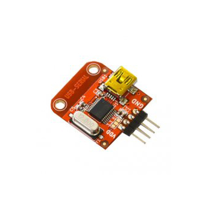

# Adaptéry USB-UART

A USB-UART adapter is needed so a computer or Linux host can communicate with a UART device via USB. It converts USB to regular serial lines `TX`, `RX`, and `GND`.

Such an adapter is often needed for flashing, logs, diagnostics, and recovering boards without a proper USB connector.

## Where it is needed

USB-UART adapter is useful for:

- flashing some microcontroller boards;
- reading serial logs;
- accessing device console;
- bootloader mode diagnostics;
- connecting Arduino Pro Mini and some Nano clones;
- working with boards without built-in USB;
- recovery after failed flashing;
- temporary MCU connection to host via serial.

If a board already has proper USB and appears as a serial device, a separate USB-UART adapter may not be needed.

## What it has

Typical contacts:

- `TX` or `TXO` - transmission from adapter to device;
- `RX` or `RXI` - reception from device;
- `GND` - common ground;
- `VCC`, `3V3`, or `5V` - power, if needed;
- `DTR` - often used for auto-reset/flashing;
- `RTS`, `CTS` - flow control lines or boot/reset scenarios.

Connection diagram:



*Source: [Wikimedia Commons](https://commons.wikimedia.org/wiki/File:15938_-_USBtoSerial_1.jpg), SparkFun Electronics, CC BY 2.0*

For simple log reading, `TX`, `RX`, and `GND` are often sufficient. Power is only connected if it is clear the board should be powered from the adapter.

## How to connect TX and RX

Connection is cross-connected:

```text
TX adapter -> RX device
RX adapter <- TX device
GND adapter -> GND device
```

If there is no connection, the first check is: are `TX` and `RX` mixed up, is there a common `GND`, does the speed match, and is the correct COM/tty port selected.

## 3.3V and 5V

USB-UART adapters come in:

- `3.3V` only;
- `5V` only;
- with `3.3V/5V` switch;
- with jumper or solder jumper;
- with `VCC` of one voltage, but signals of another level.

This matters: the level of `VCC` and the level of `TX/RX` are not always obvious from labels.

ESP32, RP2040, and STM32 typically use `3.3V` logic. Arduino Uno/Nano often uses `5V` logic. If you apply `5V` signal to a `3.3V` input, you can damage the board.

Before connecting, check the adapter and board documentation. Do not rely only on jumper color or label on the case.

## TTL UART and RS-232

USB-UART adapter for microcontrollers usually outputs TTL/CMOS UART: `3.3V` or `5V`.

This is not the same as real RS-232.

RS-232 has different voltage levels and cannot be connected directly to a microcontroller GPIO. If you need to work with a real RS-232 port, you need a USB-RS232 adapter or level converter, not a regular USB-UART TTL.

## Power from adapter

The `VCC` pin on the adapter can be useful, but is often misused.

Safe approach:

- for logs and diagnostics, first connect only `TX`, `RX`, `GND`;
- do not connect `VCC` if the board is already powered from USB, power supply, or other circuit;
- do not power motors, servos, relays, heaters, and LED strips via USB-UART;
- verify how much current the adapter can actually provide;
- understand that `VCC` can be `3.3V` or `5V`.

If you connect two power sources without understanding the circuit, you can get reverse powering, instability, or board damage.

## DTR and RTS

Some boards use `DTR` and `RTS` for auto-reset or bootloader entry.

Examples:

- Arduino Pro Mini often uses `DTR` through a capacitor for reset during flashing;
- ESP32 boards may use `DTR`/`RTS` to auto-control `EN` and `BOOT`;
- some bootloader scenarios require pressing a button manually if these lines are not connected.

If flashing does not start automatically, it is not always a `TX/RX` problem. It may be that `DTR`/`RTS` are not connected, wrong bootloader is selected, or `BOOT`/`RESET` must be pressed manually.

## CH340, CP2102, FTDI

Popular USB-UART chips:

- **CH340/CH341** - cheap and widespread adapters;
- **CP2102/CP210x** - common Silicon Labs USB-UART;
- **FT232/FTDI** - classic option, often more expensive;
- **PL2303** - found in old adapters and cables.

On modern systems, the driver is often installed automatically, but not always. If the port does not appear, check:

- USB cable is not charge-only;
- device is detected by the system;
- if a driver is needed;
- if old driver is not conflicting;
- if the port is not occupied by another program.

## How to test the adapter

Simple loopback test:

1. Connect adapter to computer.
2. Connect `TX` of adapter to `RX` of adapter.
3. Open serial terminal.
4. Select port and speed, for example `115200`.
5. Type characters.
6. If it works, characters are echoed back.

This tests the adapter itself, driver, cable, and terminal program without external board.

## What to check before buying

Before buying a USB-UART adapter, verify:

- what `TX/RX` levels: `3.3V`, `5V`, or switchable;
- how the level is selected;
- what chip is used: CH340, CP2102, FTDI, or other;
- if there are drivers for your system;
- if `DTR` and `RTS` are present, if auto-flashing is needed;
- what USB connector;
- if pins `GND`, `TX`, `RX`, `VCC` are in convenient order;
- if there is a schematic or good documentation;
- how much current can be drawn from `VCC`, if needed.

For ESP32/RP2040/STM32 diagnostics, an adapter with `3.3V` signals and clear marking is more convenient.

## Typical mistakes

- connecting `TX` with `TX`, `RX` with `RX`;
- forgetting common `GND`;
- selecting `5V` level for `3.3V` board;
- connecting `VCC` to an already-powered board;
- powering load via USB-UART adapter;
- confusing USB-UART TTL with USB-RS232;
- using a charge-only USB cable;
- not installing CH340/CP2102/FTDI driver;
- selecting wrong COM/tty port;
- not connecting `DTR`/`RTS` when needed for auto-flashing;
- leaving serial terminal open, then wondering why the flasher cannot open the port.

## Key takeaway

USB-UART adapter is a bridge between computer USB and UART pins of a device. For minimal connection, you need cross-connected `TX/RX` and common `GND`.

Main risks: wrong `3.3V/5V` level, unnecessary power connection, confusing TTL UART with RS-232, and missing `DTR`/`RTS` lines for flashing.

## Related materials

- [SparkFun: Serial Basic CH340C Hookup Guide](https://learn.sparkfun.com/tutorials/sparkfun-serial-basic-ch340c-hookup-guide) - practical guide to USB-UART CH340C, `DTR/RX/TX/VCC/CTS/GND` pins, voltage selection, and loopback test.
- [SparkFun: Serial Basic Overview](https://learn.sparkfun.com/tutorials/sparkfun-serial-basic-ch340c-hookup-guide/serial-basic-overview) - pinout description and `3.3V/5V` switching on adapter.
- [Adafruit: FT232H Serial UART](https://learn.adafruit.com/adafruit-ft232h-breakout/serial-uart) - example USB-serial adapter, `TX`/`RX`, flow-control lines, and connection to device.
- [Silicon Labs: CP2102 USB to UART Bridge](https://www.silabs.com/interface/usb-bridges/classic/device.cp2102) - official example of USB-UART bridge chip and Virtual COM Port drivers.
- [Klipper Configuration Reference: `[mcu]`](https://www.klipper3d.org/Config_Reference.html#mcu) - how serial MCU connection is described in Klipper via `serial`.
