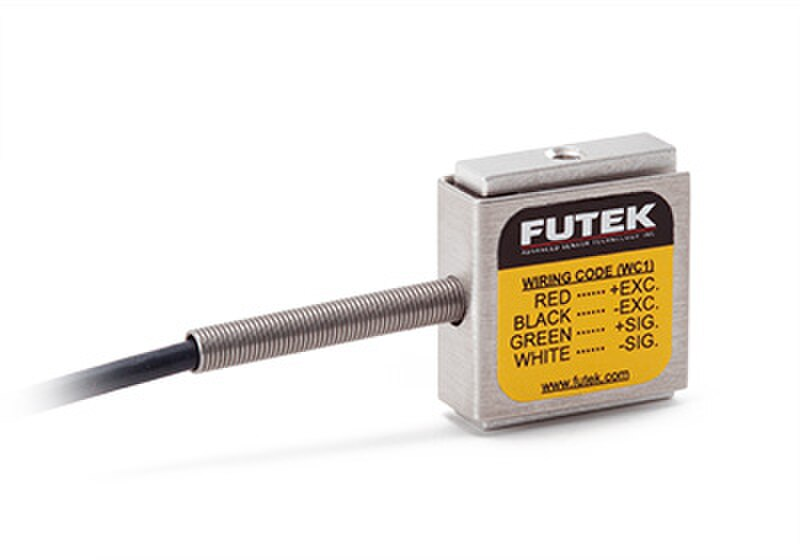

# Tenzometry

A load cell measures force through tiny metal deformation. Weighing a spool, monitoring remaining filament and simple weight platforms almost always use such sensors.

Important to understand: a load cell doesn't "feel weight" by itself. It slightly bends or compresses under load, and electronics measure the microscopic resistance change in strain gauges. So two things are critical: correct mechanics and a normal amplifier/ADC.

## Where It's Used

In iDryer-like projects, a load cell can be used for:

- estimating spool weight with filament;
- rough calculation of remaining plastic;
- checking that the spool is installed;
- detecting sudden weight change;
- measuring load on a small mechanism;
- experimental weight platform;
- dosing control in DIY systems.

For simple "spool present/absent", sometimes a limit switch or optical sensor is enough. A load cell is needed when it's important to actually measure weight or force change.

## Why HX711 Is Needed

A load cell signal is very weak. A typical analog input on ESP32, Arduino or a printer board usually doesn't work for direct connection.

So a load cell is usually connected through HX711 or a similar module. HX711 does two things:

- amplifies the weak differential bridge signal;
- converts it to digital data for the controller.

Typical chain:

```text
load cell -> HX711 -> controller
```

Detailed connection diagram is in the practical section: [Connecting a load cell](../06-practical-guides/04-connecting-load-cell.md).

## What Types of Load Cells Exist

In small projects, the most common are:

- beam cell - convenient for small platforms and spool holders;
- S-type cell - works in tension/compression, often used in hanging setups;
- button cell - measures compression at one point;
- four cells on a platform - typical floor scale design;
- single strain gauge elements - require proper bridge and mechanics, harder for beginners.

For a DIY spool weight system, it's usually easier to start with a beam load cell on `5 kg`, `10 kg` or nearby range. But the range depends on spool mass, holder and possible jerks.

## Wires and Bridge

Most common four-wire load cells have a bridge circuit.

On HX711, you usually see markings:

- `E+` or `VCC` - bridge power plus;
- `E-` or `GND` - bridge power minus;
- `A+`, `S+`, `O+` - positive measurement signal;
- `A-`, `S-`, `O-` - negative measurement signal.

Common color scheme:

- red - `E+`;
- black - `E-`;
- green or blue - `A+`;
- white - `A-`;
- yellow, foil or separate wire - shield.

Colors are not guaranteed. If there's a technical description of the specific cell, it's more important than any internet table. If readings go the wrong way, often just swapping `A+` and `A-` or accounting for the sign in the program is enough.

## Mechanics Matter More Than Circuit

A load cell must deform exactly as the manufacturer intended. If the load goes around the working zone, the cell will show unstable readings or almost nothing.



*Source: [Wikimedia Commons](https://commons.wikimedia.org/wiki/File:Miniature_S-beam_load_cell.jpg), FUTEK Advanced Sensor Technology, CC BY-SA 4.0*

For a beam cell, the typical idea is:

- one side is firmly mounted to a fixed base;
- other side carries a platform or load;
- there's clearance between the moving part and base;
- screws and case don't block beam bending.

Poor mechanics gives such symptoms:

- readings drift without load;
- weight depends on where you put the spool;
- cell barely reacts to load;
- after removing load, zero doesn't return;
- touching the case changes readings sharply;
- different assemblies show different weight with the same setup.

## Range and Overload

A load cell's range is not the desired working weight, it's the limit it's rated for.

Using a `1 kg` cell for a spool, holder and jerks over `1 kg` can drive it into nonlinearity or permanent deformation. Using a `100 kg` cell for a `1 kg` spool loses sensitivity, and mechanics must be much more careful.

When choosing range, consider:

- maximum weight of full spool;
- holder and platform weight;
- misalignment forces;
- accidental jerks on mounting;
- margin for the user;
- desired accuracy.

For remaining filament, moderate margin is often more useful than huge range. For example, for a spool with holder weighing several kilos, a `5 kg` or `10 kg` cell is usually better than `50 kg` if mechanics allow.

## Tare and Calibration

A load cell without calibration outputs raw numbers, not grams.

Typical process:

1. Install the cell in real mechanics.
2. Put an empty platform or holder.
3. Do tare - accept the current value as zero.
4. Put a known weight.
5. Adjust the calibration coefficient.
6. Check one or two more weights.

For spools, there's an extra problem: an empty spool also weighs differently. If you need to estimate just the plastic, you need to know the empty spool weight or store a profile for that specific spool.

## Accuracy and Stability

In practice, accuracy depends on more than HX711 and cell.

Readings are affected by:

- case rigidity;
- mounting play;
- side load;
- printer vibration or fan noise;
- wire length and shielding;
- measurement wires near power lines;
- temperature;
- material creep and plastic deformation;
- cable or spool touching the case around the cell.

If a load cell is in a printed plastic case, don't expect lab accuracy. For filament remaining estimates, stable readings and repeatability after calibration are often enough.

## Power and Wiring

HX711 measures a weak signal, so wiring should be careful.

Practical rules:

- keep HX711 close to the load cell;
- don't route cell wires near heaters, motors and power lines;
- secure wires so they don't pull the platform;
- use common `GND` with the controller;
- power the module with voltage compatible to the controller;
- don't use poor Dupont contacts in final assembly if the device should run long.

On the controller side, HX711 usually connects through `DT`/`DOUT` and `SCK`/`CLK`. This is not regular I2C or SPI, but a separate simple interface.

## What to Check Before Buying

Before buying, check:

- cell type: beam, S-type, button, platform;
- weight range;
- load application direction;
- dimensions and mounting holes;
- availability of description or wire diagram;
- whether one cell or four cells are needed;
- whether HX711 module fits your chosen cell;
- whether there's room for proper clearance and mounting;
- whether you can put a known weight for calibration;
- whether load won't go through the case around the cell.

If mechanics aren't thought through yet, it's better to first sketch the mounting. Buying "any load cell" often ends with it being physically impossible to mount correctly.

## Typical Errors

- connecting load cell directly to analog input;
- confusing `E+`/`E-` and `A+`/`A-`;
- trusting wire colors without description;
- mounting both sides of beam cell to one rigid part;
- blocking cell bending with screws or case;
- overloading the cell;
- choosing too large a range and losing sensitivity;
- forgetting tare and calibration;
- calibrating on the bench, then installing cell in different mechanics;
- routing wires near heater power lines;
- expecting gram-level accuracy from soft plastic case.

## Main Point

A load cell is a component where mechanics matter as much as electronics. HX711 helps read the weak signal, but won't fix crooked mounting, overload or load going around the cell.

First choose the right type and range, then design the mounting, then connect HX711, and only then do tare and calibration.

## Reference Materials

- [SparkFun: Load Cell Amplifier HX711 Breakout Hookup Guide](https://learn.sparkfun.com/tutorials/load-cell-amplifier-hx711-breakout-hookup-guide) - practical connection of load cell to HX711, wires, library and calibration.
- [SparkFun HX711 product page](https://www.sparkfun.com/sparkfun-load-cell-amplifier-hx711.html) - description of HX711 role as bridge between load cell and microcontroller.
- [DigiKey: HX711 Datasheet by Avia Semiconductor](https://www.digikey.com/en/htmldatasheets/production/1836471/0/0/1/hx711.html) - technical description of HX711: 24-bit ADC, bridge sensor input and digital interface.
- [Phidgets: Load Cell Guide](https://cdn.phidgets.com/docs/Load_Cell_Guide) - practical examples of load cell types, load direction and mounting.
- [SparkFun retired HX711 guide: mechanical setup](https://learn.sparkfun.com/tutorials/retired---load-cell-amplifier-hx711-breakout-hookup-guide) - useful illustrations of beam, S-type and platform cell mounting.
