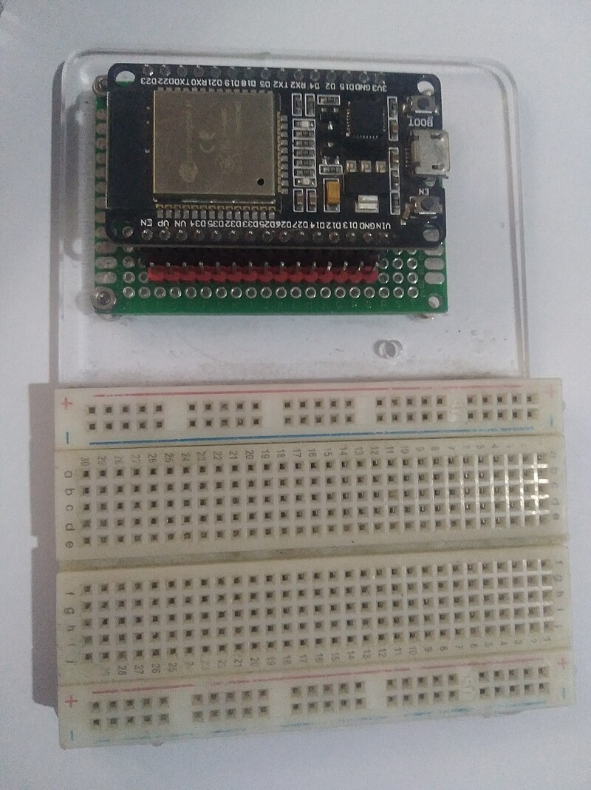

# ESP32 Controller

ESP32 ist eine Familie von Espressif-Mikrocontrollern mit Wi-Fi, Bluetooth und einer großen Auswahl an Peripheriegeräten. In DIY-Geräten wird er oft gewählt, wenn ein eigenständiges Modul aufgebaut werden soll: Es verbindet sich selbst mit dem Netzwerk, liest Sensoren aus, zeigt eine Seite im Browser an und steuert einfache Ausgänge.

Für Geräte rund um einen 3D-Drucker ist ESP32 nicht als „weitere Leistungsplatine" nützlich, sondern als kleiner Netzwerk-Controller: ein Temperatur-/Luftfeuchtigkeitssensor, ein Belüftungsmodul, ein einfaches Filter mit Weboberfläche, separate Kameraüberwachung oder ein eigenständiger Trockner.

## Einsatzbereiche von ESP32

Typische Aufgaben:

- Wi-Fi-Temperatur- und Luftfeuchtigkeitssensor;
- separater Lüfterregler über MOSFET-Modul;
- Ansteuerung eines Relais oder SSR mit Niederspannungssignal;
- OLED-Display über I2C;
- RFID/NFC-Lesegerät über SPI oder UART;
- Servo mit separater Stromversorgung;
- einfache Webseite für Status und Einstellungen;
- Integration mit MQTT, Home Assistant oder eigener lokaler Logik;
- autonomes Prototyp, das kein Teil von Klipper sein muss.

ESP32 ist geeignet, wenn das Gerät separat vom Drucker betrieben werden und Daten über das Netzwerk austauschen soll. Sollen lediglich zusätzliche Pins für Klipper bereitgestellt werden, ist es in der Regel besser, RP2040, STM32 oder eine fertige Druckerplatine zu verwenden.

## Typische Gerätearchitektur

ESP32 versorgt Lasten nicht direkt mit Strom. Er gibt Steuersignale aus, und separate Module übernehmen die Leistungsarbeit.

*Quelle: [Wikimedia Commons](https://commons.wikimedia.org/wiki/File:ESP32_Dev_Board.jpg), Edwiyanto, CC BY-SA 4.0*

In der Praxis sieht das so aus:

- ESP32 wird über USB oder stabilen `5V`-Anschluss auf der Entwicklungsplatine gespeist;
- die ESP32-Logik selbst läuft mit `3.3V`;
- Sensoren sind über GPIO, I2C, SPI, UART oder ADC angeschlossen;
- Lüfter, LED-Streifen, DC-Heizungen sind über MOSFET oder Treiber angeschlossen;
- Netzheizungen werden nur über ein geeignetes AC-SSR/Relais und einen sicheren Leistungsabschnitt angeschlossen;
- Servos werden aus einer separaten `5V/6V`-Quelle gespeist, ESP32 liefert nur das Signal.

GPIO ist keine Stromquelle für eine Last. Ein Pin kann den Treibereingang schalten, darf aber keinen Lüfter, Heizer, Relais, Servo oder LED-Streifen direkt versorgen.

## Was „ESP32" auf einer Platine bedeutet

Die Bezeichnung „ESP32" kann verschiedene Dinge bedeuten:

- den ESP32-Chip selbst;
- ein Modul mit Chip, Flash-Speicher und Antenne, z. B. ESP32-WROOM;
- eine Entwicklungsplatine mit USB, Spannungsregler, Tasten und freiliegenden Pins;
- neuere Varianten: ESP32-S3, ESP32-C3, ESP32-C6 und andere.

Für ein erstes Projekt ist eine Entwicklungsplatine praktischer als ein blankes Modul. Eine Entwicklungsplatine hat bereits USB, einen Spannungsregler, `BOOT`/`EN`-Tasten und Pins für Steckbrettaufbauten.

Vor dem Kauf prüfen:

- genaue Bezeichnung von Platine und Chip;
- ob USB-C oder Micro-USB vorhanden ist;
- welches USB-UART oder integriertes USB verwendet wird;
- ob ein Schaltplan und Pinout vorhanden ist;
- welche GPIO tatsächlich herausgeführt sind;
- welcher Spannungsregler auf der Platine sitzt;
- ob eine ordentliche Antenne und ausreichend Freiraum darum vorhanden ist;
- ob die Platinenabmessungen in das Gehäuse passen.

## 3.3V-Logik

ESP32 arbeitet mit `3.3V`-Logik. Das bedeutet, dass ein typischer `HIGH`-Pegel an GPIO etwa `3.3V` beträgt, nicht `5V`.

Was zu beachten ist:

- keine `5V` an ESP32-GPIO anlegen;
- für `5V`-Sensoren und -Module kann ein Pegelwandler erforderlich sein;
- I2C-Pull-ups müssen auf `3.3V` gehen, wenn der Bus mit ESP32 verbunden ist;
- einige fertige MOSFET/SSR-Module funktionieren mit `3.3V` möglicherweise nicht zuverlässig;
- Laststrom kann nicht von GPIO entnommen werden.

Viele Sensoren sind bereits in `3.3V`-Varianten erhältlich. Für ESP32 ist das die beste Wahl.

## Stromversorgung

Entwicklungsplatinen haben in der Regel einen USB-Eingang und einen `5V`/`VIN`-Pin, der ESP32 selbst wird von einem `3.3V`-Regler versorgt.

Häufige Fehler:

- ESP32 über ein schwaches USB-Kabel speisen;
- Servo, Lüfter oder Relais vom `3.3V`-Pin der Platine versorgen;
- eine schwere Last an den `5V`-Pin anschließen, ohne zu verstehen, woher der Strom kommt;
- gemeinsame GND zwischen ESP32 und dem Niederspannungstreiber nicht verbinden;
- ESP32 startet neu, wenn Wi-Fi hochfährt, wegen Spannungseinbruchs.

Wi-Fi zieht gepulsten Strom. Für stabilen Betrieb sind ein gutes Kabel, ein Regler, Kondensatoren auf der Platine und eine separate Stromversorgung für Lasten wichtig.

## GPIO und Sonderpins

ESP32 hat viele GPIO, aber nicht jeder Pin ist gleich praktisch.

Beim klassischen ESP32:

- einige Pins sind mit dem Chip-Ladevorgang verbunden – das sind Strapping-Pins;
- `GPIO6-GPIO11` sind in der Regel durch den Flash-Speicher belegt und werden nicht verwendet;
- `GPIO34-GPIO39` sind nur als Eingang nutzbar;
- `GPIO1` und `GPIO3` werden häufig als UART für Firmware und Logs verwendet;
- einige Pins können auf einer bestimmten Entwicklungsplatine durch LED, Taste oder andere Schaltkreise belegt sein.

Strapping-Pins bestimmen den Boot-Modus beim Start. Wenn externe Beschaltung einen solchen Pin falsch zieht, startet ESP32 möglicherweise nicht oder wechselt in den Firmware-Update-Modus.

Praktische Regel: In der ersten Version Pins aus dem Pinout der eigenen Platine verwenden und Pins meiden, die mit `BOOT`, `FLASH`, `STRAP`, `TX0`, `RX0`, `GPIO6-GPIO11` gekennzeichnet sind, sofern ihre Funktion nicht bekannt ist.

## ADC auf ESP32

ESP32 kann analoge Spannung über ADC messen, ist aber kein Labormultimeter.

Was zu beachten ist:

- beim klassischen ESP32 gibt es ADC1 und ADC2;
- ADC2 kollidiert mit Wi-Fi – für ein Wi-Fi-Gerät daher besser ADC1-Pins verwenden;
- der Messbereich hängt von der Dämpfungseinstellung ab;
- die Messung kann eine Kalibrierung erfordern;
- an ADC darf keine Spannung über dem sicheren GPIO-Pegel angelegt werden;
- ein Thermistor benötigt in der Regel einen Spannungsteiler und die richtige Tabelle/das richtige Modell in der Firmware.

Wenn ein genauer Temperatursensor benötigt wird, ist es oft einfacher, einen digitalen Sensor oder ein fertiges Modul mit einer bekannten Bibliothek zu verwenden. Für einen NTC-Thermistor funktioniert ESP32, aber Schaltung und ADC-Einstellungen müssen geprüft werden.

## PWM, I2C, SPI und UART

ESP32 ist für Peripheriegeräte praktisch:

- PWM über LEDC eignet sich für Lüfter, Beleuchtung und Servosignale;
- I2C eignet sich für OLED-Displays und viele Sensoren;
- SPI eignet sich für RFID-Module, Displays und schnelle Geräte;
- UART eignet sich für GPS, bestimmte Sensoren, andere Controller und Debugging.

ESP32 hat eine flexible GPIO-Matrix: Viele Signale können verschiedenen Pins zugewiesen werden. Das bedeutet jedoch nicht, dass jeder Pin immer eine gute Wahl ist. Spezifische Platinenbeschränkungen, Flash-Speicher, Boot-Pins und belegte UART müssen trotzdem berücksichtigt werden.

## ESP32 und Klipper

ESP32 ist besser als eigenständiges Wi-Fi/IoT-Gerät neben dem Drucker zu betrachten, nicht als Hauptweg für einen zusätzlichen MCU in Klipper.

Klipper ist als Host plus einem oder mehreren MCUs aufgebaut. Für neue zusätzliche MCUs ist es in der Regel praktischer, Folgendes zu verwenden:

- RP2040;
- STM32;
- fertige 3D-Druckerplatinen.

ESP32 kann separat Daten mit dem Druckersystem austauschen: über MQTT, HTTP API, Home Assistant, einen eigenen Server oder eine andere Integration. Das ist jedoch nicht dasselbe wie das Hinzufügen von `[mcu]` zur Klipper-Konfiguration und die direkte Verwendung von Pins.

## Was vor dem Kauf zu prüfen ist

Vor dem Kauf einer ESP32-Platine prüfen:

- genaues Modell: ESP32, S3, C3, C6 usw.;
- Logikspannung;
- ob USB vorhanden ist und wie die Platine geflasht wird;
- ob ein offizielles Pinout oder ein Schaltplan vorhanden ist;
- welche Pins für GPIO sicher sind;
- welche Pins nur als Eingang nutzbar sind;
- welche Pins durch Flash/PSRAM, USB, UART oder LED belegt sind;
- ob genug ADC/I2C/SPI/UART für die Aufgabe vorhanden ist;
- wie die Platine gespeist wird;
- ob sie ins Gehäuse passt;
- ob eine Bibliothek oder Firmware für das eigene Szenario vorhanden ist.

Wenn eine Platine aus einem Online-Marktplatz keinen Schaltplan und kein ordentliches Pinout hat, kann sie für Experimente verwendet werden, ist aber nicht für ein Gerät geeignet, das lange unbeaufsichtigt laufen soll.

## Häufige Fehler

- `5V` an ESP32-GPIO anlegen;
- Last von GPIO versorgen;
- Servo oder Relais von einem schwachen `3.3V`-Pin speisen;
- gemeinsame GND mit MOSFET/Treiber vergessen;
- einen ADC2-Pin für einen Sensor wählen und dann Wi-Fi aktivieren;
- einen Boot-Strapping-Pin so verwenden, dass ESP32 nicht startet;
- `GPIO34-GPIO39` als Ausgänge verwenden;
- ein Modul ohne Pinout und Schaltplan kaufen;
- denken, dass „ESP32 mit Wi-Fi" automatisch sichere Netzheizungssteuerung bedeutet;
- versuchen, Leistungselektronik durch Firmware zu ersetzen.

## Kernpunkte

ESP32 ist eine gute Wahl für autonome Wi-Fi-Geräte: Sensoren, Weboberflächen, einfache Lüftersteuerung, Filter, Displays und Peripheriegeräte.

ESP32 arbeitet jedoch mit `3.3V`-Logik, hat Sonderpins und darf Lasten nicht direkt versorgen. Für Leistungsschaltkreise werden MOSFET, Treiber, Relais oder SSRs benötigt, und für eine Netzheizung ist ein vollständiger sicherer Leistungsabschnitt erforderlich.

## Weiterführende Materialien

- [Espressif: ESP32 Wi-Fi & Bluetooth SoC](https://www.espressif.com/en/products/socs/esp32/datasheet) — offizielle Übersicht der ESP32-Familie, Module, Entwicklungsplatinen und Links zur Dokumentation.
- [Espressif: ESP32 Series Datasheet](https://documentation.espressif.com/esp32_datasheet_en.html) — Chip-Eigenschaften, Peripheriegeräte, ADC, PWM, UART, I2C, SPI und Pin-Beschränkungen.
- [ESP-IDF Programming Guide: GPIO & RTC GPIO](https://docs.espressif.com/projects/esp-idf/en/latest/esp32/api-reference/peripherals/gpio.html) — GPIO-Tabelle, Strapping-Pins, nur als Eingang nutzbare Pins, Flash/PSRAM-Pins und ADC2-Einschränkung bei Wi-Fi.
- [Espressif: ESP32 Hardware Design Guidelines](https://docs.espressif.com/projects/esp-hardware-design-guidelines/en/latest/esp32/esp-hardware-design-guidelines-en-master-esp32.pdf) — Empfehlungen für Stromversorgung, Strapping-Pins, GPIO, ADC und Platinendesign.
- [Arduino-ESP32: LED Control API](https://docs.espressif.com/projects/arduino-esp32/en/latest/api/ledc.html) — PWM/LEDC in Arduino-ESP32 für Lüfter, Beleuchtung und andere PWM-Signale.
- [Klipper: Code overview](https://www.klipper3d.org/Code_Overview.html) — Klipper-Architekturkontext für MCU und Liste der unterstützten Mikrocontroller-Backends im Quellbaum.
