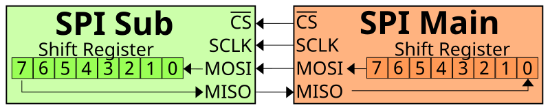

# SPI Interface

SPI ist eine schnelle serielle Kommunikationsschnittstelle zwischen einem Controller und Peripheriegeräten. Ausgeschrieben: `Serial Peripheral Interface`.

SPI wird häufig dort eingesetzt, wo Daten schneller als über I2C übertragen werden müssen oder das Gerät für SPI ausgelegt ist: Display, SD-Karte, RFID-Modul, Sensor, Treiber oder Speicherchip.

## Einsatzgebiete von SPI

In 3D-Druckern und iDryer-ähnlichen Geräten kann SPI vorkommen bei:

- RFID/NFC-Modulen wie RC522;
- OLED/TFT-Displays;
- SD-Karten;
- Beschleunigungssensoren für Input Shaper;
- Schrittmotortreibern, zum Beispiel TMC2130/TMC5160;
- Speicherchips;
- ADC/DAC und Erweiterungsplatinen;
- einigen Sensoren und Spezialmodulen.

SPI ist in der Regel schneller als I2C, benötigt jedoch mehr Leitungen und eine sorgfältigere Pin-Auswahl.

## Grundlegende Leitungen

Ein typischer SPI-Bus verwendet:

- `SCK` oder `CLK` – Taktsignal;
- `MOSI` – Daten vom Controller zum Gerät;
- `MISO` – Daten vom Gerät zum Controller;
- `CS`, `SS` oder `NSS` – Auswahl des jeweiligen Geräts;
- `GND` – gemeinsame Masse;
- Modulversorgungsspannung.

Schaltbild mit zwei Geräten:



*Quelle: [Wikimedia Commons](https://commons.wikimedia.org/wiki/File:SPI_basic_operation,_single_Main_%26_Sub.svg), Em3rgent0rdr, CC0 Public Domain*

`SCK`, `MOSI` und `MISO` können von mehreren Geräten gemeinsam genutzt werden. Jedes Gerät benötigt jedoch in der Regel eine eigene `CS`-Leitung.

## CS statt Adressen

Bei I2C werden Geräte über Adressen unterschieden. Bei SPI gibt es in der Regel keine Adressen. Der Controller wählt das Gerät über eine separate `CS`-Leitung aus.

Beispiel:

```text
SCK  -> common to all SPI devices
MOSI -> common
MISO -> common
CS1  -> RFID module
CS2  -> display
CS3  -> SD card
```

Wenn der Controller mit dem RFID-Modul kommunizieren möchte, aktiviert er `CS1`. Für das Display aktiviert er `CS2`.

In den meisten Fällen ist `CS` aktiv-niedrig: Im Ruhezustand liegt die Leitung auf `HIGH`, zur Geräteauswahl wird sie auf `LOW` gezogen. Dies sollte jedoch im technischen Datenblatt überprüft werden.

## MOSI/MISO und neue Bezeichnungen

In älteren und weit verbreiteten Schaltplänen lauten die Bezeichnungen:

- `MOSI` – Master Out Slave In;
- `MISO` – Master In Slave Out;
- `SS` – Slave Select.

In neuerer Dokumentation sind neutrale Bezeichnungen anzutreffen:

- `PICO` – Peripheral In Controller Out, entspricht MOSI;
- `POCI` – Peripheral Out Controller In, entspricht MISO;
- `CS` – Chip Select.

In der 3D-Drucker-Elektronik sind `MOSI`, `MISO`, `SCK`, `CS` nach wie vor sehr gebräuchlich. Entscheidend ist, die Signalrichtung zu verstehen und das Pinout des jeweiligen Moduls zu prüfen.

## MISO wird nicht immer benötigt

Nicht jedes SPI-Gerät sendet tatsächlich Daten zurück.

Ein einfaches Display beispielsweise empfängt möglicherweise nur Befehle und Pixeldaten. In diesem Fall kann die `MISO`-Leitung fehlen oder ungenutzt sein.

Für Geräte, die Daten zurücklesen, wird `MISO` jedoch benötigt:

- RFID-Modul;
- SD-Karte;
- Sensor;
- Treiber mit Diagnosefunktion;
- Speicherchip.

Wenn das Modul eine Antwort senden soll und `MISO` nicht angeschlossen oder vertauscht ist, kann die Initialisierung fehlschlagen.

## SPI-Geschwindigkeit und Modus

SPI besitzt eine einstellbare Geschwindigkeit. Sie kann deutlich höher als bei I2C sein, was jedoch nicht bedeutet, dass sofort das Maximum eingestellt werden sollte.

Den Betrieb beeinflussen:

- Leitungslänge;
- Qualität der Masseverbindung;
- Modul und zugehöriges Datenblatt;
- Störpegel;
- Controller-Taktfrequenz;
- gewählter SPI-Modus.

Der SPI-Modus wird über die Parameter Taktpolarität und Taktphase festgelegt: `CPOL` und `CPHA`. Häufig wird Modus 0 verwendet, aber nicht immer. Bei falschem Modus reagiert das Gerät möglicherweise nicht oder liefert falsche Daten.

In den meisten fertigen Bibliotheken ist der Modus bereits voreingestellt. Wird jedoch ein ungewöhnliches Modul angeschlossen oder eine Low-Level-Konfiguration geschrieben, muss das Datenblatt konsultiert werden.

## 3,3 V und 5 V

Wie andere Schnittstellen garantiert SPI keine sicheren Spannungspegel.

ESP32, RP2040, STM32 und viele moderne Module arbeiten mit `3,3-V`-Logik. Arduino Uno/Nano verwendet häufig `5 V`.

Vor dem Anschluss prüfen:

- Modulversorgungsspannung;
- Logikpegel von `SCK`, `MOSI`, `MISO`, `CS`;
- ob eine Pegelanpassung vorhanden ist;
- ob das Modul `5 V` an den Signaleingängen verträgt;
- ob der Controller-Eingang `5 V` verträgt.

RC522 beispielsweise benötigt typischerweise `3,3-V`-Versorgung und -Logik. Es ohne Pegelanpassung an einen `5-V`-Arduino anzuschließen ist keine gute Idee.

## SPI in Klipper

In Klipper wird SPI für verschiedene Geräte verwendet: TMC-Treiber, Beschleunigungssensoren, einige Displays und Sensoren.

Die Konfiguration kann folgende Parameter enthalten:

- `cs_pin` – Pin zur Geräteauswahl;
- `spi_bus` – Hardware-SPI-Bus;
- `spi_speed` – Geschwindigkeit in Hz;
- `spi_software_sclk_pin`;
- `spi_software_mosi_pin`;
- `spi_software_miso_pin`.

Ist das Gerät an einem zusätzlichen MCU angeschlossen, müssen die Pins zu diesem MCU gehören. Wie bei anderen Klipper-Sektionen ist das spezifische Pinout der Platine wichtiger als Annahmen.

Grobe Veranschaulichung:

```ini
[some_spi_device]
cs_pin: chamber:gpio9
spi_software_sclk_pin: chamber:gpio10
spi_software_mosi_pin: chamber:gpio11
spi_software_miso_pin: chamber:gpio12
```

Dies ist keine fertige Konfiguration für ein bestimmtes Gerät, sondern eine Illustration: Alle SPI-Pins müssen dem MCU angehören, an den das Modul tatsächlich angeschlossen ist.

## Leitungslänge und Störungen

SPI kann schnell arbeiten, verträgt jedoch keine langen, nachlässig verlegten Leitungen.

Praktische Regeln:

- `SCK`, `MOSI`, `MISO`, `CS` kurz halten;
- nah an `GND` verlegen;
- nicht parallel zu Heizungs- und Motorleitungen verlegen;
- `spi_speed` bei Fehlern reduzieren;
- geeignete Steckverbinder verwenden;
- SPI nicht ohne Grund quer durch den gesamten Drucker führen;
- für entfernte Knoten häufiger CAN, UART/RS-485 oder einen separaten MCU in der Nähe des Moduls wählen.

Die `SCK`-Leitung ist besonders empfindlich: Sie führt das Taktsignal. Ist sie gestört, kann die gesamte Kommunikation instabil werden.

## SPI und RC522

RC522 ist ein gutes Beispiel für ein SPI-Modul mit Bezeichnungsverwirrung.

Auf vielen RC522-Platinen wird der `SDA`-Pin tatsächlich als `SS`/`CS` für SPI verwendet. Dies ist nicht das I2C-`SDA`.

Für RC522 werden typischerweise benötigt:

- `3,3 V`;
- `GND`;
- `SCK`;
- `MOSI`;
- `MISO`;
- `SDA`/`SS`/`CS`;
- `RST`;
- manchmal `IRQ`, in einfachen Projekten jedoch oft nicht verwendet.

Ein detailliertes Schaltbild befindet sich im praktischen Artikel: [RFID-Lesegerät anschließen](../06-practical-guides/05-connecting-rfid-reader.md).

## Was vor dem Anschluss zu prüfen ist

Vor dem Anschluss eines SPI-Moduls prüfen:

- Modulversorgungsspannung;
- Logikpegel;
- Pinout der jeweiligen Platine;
- wo sich `SCK`, `MOSI`, `MISO`, `CS` befinden;
- ob `RST`, `DC`, `IRQ` oder andere Pins benötigt werden;
- welches `CS` dem Gerät zugewiesen ist;
- ob `CS` nicht mit einem anderen Modul kollidiert;
- ob Hardware-SPI oder Software-SPI benötigt wird;
- welche Geschwindigkeit die Dokumentation empfiehlt;
- ob die Firmware dieses Modul unterstützt.

## Typische Fehler

- `MOSI` und `MISO` vertauscht;
- `CS` vergessen;
- zwei Geräte an einem `CS` angeschlossen;
- gemeinsame `GND`-Verbindung nicht hergestellt;
- `5 V` an ein `3,3-V`-SPI-Modul angelegt;
- `SDA` am RC522 mit I2C-`SDA` verwechselt;
- zu hohe Geschwindigkeit gewählt;
- Leitungen zu lang gemacht;
- Modul an einem MCU angeschlossen, aber Pins eines anderen MCU angegeben;
- SPI für eine Leistungsschnittstelle zum Treiben von Lasten gehalten.

## Wichtigste Erkenntnis

SPI ist eine schnelle Schnittstelle für Module in der Nähe des Controllers. In der Regel werden `SCK`, `MOSI`, `MISO`, `CS`, Versorgungsspannung und `GND` benötigt.

Der wesentliche Unterschied zu I2C: SPI verwendet in der Regel keine Adressen, jedes Gerät wird über eine separate `CS`-Leitung ausgewählt. Vor dem Anschluss Pinout, Logikpegel, Geschwindigkeit, Leitungslänge und Firmware-Unterstützung prüfen.

## Weiterführende Materialien

- [SparkFun: Serial Peripheral Interface](https://learn.sparkfun.com/tutorials/serial-peripheral-interface-spi) – praktische Erklärung von SPI, Datenleitungen, neuen PICO/POCI-Bezeichnungen und grundlegender Austauschlogik.
- [SparkFun: SPI Chip Select](https://learn.sparkfun.com/tutorials/serial-peripheral-interface-spi/chip-select-cs) – warum `CS` benötigt wird und wie mehrere SPI-Geräte angeschlossen werden.
- [Adafruit: SPI Devices](https://learn.adafruit.com/circuitpython-basics-i2c-and-spi/spi-devices) – Vergleich SPI vs. I2C, separates `CS`, Geschwindigkeit, Polarität/Phase und Einschränkungen.
- [DigiKey: SPI Simplifies Device Communication](https://www.digikey.com/en/articles/why-how-to-use-serial-peripheral-interface-simplify-connections-between-multiple-devices) – Möglichkeiten zum Anschluss mehrerer SPI-Geräte und die Rolle von `CS`.
- [Klipper Configuration Reference: Common SPI settings](https://www.klipper3d.org/Config_Reference.html) – Parameter `spi_speed`, `spi_bus`, Software-SPI und `cs_pin` in Klipper.
