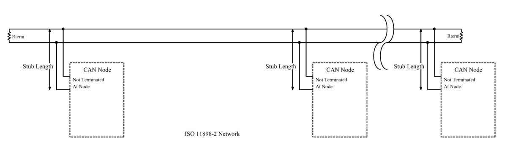

# CAN-Schnittstelle

CAN ist eine Kommunikationsschnittstelle für mehrere Geräte auf einer gemeinsamen Differenzleitung. Ausgeschrieben: `Controller Area Network`.

CAN stammt aus der Automobil- und Industrieelektronik, wurde in 3D-Druckern jedoch für Toolhead-Boards, entfernte MCUs und Module populär, bei denen eine längere und zuverlässige Kommunikation als I2C/SPI benötigt wird.

## Wo CAN nützlich ist

In Drucker- und iDryer-ähnlichen Peripheriegeräten wird CAN verwendet für:

- Toolhead-Boards am Druckkopf;
- zusätzliche MCU in einem entfernten Block;
- Reduzierung der Kabelanzahl im Kabelstrang;
- Kommunikation mit CAN-Filter, Kamera oder Dryer-Boards;
- verteiltes System aus mehreren Controllern;
- Fälle, in denen USB oder langes I2C/SPI unpraktisch ist.

CAN ist besonders nützlich, wenn ein Knoten weit vom Host oder Hauptboard entfernt ist und sich in der Nähe von Motoren, Heizungen und anderen Störquellen befindet.

## CANH, CANL und GND

Ein physischer CAN-Bus verwendet typischerweise:

- `CANH`;
- `CANL`;
- manchmal `GND` oder eine gemeinsame Referenzleitung;
- Modulstromversorgung separat, falls erforderlich.

Das Signal wird als Differenz zwischen `CANH` und `CANL` übertragen. Deshalb verarbeitet CAN Störungen besser als einzelne Signalleitungen.

Vereinfachtes Diagramm:



*Quelle: [Wikimedia Commons](https://commons.wikimedia.org/wiki/File:CAN_ISO11898-2_Network.png), EE JRW, CC BY-SA 4.0*

Für die Verdrahtung wird für `CANL`/`GND` oft ein verdrilltes Paar verwendet. `GND` hängt von der jeweiligen Schaltung, den Boards und der Dokumentation ab, in kleinen DIY-Systemen wird jedoch oft eine gemeinsame Referenz für stabilen Betrieb und Schnittstellensicherheit benötigt.

## CAN-Transceiver ist erforderlich

Wichtig: CAN-Unterstützung im Mikrocontroller und CAN-Präsenz auf dem Board sind nicht dasselbe.

Damit CAN funktioniert, benötigt man:

- Mikrocontroller mit CAN-Controller oder geeigneter Firmware-Unterstützung;
- CAN-Transceiver auf dem Board;
- korrekte `CANH`/`CANL`-Anschlüsse;
- Transceiver-Stromversorgung;
- Terminatoren;
- für CAN kompilierte Firmware.

Wenn das Datenblatt des Mikrocontrollers CAN erwähnt, das Board jedoch keinen Transceiver hat, kann man nicht direkt mit dem CAN-Bus verbinden.

## Topologie und Terminatoren

CAN ist ein Bus. Eine gute Topologie sieht wie eine Linie aus, an der Knoten über kurze Abzweige angeschlossen sind.

Normalerweise werden zwei `120-Ohm`-Terminatoren benötigt:

- einer am einen physischen Ende des Buses;
- zweiter am anderen physischen Ende.

Nicht einer, nicht drei und nicht „auf jedem Board". Genau zwei an den Enden.

Wenn die Stromversorgung ausgeschaltet ist, zeigt ein Multimeter zwischen `CANH` und `CANL` bei einem korrekt terminierten Bus oft etwa `60 Ohm`, da zwei `120-Ohm`-Widerstände parallel geschaltet sind.

Viele Boards haben einen Terminator-Jumper. Einige haben einen eingebauten Terminator ohne bequeme Deaktivierungsmöglichkeit. Daher sollten vor dem Zusammenbau die Schaltpläne aller Boards am Bus überprüft werden.

## Bitrate

Die CAN-Geschwindigkeit muss auf allen Knoten übereinstimmen. In Klipper verwendet CAN oft `1 Mbit/s`, was `1 Mbit/s` entspricht, der spezifische Wert hängt jedoch von Firmware, Einstellungen und Buslänge ab.

Wenn die Bitrate unterschiedlich ist, können die Knoten nicht normal kommunizieren.

Bei langen oder problematischen Verkabelungen kann die Geschwindigkeit entscheidend sein. Je höher die Geschwindigkeit, desto anspruchsvoller ist der Bus hinsichtlich Topologie, Terminatoren und Kabelqualität.

## CAN in Klipper

In Klipper wird CAN als Kommunikationsweg mit MCU verwendet.

Ein Gerät am CAN wird normalerweise nicht über `serial:` angegeben. Stattdessen verwendet die Konfiguration `canbus_uuid`:

```ini
[mcu toolhead]
canbus_uuid: 11aa22bb33cc
```

Auf der Linux-Seite benötigt man normalerweise ein `can0`-Interface. Der Host muss einen CAN-Adapter haben:

- USB-CAN-Adapter;
- Board im USB-to-CAN-Bridge-Modus;
- HAT/Adapter für SBC;
- andere unterstützte Schaltung.

Klipper hat ein Werkzeug, um die `canbus_uuid` neuer, nicht initialisierter Geräte zu finden. Wichtig zu verstehen: Wenn ein Gerät bereits von Klipper konfiguriert wurde, erscheint es möglicherweise nicht mehr als „neu“ in der Liste.

## USB-to-CAN-Bridge

Einige Boards können im USB-to-CAN-Bridge-Modus geflasht werden. Dann verbindet sich das Board über USB mit dem Host und erscheint für Linux als CAN-Adapter.

Das ist praktisch, hat aber eine wichtige Einschränkung: Der Bridge-Modus wird benötigt, um mit einem echten CAN-Bus und anderen CAN-Knoten zu kommunizieren. Wenn man nur ein Board in der Nähe des Hosts hat und keinen echten CAN-Bus hat, ist es normalerweise einfacher, den normalen USB/Serial-Modus zu verwenden.

Außerdem ist USB-to-CAN-Bridge nicht als `canbus_uuid` sichtbar. Es wird als CAN-Interface konfiguriert und verwendet `serial:`, nicht `serial:`.

## Wann CAN gerechtfertigt ist

CAN ist es wert, in Betracht gezogen zu werden, wenn:

- ein Toolhead-Board angeschlossen werden muss;
- Kommunikation über einen langen Kabelstrang geführt werden muss;
- mehrere entfernte MCUs benötigt werden;
- Kabel zwischen beweglichen Teilen und Gehäuse reduziert werden sollen;
- bereits CAN-Infrastruktur vorhanden ist;
- das gewählte Board für Klipper CAN gut dokumentiert ist.

CAN kann unnötig sein, wenn:

- das Board befindet sich in der Nähe des Hosts;
- nur ein zusätzlicher MCU benötigt wird;
- USB stabil funktioniert;
- keine Erfahrung mit Flashen, `can0`, Terminatoren und Linux-Netzwerken vorhanden ist;
- das gewählte Board schlecht dokumentiert ist.

Für den ersten einfachen zusätzlichen Controller ist USB oft schneller und klarer. CAN macht Sinn, wenn es ein echtes Verkabelungs- oder Board-Verteilungsproblem löst.

## CAN versorgt keine Last mit Strom

CAN ist nur Kommunikation.

Wenn ein CAN-Board einen Lüfter, eine Heizung, SSR oder Servo steuert, benötigt es trotzdem:

- Board-Stromversorgung;
- Last-Stromversorgung;
- MOSFET/Treiber/SSR;
- Sicherungen;
- geeignete Klemmen;
- Thermoschutz für Heizungen;
- sicheres Gehäuse.

CAN ersetzt keine Leistungselektronik und macht eine Heizung nicht sicher.

## Was vor dem Kauf zu prüfen ist

Vor dem Kauf eines CAN-Boards prüfen:

- welcher Mikrocontroller verwendet wird;
- ob das Board Klipper CAN unterstützt;
- ob ein CAN-Transceiver vorhanden ist;
- wo sich `CANH` und `CANL` befinden;
- ob ein Terminator vorhanden ist und wie er aktiviert wird;
- welcher Steckverbinder verwendet wird;
- wie das Board mit Strom versorgt wird;
- wie das Board geflasht wird;
- ob eine Anleitung für `canbus_uuid` vorhanden ist;
- ob ein separater USB-CAN-Adapter benötigt wird;
- ob ein Schaltplan und Pinout vorhanden sind;
- welche Pins und Leistungsausgänge verfügbar sind.

Wenn der Verkäufer „CAN" nur schreibt, weil der Chip es theoretisch unterstützt, das Board aber keinen Transceiver und keine Dokumentation hat, ist es eine schlechte Wahl.

## Typische Fehler

- `CANH` und `CANL` vertauscht;
- vergessen, dass ein CAN-Transceiver erforderlich ist;
- einen Terminator statt zwei eingesetzt;
- Terminatoren auf jedem Board aktiviert;
- Widerstand zwischen `CANH` und `CANL` nicht geprüft;
- unterschiedliche Bitrate auf den Knoten gewählt;
- `/dev/serial/by-id` von USB-to-CAN-Bridge erwartet;
- Board für USB geflasht, aber als CAN angeschlossen;
- für CAN geflasht, aber `can0` nicht konfiguriert;
- einen Stern aus langen Abzweigen statt eines Buses gemacht;
- denkt, CAN sei eine Methode, Last mit Strom zu versorgen.

## Wichtigste Erkenntnis

CAN ist eine gute Schnittstelle für entfernte MCUs, Toolhead-Boards und verteilte Systeme innerhalb eines Druckers. Es verwendet ein Differenzpaar `CANH`/`CANL`, benötigt CAN-Transceiver, korrekte Topologie und zwei Terminatoren an den Busenden.

Für Klipper ist CAN nützlich, aber komplexer als USB: Man muss das Board für CAN flashen, den Adapter/`can0` konfigurieren, die `canbus_uuid` finden und den physischen Bus überprüfen. CAN dort einsetzen, wo es die Verkabelung tatsächlich vereinfacht oder die Verbindungsrobustheit verbessert.

## Verwandte Materialien

- [Klipper: CANBUS](https://www.klipper3d.org/CANBUS.html) - offizielle Klipper CAN-Dokumentation: Hardware, Host-Adapter, `can0`, `canbus_uuid`, Terminatoren und USB-to-CAN-Bridge.
- [Klipper: CANBUS protocol](https://www.klipper3d.org/CANBUS_protocol.html) - wie Klipper CAN-Knoten-IDs zuweist und `canbus_uuid` verwendet.
- [CAN Bus Debugger: CAN Bus Termination Explained](https://www.canbusdebugger.com/articles/can-bus-termination) - praktische Erklärung von zwei `120-Ohm`-Terminatoren, `60-Ohm`-Messung und häufigen Fehlern.
- [DigiKey: CAN Bus explained](https://www.digikey.com/en/blog/can-bus-explained) - allgemeiner Überblick über CAN-Bus, Differenzkommunikation und Anwendung in verteilten Systemen.
- [Texas Instruments: Introduction to CAN](https://www.ti.com/lit/an/sloa101b/sloa101b.pdf) - grundlegende Beschreibung der physischen CAN-Schicht, Transceiver und typisches Netzwerk.
