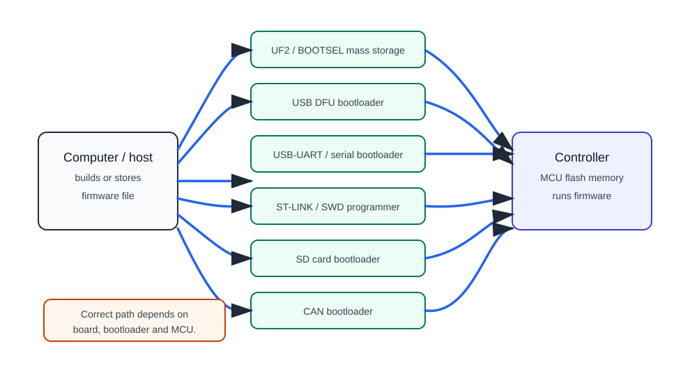

# Flashing des Controllers

Firmware (`firmware`) ist ein Programm, das in den Flash-Speicher eines Mikrocontrollers geschrieben wird. Ohne Firmware weiß das Board nicht, was es mit Pins, Sensoren, Lüftern und Schnittstellen anfangen soll.

Wichtig: Verwirre nicht Firmware und Konfiguration. Firmware wird in den Controller geschrieben. Klipper-Konfiguration lebt normalerweise auf dem Host in `printer.cfg` und teilt dem bereits geflashten MCU mit, welche Pins und Parameter zu verwenden sind.

## Firmware, Bootloader, Konfiguration

Drei verschiedene Konzepte:

- **firmware** - Hauptprogramm des Mikrocontrollers;
- **bootloader** - kleines Programm, das hilft, die Hauptfirmware zu schreiben;
- **config** - Geräteeinstellungen, zum Beispiel `printer.cfg` in Klipper.

Der Bootloader läuft zuerst und kann neue Firmware über USB, UART, DFU, SD-Karte, CAN oder einen anderen Mechanismus akzeptieren. Wenn der Bootloader versehentlich gelöscht wird, kann das Flashing des Boards schwierig werden: Manchmal ist ST-LINK/SWD, USB-UART oder ein anderer Programmer erforderlich.

## Allgemeine Route

Vor dem Flashing ist das normale Verfahren:

1. Lerne das genaue Board-Modell.
2. Lerne den genauen Mikrocontroller.
3. Finde den Pinout, das Schaltschema und die Anleitung des Herstellers.
4. Verstehe, ob eigenständige Firmware oder Klipper MCU-Firmware erforderlich ist.
5. Finde eine vorgefertigte Konfiguration oder ein Beispiel für dieses Board.
6. Wähle die richtige Flashing-Methode.
7. Baue oder lade die richtige Datei herunter.
8. Versetze das Board in den Flashing-Modus.
9. Schreibe die Firmware.
10. Überprüfe, ob das Board im System erscheint.
11. Überprüfe die Kommunikation mit dem Host und die grundlegenden Pins ohne Last.

Du kannst die Firmware-Einstellungen nicht erraten. Bei Klipper sind der Mikrocontroller-Typ, der Bootloader-Offset, die Taktfrequenz und die Kommunikationsschnittstelle besonders wichtig.

## Typische Flashing-Methoden

Unterschiedliche Boards flashen unterschiedlich:



Häufige Varianten:

- **USB-Massenspeicher / UF2** - Board erscheint als Disk, `.uf2` wird darauf kopiert;
- **USB DFU** - Board wechselt in DFU-Modus, Firmware wird über USB geschrieben;
- **USB seriell / UART Bootloader** - Firmware über seriellen Port;
- **ST-LINK / SWD** - Programmer verbindet sich mit SWD-Pins;
- **SD-Karte** - einige 3D-Printer-Boards flashen mit einer Datei auf der Karte;
- **CAN/Katapult/CanBoot** - Firmware über CAN-Bootloader;
- **Arduino Bootloader** - Sketch-Flashing über Arduino IDE oder avrdude.

Es gibt keine universelle Methode für alle Boards. Die Methode wird durch das spezifische Board, den Bootloader und die Firmware bestimmt.

## RP2040 und UF2

Bei Raspberry Pi Pico und vielen RP2040-Boards ist der einfachste Weg `BOOTSEL` und UF2.

Üblicherweise:

1. Halte `BOOTSEL`.
2. Verbinde USB.
3. Board erscheint als `RPI-RP2` Disk.
4. Kopiere `.uf2` Datei.
5. Disk verschwindet, Board startet neu.

Picos BOOTSEL ist im Mikrocontroller ROM, daher kann es durch normales Flashing nicht versehentlich gelöscht werden. Dies macht RP2040 praktisch für Anfänger.

## STM32: DFU, ST-LINK, SD-Karte

STM32-Boards flashen auf verschiedene Weise.

Mögliche Optionen:

- eingebauter USB DFU Bootloader;
- UART Bootloader;
- ST-LINK/SWD;
- SD-Karte auf Printer Board;
- Board-Hersteller Bootloader;
- CAN Bootloader.

Bei STM32 ist der Bootloader-Offset oft wichtig. Wenn der Bootloader zum Beispiel die erste `8 KiB` benötigt, muss Klipper mit dem korrekten Offset gebaut werden. Wenn falsch gewählt, startet das Board nach dem Flashing möglicherweise nicht.

ST-LINK/SWD ist als eine tiefergehende Option nützlich: Es kann oft ein Board wiederherstellen, wenn der normale Bootloader nicht funktioniert. Dies erfordert aber SWD-Pins, einen Programmer und das Verständnis der Verbindung.

## Klipper: make menuconfig

Bei Klipper-Firmware machst du normalerweise:

```bash
cd ~/klipper
make menuconfig
make
```

In `make menuconfig` wählst du:

- Mikrocontroller-Architektur;
- Prozessor-Modell;
- Bootloader-Offset;
- Taktfrequenz;
- Kommunikationsschnittstelle: USB, seriell, CAN, usw.;
- manchmal zusätzliche Parameter für spezifisches Board.

Die korrekten Werte sind oft in Kommentaren am Anfang einer vorgefertigten Konfigurationsdatei für das Board geschrieben. Falls eine solche Konfiguration existiert, lies zuerst die Kommentare oben.

Nach dem Build erscheint die Firmware-Datei normalerweise in `~/klipper/out/`. Als nächstes wird sie mit der Methode geschrieben, die für das spezifische Board geeignet ist.

## Überprüfung nach dem Flashing

Nach dem Flashing musst du mehr als nur „Flasher hat erfolgreich geschrieben" überprüfen.

Überprüfe:

- erscheint das Gerät im System;
- ist `/dev/serial/by-id/...` vorhanden, wenn USB/seriell verwendet wird;
- ist `canbus_uuid` sichtbar, wenn CAN verwendet wird;
- passt der Pfad zu `printer.cfg`;
- gibt es keine Kommunikationsfehler in Klipper;
- stimmen die Pins mit dem Pinout dieses spezifischen Boards überein;
- funktionieren grundlegende Ein-/Ausgänge ohne Lastversorgung;
- sind Lüfter/MOSFET/SSR im sicheren Zustand ausgeschaltet.

Für die erste Überprüfung verbinde nicht den Heizer als endgültige Last. Überprüfe zuerst die Kommunikation, Sensoren und Logik unter sicheren Bedingungen.

## Was vor dem Flashing zu speichern ist

Vor dem Ändern der Firmware ist es nützlich zu speichern:

- aktuelle `printer.cfg`;
- alte Firmware-Version, falls verfügbar;
- Board-Modell und Mikrocontroller;
- gefundener serieller Pfad oder CAN UUID;
- Foto der Verbindungen;
- Pinout;
- `make menuconfig` Einstellungen;
- Link zu Hersteller-Anleitung.

Falls etwas schiefgeht, helfen diese Daten, schnell wiederhergestellt zu werden.

## Was kann schiefgehen

Häufige Probleme:

- USB-Kabel ist nur zum Laden;
- Board wechselte nicht in den Bootloader;
- falcher Mikrocontroller ausgewählt;
- falscher Bootloader-Offset ausgewählt;
- falsche Kommunikationsschnittstelle ausgewählt;
- Firmware geschrieben, aber Board wird an der falschen Stelle gesucht;
- serieller Pfad ändert sich nach Wiederverbindung;
- SD-Karte wird nicht vom Board gelesen;
- Firmware-Datei für Board-Bootloader falsch benannt;
- DFU/USB-UART-Treiber nicht installiert;
- Board wird von zwei Seiten mit Strom versorgt;
- nach dem Flashing verweist Konfiguration auf alte Pins.

Ändere nicht alles als Reaktion auf den ersten Fehler. Besser ist es, Schritt für Schritt zu gehen: Kabel, Bootloader-Modus, MCU-Modell, Build-Einstellungen, Schreib-Methode, System-Geräteerscheinung, Konfiguration.

## Flashing und Sicherheit

Firmware kann Ausgänge ein- und ausschalten, ersetzt aber nicht die Hardware-Sicherheit.

Für Heizer brauchst du:

- richtigen Power-Schalter;
- Sicherung;
- unabhängigen Wärmeschutz;
- korrekten Temperatursensor;
- sichere Gehäuse;
- Überprüfung des Verhaltens bei Firmware-Fehler, MCU-Aufhängung oder verlorener Kommunikation.

Nach dem Flashing des Controllers, verbinde den Heizer nicht, ohne zu überprüfen, dass der Pin richtig gewählt ist, die Ein-Logik nicht invertiert ist und die Sicherheitsgrenzen funktionieren.

## Typische Fehler

- Verwechselung von Firmware und `printer.cfg`;
- Flashing einer Datei von einem ähnlichen aber anderen Board;
- Nicht lesen von Kommentaren am Anfang einer vorgefertigten Klipper-Konfiguration;
- falsch gewählter Bootloader-Offset;
- Bootloader löschen, ohne die Konsequenzen zu verstehen;
- Verwendung eines reinen USB-Ladekabels;
- Board nicht in den Flashing-Modus versetzen;
- CAN-Board in `/dev/serial/by-id` suchen;
- USB-serielles Board über `canbus_uuid` suchen;
- Power-Last verbinden, bevor Pins überprüft sind;
- alte Konfiguration nicht speichern.

## Wichtigste Erkenntnisse

Firmware ist das Programm im Controller, Konfiguration sind die Betriebseinstellungen. Für jedes Board musst du das genaue Modell, den Mikrocontroller, den Bootloader, die Flashing-Methode und die Build-Parameter kennen.

Bei RP2040 ist UF2/BOOTSEL normalerweise am einfachsten. Bei STM32 überprüfe das spezifische Board: DFU, ST-LINK, SD-Karte, UART oder CAN Bootloader. Bei Klipper finde zuerst eine vorgefertigte Konfiguration und Kommentare für `make menuconfig`.

## Verwandte Materialien

- [Klipper: Installation - Building and flashing the micro-controller](https://www.klipper3d.org/Installation.html#building-and-flashing-the-micro-controller) - offizielle Route für `make menuconfig`, `make` und Überprüfung des seriellen Pfads.
- [Klipper: Bootloaders](https://www.klipper3d.org/Bootloaders.html) - warum Bootloader zwischen Boards unterscheiden, warum Bootloader-Offset erforderlich ist und wie verschiedene MCUs geflasht werden.
- [Raspberry Pi Documentation: Pico-series microcontrollers](https://www.raspberrypi.com/documentation/microcontrollers/raspberry-pi-pico.html) - BOOTSEL, UF2 und Pico/RP2040/RP2350 Besonderheiten.
- [Raspberry Pi Documentation: C/C++ SDK - Your First Binaries](https://www.raspberrypi.com/documentation/microcontrollers/c_sdk.html#your-first-binaries) - offizielles Beispiel von BOOTSEL, USB-Massenspeicher `RPI-RP2` und Pico-Flashing über UF2.
- [STMicroelectronics: STM32CubeProgrammer](https://www.st.com/en/development-tools/stm32cubeprog.html) - offizielles STM32-Tool zum Flashing über ST-LINK/SWD, UART, USB DFU, SPI, I2C und CAN Bootloader.
