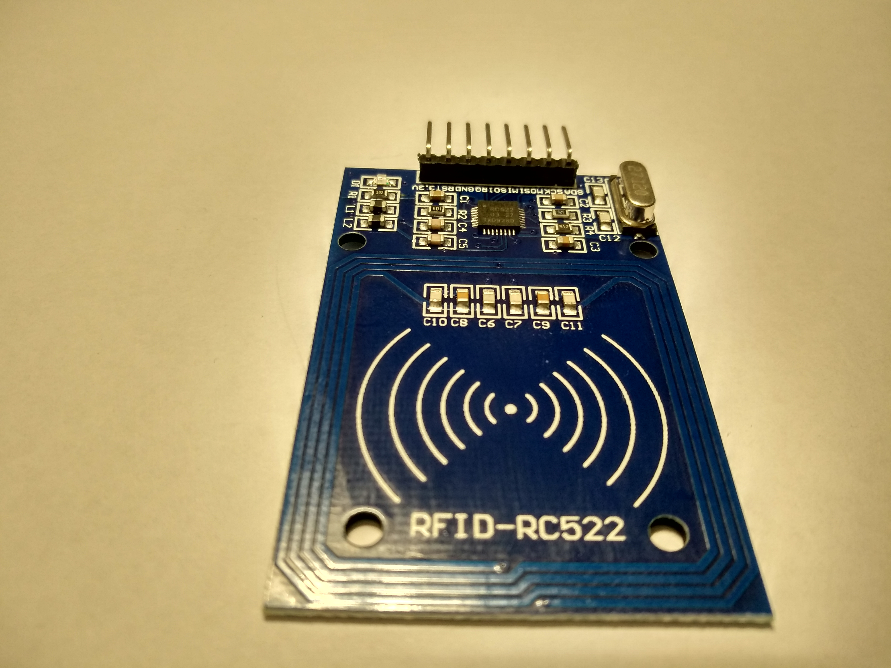

# RFID-Lesegerät anschließen

Ein RFID/NFC-Lesegerät ermöglicht es dir, eine Karte, einen Tag oder eine Fernbedienung ohne drahtlose Verbindung zu lesen.

In Geräten wie iDryer kann dies für die Spulenidentifikation, Materialprofilauswahl, Servicezugang oder Experiments zur Verfolgung von Verbrauchsmaterialien nützlich sein.

Hauptfehler: Kaufe ein „RFID-Modul" und gehe davon aus, dass jede Karte aus jeder Entfernung auf jedem Controller gelesen wird. In Wirklichkeit musst du Frequenz, Tag-Typ, Schnittstelle, Stromversorgung, Logikpegel und Antennenplatzierung überprüfen.

## Beliebte Module

Häufig verwendete sind:

- RC522 / MFRC522;
- PN532;
- vorgefertigte USB/UART RFID-Lesegeräte;
- NFC-Module mit I2C, SPI oder UART.

Bei einfachen 3D-Drucker-Projekten sind 13.56 MHz Module und Tags am häufigsten: Karten, Fernbedienungen, NTAG/MIFARE-kompatible Tags.

## Was vor dem Anschließen zu überprüfen ist

Vor dem Anschließen überprüfe:

- Modul-Frequenz;
- unterstützte Karten- und Tag-Typen;
- Schnittstelle: SPI, I2C oder UART;
- Versorgungsspannung;
- Logikpegel;
- Board-Pinout;
- Schnittstellen-Auswahl über Jumper oder Lötrückstände;
- Leseentfernung;
- Anforderungen an Antenne und Platzierung.

Falls das Modul für `3.3V` bewertet ist, kannst du es nicht einfach mit `5V` Logik verbinden ohne zu überprüfen. Einige Boards haben Spannungsregler, aber fehlende Pegelverschächtelung auf Signalleitungen.

## RC522: typische SPI-Verbindung

Billige RC522-Module laufen normalerweise auf `3.3V` und verbinden sich am häufigsten über SPI.

Typische Leitungen:

- `VCC` - `3.3V` Stromversorgung;
- `GND` - Masse;
- `SCK` - SPI-Taktsignal;
- `MOSI` - Daten vom Controller zum Modul;
- `MISO` - Daten vom Modul zum Controller;
- `SDA`, `SS` oder `CS` - SPI-Chipauswahl;
- `RST` - Zurücksetzen;
- `IRQ` - Unterbrechung, oft in einfachen Projekten ungenutzt.

*Quelle: [Wikimedia Commons](https://commons.wikimedia.org/wiki/File:RFID-RC522_photo.jpg), Giacomo Alessandroni, CC BY-SA 4.0*

Pin-Namen können unterschiedlich sein. Zum Beispiel auf RC522 bedeutet Pin `SDA` oft `SS`/`CS` für SPI, nicht die I2C `SDA`-Leitung. Dies ist eine häufige Quelle der Verwirrung.

## PN532: SPI, I2C oder UART

PN532 ist ein flexibleres Modul. Je nach Board kann es funktionieren über:

- SPI;
- I2C;
- UART.

Aber du kannst nicht einfach beliebige Pins verbinden. Bei vielen PN532 Boards wird die Schnittstelle über Jumper, DIP-Schalter oder Lötbrücken ausgewählt.

Vor dem Anschließen überprüfe:

- welche Schnittstelle ist auf dem Board physisch ausgewählt;
- welche Pins passen zur gewählten Schnittstelle;
- ob Pull-up-Widerstände für I2C erforderlich sind;
- ob Pull-up oder Reset-Pin erforderlich ist;
- ob Logikpegel mit dem Controller kompatibel sind.

Falls das Board „3.3V Logik" sagt, verbinde es nicht direkt mit 5V GPIO.

## Gemeinsame Masse

Wie bei anderen Modulen wird eine gemeinsame Masse benötigt.

Falls das RFID-Modul von einer Quelle versorgt wird und der Controller von einer anderen, muss deren `GND` verbunden sein.

Ohne gemeinsame Masse funktioniert SPI/I2C/UART möglicherweise nicht oder funktioniert instabil.

## Tag muss zum Lesegerät passen

RFID/NFC ist kein einziger universeller Standard.

Ein Modul kann physisch nur Tags lesen, die von seinem Chip und der Bibliothek unterstützt werden.

Überprüfe:

- Tag-Frequenz;
- Karten- oder Fernbedienungstyp;
- unterstützt das Modul MIFARE, NTAG, ISO14443A oder den erforderlichen Typ;
- musst du nur UID lesen oder auch Daten lesen/schreiben;
- unterstützt die gewählte Bibliothek die erforderliche Operation.

Für einfache Materialprofilauswahl reicht oft das Lesen der Tag-UID und das Speichern der UID -> Material-Zuordnung in Firmware oder Host.

## Leseentfernung

Die Leseentfernung für kleine RFID/NFC-Module ist normalerweise kurz.

Ergebnisse hängen ab von:

- Antennengröße;
- Tag-Typ;
- Tag-Ausrichtung;
- Entfernung;
- Gehäuskunststoff;
- nahes Metall;
- Störungen;
- Modul-Stromversorgung.

Metall in der Nähe der Antenne kann das Lesen drastisch verschlechtern. Falls das Lesegerät in einem Trockner, einer Kammer oder einem Spulenhalter montiert ist, teste die Entfernung in der echten Baugruppe, nicht nur auf der Werkbank.

## Wo wird das Lesegerät platziert?

Bei einer Filamentspule ist es am besten, das RFID/NFC-Lesegerät dort zu platzieren, wo der Benutzer absichtlich den Tag bringt.

Entwerfe nicht eine Logik, die davon ausgeht, dass der Tag immer automatisch gelesen wird.

Praktische Optionen:

- „Tag hier einbringen" Zone auf dem Gehäuse;
- Stelle in der Nähe des Spulenhalters;
- Service-Zone für Zugangskarte;
- separates Panel mit kurzer Leseentfernung.

Falls der Tag auf der Spule ist, teste mit verschiedenen Spulen, verschiedenen Tag-Ausrichtungen, unterschiedlichem Kunststoff und Metallnähe.

## Erste Inbetriebnahme

Vor der Integration:

1. Verbinde das Modul auf der Werkbank.
2. Führe ein Beispiel aus der Bibliothek für dein Modul aus.
3. Überprüfe, dass die Karte oder der Tag stabil gelesen wird.
4. Notiere die UID mehrerer Tags.
5. Überprüfe, dass nicht unterstützte Karten die Logik nicht beschädigen.
6. Montiere das Modul im Gehäuse und teste erneut.

In diesem Stadium baue nicht sofort komplexe Profilsysteme. Erreiche zunächst stabiles UID-Lesen.

## Beispielgeräte-Logik

Für Materialprofil kann einfache Logik sein:

1. Benutzer bringt Tag.
2. Gerät liest UID.
3. UID wird in einer Tabelle nachgeschlagen.
4. Falls UID bekannt ist, wird Materialprofil ausgewählt.
5. Falls UID unbekannt ist, fordert das Gerät die manuelle Profilauswahl auf.

RFID sollte nicht die einzige Kontrolrmethode sein. Du brauchst ein manuelles Backup: Profil im Menü, Schaltfläche, Bildschirm oder Interface-Einstellung.

## Was nach dem Zusammenbau zu überprüfen ist

Überprüfe:

- Modul empfängt richtige Spannung;
- Logikpegel sind mit dem Controller kompatibel;
- richtige Schnittstelle ist ausgewählt;
- `MOSI`, `MISO`, `SCK`, `CS` werden nicht für SPI vertauscht;
- `SDA`, `SCL` werden nicht für I2C vertauscht;
- `TX` und `RX` sind für UART korrekt gekreuzt;
- gemeinsame Masse existiert;
- Reset/IRQ werden wie von der Bibliothek benötigt verbunden;
- Tags des richtigen Typs werden gelesen;
- Leseentfernung ist im Gehäuse normal;
- Metall und Drähte blockieren nicht die Antenne;
- Gerät funktioniert normal, wenn Tag nicht gelesen wird.

## Häufige Fehler

- Verbindung von 3.3V RC522 mit 5V Stromversorgung oder 5V Logik;
- Verwechselung von RC522 `SDA` mit I2C `SDA`;
- Vergessen von `CS`/`SS` auf SPI;
- Vertauschung von `MOSI` und `MISO`;
- Auswahl einer Schnittstelle auf PN532 mit Jumpern, aber Verdrahtung einer anderen;
- Verwendung eines nicht unterstützten Kartentyps;
- Antennenplatzierung direkt neben Metall;
- Test der Leseentfernung auf der Werkbank, aber nicht im Gehäuse;
- RFID als einzige Profilwahlmethode einsetzen;
- wichtige Logik nur in UID speichern ohne Lesefehlerüberprüfung.

## Wichtigste Punkte

- RFID/NFC-Modul muss für spezifische Tags und Schnittstelle gewählt werden.
- RC522 benötigt normalerweise `3.3V` und SPI.
- PN532 kann über SPI, I2C oder UART funktionieren, aber die Schnittstelle muss auf dem Board ausgewählt werden.
- Gemeinsame Masse ist erforderlich.
- Metall in der Nähe der Antenne kann das Lesen stark verschlechtern.
- Für Materialprofile reicht Tag-UID oft aus, aber manuelle Backup-Auswahl ist erforderlich.
- Teste im echten Gehäuse, nicht nur auf der Werkbank.

## Weiterführende Lektüre

- [Adafruit: PN532 RFID/NFC Breakout Wiring](https://learn.adafruit.com/adafruit-pn532-rfid-nfc/breakout-wiring) - PN532-Verbindung, SPI/I2C/UART-Auswahl und 3.3V Logik-Warnungen.
- [Adafruit: PN532 RFID/NFC guide, single page](https://learn.adafruit.com/adafruit-pn532-rfid-nfc?view=all) - vollständiger PN532-Leitfaden, Verdrahtung, CircuitPython, Raspberry Pi und Schnittstellenauswahl.
- [Adafruit PN532 product page](https://www.adafruit.com/product/364) - PN532 Fähigkeiten, NFC/RFID-Tag-Unterstützung und 3.3V UART/I2C/SPI-Schnittstellen.
- [NXP: MFRC522 Standard performance MIFARE and NTAG frontend](https://www.nxp.com/products/rfid-nfc/nfc-hf/nfc-readers/standard-performance-mifare-and-ntag-frontend:MFRC52202HN1) - offizielle MFRC522/RC522-Seite für 13.56 MHz MIFARE/NTAG-Szenarien.
- [DigiKey: MFRC522 Datasheet by NXP](https://www.digikey.com/htmldatasheets/production/993456/0/0/1/mfrc522.html) - MFRC522 technisches Datenblatt: unterstützte Karten, Stromversorgung, Kommunikationsschnittstellen mit Controller und Antenne/Stromversorgungs-Effekte auf die Entfernung.
