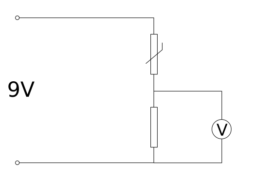

# Thermistors

A thermistor is a temperature sensor whose resistance changes when heated or cooled. In 3D printers, dryers and small heating devices, it's often used as feedback to control the heater.

The most common option in the 3D printing community is NTC thermistor `100K`. NTC means that as temperature rises, resistance decreases. `100K` usually means about `100 kOhm` at `25°C`.

## Where It's Used

Thermistors are used to measure temperature of:

- hotend;
- heated bed;
- printer chamber;
- filament dryer;
- air duct;
- heating module;
- electronics area, if simple overheat protection is needed.

In a device with a heater, a thermistor is not a decorative sensor. It determines when the controller reduces power, disables heating or stops with an error.

## NTC 100K, Beta and Lookup Tables

Different thermistors may look the same but have different characteristics.

Important parameters:

- resistance at `25°C`, for example `100 kOhm`;
- type: NTC or PTC;
- Beta, for example `3950K`;
- resistance/temperature lookup table;
- operating temperature range;
- accuracy;
- package: glass bead, cartridge, screw sensor, sheath;
- wire insulation.

If the firmware selects the wrong sensor type, temperature will be displayed incorrectly. The error can be small at room temperature and dangerous at operating temperature.

So the phrase "100K thermistor" is not always enough. For the firmware, a specific model or at least the right Beta/table matters.

## How the Controller Measures Temperature

A thermistor is usually connected to an analog input through a voltage divider with a pull-up resistor. The controller measures voltage, converts it to resistance, then uses a lookup table or formula to get temperature.

*Source: [Wikimedia Commons](https://commons.wikimedia.org/wiki/File:Thermistor_potential_divider.svg), Sjlegg, Public Domain*

In Klipper, this is set through `sensor_type`, `sensor_pin`, sometimes `pullup_resistor` or a custom `[thermistor]` section.

In Marlin, the thermistor type is selected through sensor configuration parameters and temperature limits.

For the user, the key takeaway is simple: the firmware must know exactly the sensor type that's installed in the device.

## Open Circuit and Short Circuit

A thermistor and its wiring can fail.

Typical symptoms:

- broken wire;
- poor connector contact;
- wires short together;
- damaged insulation;
- sensor slipped out of sheath;
- wire abraded in a moving part;
- sensor shows room temperature even though heating is happening.

Firmware usually has protections like `MINTEMP`, `MAXTEMP`, heating verification and thermal runaway protection. But these protections only work if the sensor and firmware are set up correctly, and the power part can actually be switched off.

If a sensor falls off the heater but stays electrically connected, this is especially dangerous: the firmware may see "low temperature" and keep heating.

## Thermal Contact

Thermistor mounting is often more important than it seems.

The sensor should measure the temperature of the place you actually need to control. For a hotend, it's the heating block. For a bed, it's the surface or a place related to the actual bed temperature. For an air heater, it's a point chosen by safety and control logic.

Thermal contact is affected by:

- sensor pressure;
- thermal paste;
- mounting hole;
- sheath;
- screw mounting;
- gap;
- material around the sensor;
- wire condition;
- contamination or dried paste;
- vibration and loose mounting.

If a thermistor just touches a part sideways, it may respond slowly and show the wrong temperature. The PID controller then gets delayed information, and temperature may overshoot or exceed the target.

## Sensor Package

Thermistors come in different packages.

Glass bead:

- cheap;
- tiny;
- requires careful mounting;
- easy to damage wire or insulation.

Cartridge thermistor:

- easier to insert into the heating block hole;
- usually mechanically more stable;
- important to match diameter and length.

Screw thermistor:

- easily mounts to a metal surface;
- can give good contact if installed properly;
- must not overtighten or damage the wire.

Sensor in sheath:

- convenient for air, liquid or enclosure;
- responds slower if the sheath is massive;
- proper installation point is important.

Package choice depends on what is being measured and how the sensor will be serviced.

## Multimeter Check

Basic checking can be done with a multimeter in resistance mode. Detailed procedure is in the practical article: [Checking a thermistor](../06-practical-guides/02-checking-thermistor.md).

For a typical NTC `100K` at room temperature around `25°C`, you expect about `100 kOhm`. The exact value depends on temperature and tolerance.

When heated with fingers, NTC resistance should decrease. If the multimeter shows open circuit, short circuit, or the value jumps when you move the wire, first check the connector and wiring.

Multimeter checking doesn't replace calibration and doesn't prove accuracy at `200°C`, but it quickly shows an obvious open, short or wrong sensor type.

## What to Check Before Buying

Before buying a thermistor, check:

- resistance at `25°C`;
- Beta or exact model;
- compatibility with firmware;
- operating temperature range;
- sensor package;
- wire length and material;
- connector type;
- mounting method;
- whether you need a cartridge, screw, sheath or glass bead;
- whether the sensor fits your heating block or installation location;
- availability of technical description or clear information.

For a hotend, it's better to get a sensor that mechanically fits the specific block. For a chamber or dryer, the installation location, wire protection and measurement stability in airflow matter more.

## Typical Errors

- wrong `sensor_type` selected;
- thinking any `100K` thermistor is the same;
- sensor is poorly pressed;
- no proper thermal contact;
- sensor slipped out of sheath;
- wire rubbed or broke at the sensor body;
- connector contact is poor;
- wiring next to power lines unnecessarily;
- thermistor measures air but controller thinks it measures the heater;
- firmware set without reasonable `min_temp` and `max_temp`;
- heater on without independent hardware protection.

## Main Point

A thermistor is feedback for a heater. It's important not just to buy "100K NTC", but to select the right type in firmware, mount the sensor in the right place and check the wiring.

Poor thermal contact or wrong `sensor_type` can be more dangerous than a completely dead sensor, because the system keeps working but makes decisions on wrong temperature.

## Reference Materials

- [Klipper Configuration Reference: Temperature sensors](https://www.klipper3d.org/Config_Reference.html#temperature-sensors) - official `sensor_type`, `pullup_resistor`, custom `[thermistor]` and temperature sensors in Klipper.
- [Marlin Configuration: Temperature Ranges and Thermal Protection](https://marlinfw.org/docs/configuration/configuration.html#temperature-ranges) - temperature limits, `MINTEMP`, `MAXTEMP` and thermal protection.
- [Vishay: NTC Thermistors](https://www.vishay.com/en/thermistors/ntc/) - NTC thermistor parameters: resistance at `25°C`, Beta, tolerance and operating range.
- [RepRap Europe: Thermistor NTC100K](https://www.reprap-3d-printer.com/product/335-thermistor-ntc100k) - example of typical 3D printer NTC `100K` with Beta `3950` and `100 kOhm` at `25°C`.
- [RepRap Europe: Thermistor Cartridge 100k HT-NTC B3950](https://reprap.eu/produto/?id=1245&nome=Thermistor+Cartridge+100k+HT-NTC+B3950) - example of cartridge thermistor for heating block and mechanical mounting.
