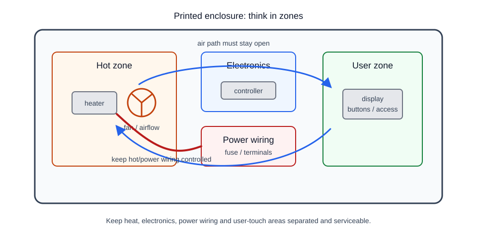

# 3D printing

This section is not a 3D printing course.

It serves a different purpose: to help understand which printed parts can be used safely in a homemade device, and which become a risk near heaters, electronics, wiring, and moving parts.

In iDryer-like projects, 3D printing is typically used for:

- enclosures;
- covers;
- air ducts;
- fan brackets;
- sensor holders;
- guides;
- handles and clips;
- decorative or service panels.

Printing a part is easy. Making it work safely in a warm enclosure for months is harder.

## Key questions

Before printing a part for a device, you must answer not just "will the STL fit in the slicer", but several questions:

- where will the part be located;
- what temperature will be there;
- is there a heater nearby;
- is there 110-230V AC nearby;
- will the part hold a load;
- will it contact wires;
- will it direct hot air;
- can it be replaced or serviced;
- what happens if it deforms.

If deformation of a part can shift a sensor, block airflow, bring a wire closer to a hot area, or loosen a heater mounting, it is no longer just a "cosmetic defect".

## STL is not an assembly instruction

STL describes the shape of a part, but does not tell you:

- what material to print it from;
- what orientation to print it in;
- how many walls to use;
- what infill to apply;
- where supports are needed;
- what screws to use;
- what temperature the part will withstand;
- in what direction it will be weaker.

The same model can be a normal cover or a poor structural bracket depending on the material, orientation, and working conditions.

Therefore, a working part needs not just an STL, but also context: material, print settings, installation location, load, and temperature regime.

## Material is more important than appearance

For a prototype, PLA often works. It prints easily and produces a nice-looking part.

But for parts near heat, PLA is a poor choice. The problem is not that it will melt immediately, but that it can gradually lose rigidity and shape at temperatures found in a closed enclosure or near a heater.

For working parts around a dryer, chamber, or heater, you typically consider:

- ABS;
- ASA;
- more heat-resistant engineering materials, if you have experience and a suitable printer.

Material is chosen based on conditions:

- working temperature;
- rigidity;
- impact resistance;
- shrinkage and deformation;
- smell and emissions during printing;
- behavior when heated;
- manufacturer documentation.

## Temperature inside an enclosure

Temperature inside a closed enclosure differs from room temperature.

Even if the heater does not touch the plastic, a part can be:

- in a hot airstream;
- near the heater;
- near a heat sink;
- near the power supply;
- in an area with poor ventilation;
- on a wall that heats up slowly.

Therefore, you cannot assess safety with just the phrase "the part does not touch the heater". You need to understand what temperature will be in that location during extended operation.

## Strength depends on layer direction

FDM parts are not equally strong in all directions.

Layer direction affects how a part breaks:

- along the plastic lines it is usually stronger;
- between layers it is often weaker;
- thin posts and clips can break between layers;
- screws can delaminate a part if geometry is not designed for it.

For structural brackets, it is important to think about where the load will go.

If a fan holder simply hangs on a wall, that is one thing. If a bracket holds a heater or a spool axis, print orientation and wall thickness become important.

## Enclosure must be serviceable

A good enclosure is not just a pretty box.

It must allow:

- access to terminals;
- replacement of a fan;
- inspection of a temperature sensor;
- tightening of fasteners;
- removal of a controller;
- replacement of a wire;
- seeing if something has overheated or darkened.

If you need to disassemble half the device to access a fuse or terminal, it will be serviced less often. This is poor engineering practice.

## Printed part must not compromise safety

A printed enclosure can be useful, but it must not turn a small mistake into a dangerous situation.

Bad scenarios:

- heater bracket softened;
- air duct warped and airflow through heater decreased;
- thermistor holder shifted;
- wire rubbed against a sharp edge;
- terminal ended up tight against plastic;
- cover blocked ventilation of the power supply;

For hot and load-bearing zones, it is better to think this way: if a printed part deforms, the device should either remain safe or enter an error state, not continue heating blindly.

## What will be in this section

The section covers several practical topics:

- `02-what-is-stl.md` - why STL does not contain material, orientation, strength, or assembly instructions.
- `03-materials-petg-abs-asa.md` - basic choices between PETG, ABS, and ASA.
- `04-heat-resistant-materials.md` - how to think about parts near heat.
- `05-enclosure-design.md` - enclosure zones, ventilation, fastening, access, and wiring.
- `06-why-pla-is-risky.md` - why PLA is convenient for prototypes but risky near heat.

## What this section does not do

There will be no complete 3D printing course here.

We will not dive into:

- all plastics in the world;
- retraction settings;
- decorative post-processing;
- artistic models;
- perfect printer calibration;
- specific filament brand selection.

The focus is simple: parts for a real device must be strong enough, heat-resistant, serviceable, and safe.

## Key takeaways

- STL is only geometry, not safe assembly instructions.
- Material is chosen based on working temperature and load, not appearance.
- PLA is convenient for prototypes but risky near heat.
- Print orientation affects strength.
- Enclosure should separate the hot zone, electronics, power wiring, and user zone.
- A printed part should not be the only thing protecting device safety.

## References

- [Prusa Knowledge Base: Material guide](https://help.prusa3d.com/category/material-guide_220) - overview of popular materials, print conditions, and properties.
- [Prusa Knowledge Base: PLA](https://help.prusa3d.com/article/pla_2062) - description of PLA as a simple material for prototypes and parts without high temperature load.
- [Prusa Knowledge Base: Enclosure guidepost](https://cdn.help.prusa3d.com/article/enclosure-guidepost_366332) - why a closed print chamber is needed and how ambient temperature affects printing and materials.
- [Bambu Lab: 3D Printer Filament Comparison Guide](https://bambulab.com/en-us/filament-guide) - comparative table of materials, including PLA, PETG, ABS, ASA, and engineering plastics.
- [Makelab: Is 3D printing strong enough for functional parts?](https://help.makelab.com/help/article/is-3d-printing-strong-enough-for-functional-parts) - practical notes on material, print orientation, walls, infill, and functional parts.
