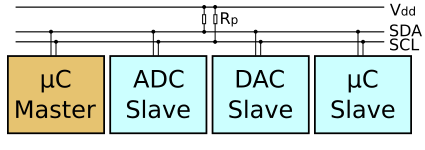

# Interfaz I2C

I2C es una interfaz de comunicación para pequeños microchips y módulos cerca del controlador. Expansión: `Inter-Integrated Circuit`. En la documentación se suele ver `bus I2C`.

Idea principal: varios dispositivos pueden conectarse a las mismas dos líneas de señal `SDA` y `SCL` si tienen direcciones diferentes.

## Dónde se usa I2C

En dispositivos sencillos alrededor de una impresora 3D, I2C se usa frecuentemente para:

- Pantallas OLED;
- sensores de temperatura, humedad, presión y luz;
- relojes en tiempo real;
- expansores GPIO;
- algunos encoders y módulos de botones;
- multiplexores I2C;
- algunos módulos RFID/NFC;
- pequeñas placas auxiliares.

I2C funciona bien para conexiones cortas dentro de una misma carcasa. Para cables largos a lo largo de toda la impresora o cerca de líneas de alimentación, se vuelve más arriesgado.

## SDA, SCL, alimentación y GND

Un módulo I2C suele tener 4 contactos:

- `VCC` o `VIN` - alimentación;
- `GND` - masa común;
- `SDA` - datos;
- `SCL` - señal de reloj.

Un circuito con varios dispositivos tiene este aspecto:



*Fuente: [Wikimedia Commons](https://commons.wikimedia.org/wiki/File:I2C.svg), Cburnett, CC BY-SA 3.0*

Todos los dispositivos en el mismo bus I2C se conectan al mismo `SDA`, `SCL` y `GND`. La alimentación puede ser común, pero su tensión y niveles lógicos deben verificarse para cada módulo.

## Direcciones de dispositivos

Cada dispositivo I2C tiene una dirección. Por ejemplo, las pantallas OLED pequeñas suelen usar `0x3C`, algunos sensores usan `0x76`, `0x77`, `0x68`, `0x69`, etc.

Si dos dispositivos en el mismo bus tienen la misma dirección, el controlador no puede direccionarlos individualmente de forma correcta.

Qué hacer ante conflictos de dirección:

- cambiar la dirección mediante jumper o puente de soldadura, si el módulo lo permite;
- seleccionar una variante diferente del módulo;
- usar un multiplexor I2C;
- distribuir los dispositivos en diferentes buses I2C, si el controlador y el firmware lo permiten.

La dirección se indica frecuentemente en formato hexadecimal (`hex`): `0x3C`. Pero algunos firmware o configuraciones pueden requerir formato decimal (`decimal`). Por ejemplo, `0x3C` en decimal es `60`. Hay que verificar la documentación del sistema concreto.

## Resistencias de pull-up

Las líneas I2C funcionan a través de resistencias de pull-up. Los dispositivos en el bus normalmente pueden poner `SDA` o `SCL` a nivel bajo, y el nivel alto proviene del pull-up hacia la alimentación lógica.

Sin pull-ups, el bus puede no funcionar. Pero demasiados módulos con sus propios pull-ups en un mismo bus también puede ser un problema: la resistencia total se vuelve demasiado pequeña, las líneas se cargan más, y los flancos y niveles de señal pueden degradarse.

En la práctica:

- muchas pantallas OLED y placas de sensores ya llevan resistencias de pull-up;
- en un bus corto y sencillo esto suele funcionar de inmediato;
- si hay muchos dispositivos, hay que revisar los esquemas del módulo y los pull-ups totales;
- si el bus es inestable, una de las primeras comprobaciones son las resistencias de pull-up.

Un valor inicial habitual para un bus independiente es alrededor de `4,7 kOhm`, pero los pull-ups en módulos listos para usar pueden ser diferentes.

## 3,3V y 5V

I2C es especialmente sensible a los niveles de tensión, ya que `SDA` y `SCL` suelen estar conectados a alguna tensión de alimentación mediante pull-up.

ESP32, RP2040 y STM32 suelen operar con lógica de `3,3V`. Arduino Uno/Nano frecuentemente opera con lógica de `5V`.

Situación peligrosa:

- controlador de `3,3V`;
- módulo I2C alimentado desde `5V`;
- las resistencias de pull-up del módulo llevan `SDA` y `SCL` a `5V`.

En este caso, pueden aparecer `5V` en el GPIO del controlador. Esto puede dañar el microcontrolador.

Antes de conectar, verifique:

- con qué tensión se alimenta el módulo;
- a qué nivel están conectados `SDA` y `SCL` mediante pull-up;
- si el módulo tiene convertidor de nivel;
- si el módulo es compatible con un controlador de `3,3V`.

En caso de duda, use alimentación de `3,3V` para módulos I2C o un convertidor de nivel.

## Velocidad

Velocidades I2C típicas:

```text
100000   # standard mode, 100 kHz
400000   # fast mode, 400 kHz
```

Para cables cortos y módulos normales, `400 kHz` suele funcionar. Pero para cables largos, pull-ups débiles, muchos dispositivos o entorno ruidoso, es mejor comenzar con `100 kHz`.

En Klipper, el parámetro `i2c_speed` no está igualmente soportado en todos los MCUs. La documentación indica que muchos microcontroladores usan `100000`, mientras que algunas plataformas soportan `400000`. Por tanto, no se puede escribir una velocidad alta y asumir que realmente se aplica.

## Escáner I2C

Un escáner I2C es un pequeño programa o comando que recorre las direcciones y muestra qué dispositivos responden en el bus.

Ayuda a entender:

- si el controlador ve el módulo;
- cuál es la dirección del dispositivo;
- si `SDA` y `SCL` están intercambiados;
- si hay alimentación y `GND` común;
- si existe un conflicto de direcciones.

Pero el escáner no prueba que el dispositivo funcione completamente. Solo muestra que alguien responde en esa dirección.

## I2C en Klipper

En Klipper, un dispositivo I2C se conecta a un MCU específico.

La configuración puede incluir los siguientes parámetros:

- `i2c_mcu` - a qué MCU está conectado el dispositivo;
- `i2c_bus` - bus I2C por hardware, si hay varios;
- `i2c_software_scl_pin` e `i2c_software_sda_pin` - I2C por software en los pines seleccionados;
- `i2c_address` - dirección del dispositivo;
- `i2c_speed` - velocidad, si está soportada.

Importante: `i2c_address` en Klipper se especifica frecuentemente como número decimal, no en formato hex. Si el datasheet indica `0x3C`, la configuración puede requerir `60`.

Si el dispositivo está conectado a un MCU adicional, también debe especificarse. De lo contrario, Klipper lo buscará en la placa principal.

## Longitud del cable e interferencias

I2C está diseñado para conexiones cortas. Dentro de una carcasa pequeña o en una sola placa, resulta conveniente. En una impresora 3D, las condiciones son peores:

- motores cercanos;
- calentadores cercanos;
- cables largos;
- conectores en puertas;
- líneas de alimentación de ventiladores y calentadores;
- interferencias electromagnéticas.

Reglas prácticas:

- mantener `SDA` y `SCL` cortos;
- rutearlos cerca de `GND`;
- no rutear en paralelo a cables de alimentación de calentadores;
- no hacer cables planos largos hacia partes móviles sin razón justificada;
- reducir la velocidad a `100 kHz` si hay errores;
- usar conectores adecuados y alivio de tensión;
- para conexiones largas, elegir otra interfaz: UART, CAN, RS-485, o un MCU local cerca del sensor.

## Qué verificar antes de conectar

Antes de conectar un módulo I2C, verifique:

- alimentación del módulo;
- nivel lógico;
- a qué nivel están conectados `SDA` y `SCL` mediante pull-up;
- dirección del dispositivo;
- si la dirección puede cambiarse;
- si hay conflicto con otros dispositivos;
- longitud del cable;
- si hay soporte en el firmware;
- a qué MCU y bus se conecta el dispositivo;
- si se necesita I2C por hardware o I2C por software.

## Errores típicos

- `SDA` y `SCL` intercambiados;
- olvidó el `GND` común;
- se aplicaron pull-ups de `5V` a un controlador de `3,3V`;
- dos dispositivos tienen la misma dirección;
- se especificó una dirección hex donde se necesitaba decimal;
- se usaron cables demasiado largos;
- se conectaron muchos módulos con resistencias de pull-up;
- se eligió un módulo no soportado por el firmware;
- se conectó el dispositivo a un MCU adicional pero no se especificó `i2c_mcu`;
- confusión entre I2C e I2S.

## Conclusión principal

I2C es conveniente para pequeñas pantallas, sensores y módulos auxiliares cerca del controlador. Requiere `SDA`, `SCL`, alimentación y `GND` común.

Comprobaciones principales antes de conectar: dirección, niveles `3,3V/5V`, resistencias de pull-up, longitud del cable y soporte en el firmware. En el entorno ruidoso de la impresora, mantenga I2C corto.

## Materiales relacionados

- [SparkFun: I2C at the Hardware Level](https://learn.sparkfun.com/tutorials/i2c/i2c-at-the-hardware-level) - explicación práctica de `SDA`, `SCL`, líneas open-drain y resistencias de pull-up.
- [SparkFun: I2C tutorial](https://learn.sparkfun.com/tutorials/i2c/all) - guía general de I2C, direcciones, varios dispositivos en un bus y características de hardware.
- [Adafruit: STEMMA QT technical specs](https://learn.adafruit.com/introducing-adafruit-stemma-qt/technical-specs) - ejemplo de un conector I2C estandarizado, pinout, alimentación y `GND`.
- [Adafruit: PCA9548 I2C multiplexer](https://learn.adafruit.com/adafruit-pca9548-8-channel-stemma-qt-qwiic-i2c-multiplexer/pinouts) - ejemplo de resolución de conflictos de dirección I2C duplicada mediante multiplexor.
- [Klipper Configuration Reference: common I2C settings](https://www.klipper3d.org/Config_Reference.html) - parámetros `i2c_address`, `i2c_mcu`, `i2c_bus`, I2C por software e `i2c_speed`.
