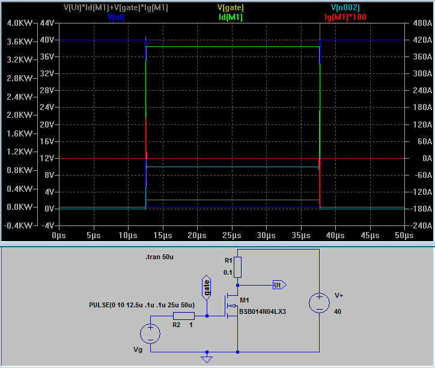

# Conexión de un ventilador

Un ventilador parece ser un componente simple: aplica energía y gira.

En la práctica, los problemas surgen de cuatro cosas:

- seleccionar un ventilador con voltaje incorrecto;
- conectarlo a una salida de controlador débil;
- no entender las diferencias entre ventiladores de 2 pines, 3 pines y 4 pines;
- colocar el ventilador donde le falta presión debido a un filtro, parrilla o conducto.

En dispositivos similares a iDryer, generalmente se necesita un ventilador para circulación de aire, enfriamiento del calentador, escape de cámara, filtración o enfriamiento de electrónica.

## Qué verificar antes de conectar

Antes de conectar, encuentre los parámetros del ventilador:

- voltaje: `5V`, `12V` o `24V`;
- corriente o potencia;
- tipo de conector: 2 pines, 3 pines o 4 pines;
- capacidad de control PWM;
- presencia de señal tacométrica;
- flujo de aire;
- presión estática;
- nivel de ruido;
- temperatura de funcionamiento.

Estos datos se encuentran en una etiqueta, página de producto u hoja técnica.

Por ejemplo, una hoja de datos de ventilador generalmente contiene no solo voltaje y corriente, sino también flujo de aire, presión estática, ruido `SPL dB(A)`, temperatura de funcionamiento y vida útil. Estos son más útiles que seleccionar un ventilador solo por tamaño.

## No alimentar un ventilador desde GPIO

GPIO de un controlador es una señal de control, no una salida de energía.

Nunca alimentar un ventilador directamente desde GPIO. Esto puede dañar el controlador o causar reinicios cuando el ventilador se inicia.

La lógica correcta es:

- el ventilador recibe energía de una fuente de alimentación o salida de energía de la placa;
- el controlador solo gestiona encendido/apagado o velocidad;
- si se utiliza un módulo MOSFET externo, la `GND` de la fuente de alimentación y la `GND` del controlador deben ser comunes.



*Fuente: [Wikimedia Commons](https://commons.wikimedia.org/wiki/File:NMOS_PWR_WHOLE.PNG), KjellElec, CC BY-SA 4.0*

## Opción más sencilla: ventilador de 2 pinos

Un ventilador de 2 pines generalmente tiene solo:

- `+` fuente de alimentación;
- `-` fuente de alimentación.

Si es un ventilador de 24V, conéctelo a 24V. Si es un ventilador de 12V, conéctelo a 12V.

Para controlar el encendido/apagado simple, puede usar:

- una salida de ventilador dedicada en la placa, si se califica para el voltaje y corriente necesarios;
- un módulo MOSFET externo para cargas DC;
- un controlador de ventilador separado.

Si el ventilador debe funcionar continuamente, se puede conectar directamente a una fuente de alimentación apropiada a través de un fusible o línea de alimentación protegida. Pero en un dispositivo con calentador, a menudo es mejor que el ventilador sea controlado por el controlador como parte de la lógica de seguridad.

## Ventilador de 3 pines

Un ventilador de 3 pines generalmente tiene:

- fuente de alimentación;
- tierra;
- señal tacométrica.

La señal tacométrica le permite monitorear las RPM del ventilador. No controla la velocidad por sí sola.

La velocidad de un ventilador de 3 pines generalmente se cambia reduciendo el voltaje de suministro o PWM en la línea de alimentación, si la placa específica y el ventilador lo admiten. Pero este método puede funcionar peor que el PWM de 4 pines adecuado: el ventilador puede chirriar, no puede iniciar a baja velocidad o funcionar de manera inestable.

Si el control de velocidad no es necesario, se puede usar un ventilador de 3 pines como un ventilador de 2 pines normal: la fuente de alimentación y tierra están conectadas, el cable tacométrico no se usa.

## Ventilador PWM de 4 pines

Un ventilador PWM de 4 pines generalmente tiene:

- tierra;
- fuente de alimentación;
- señal tacométrica;
- señal de control PWM.

La diferencia clave: la alimentación del ventilador se aplica continuamente, y la velocidad se establece mediante una señal PWM separada.

Esta es la forma correcta de controlar ventiladores PWM de computadora. No asuma que un ventilador de 4 pines debe controlarse conmutando constantemente la alimentación. Para un ventilador PWM apropiado, la señal de control debe ir a un pin PWM separado.

Los ventiladores PWM de 4 pines de computadora a menudo tienen una entrada de control diseñada para señales open-collector/open-drain con pull-up interno, no para ningún voltaje de GPIO. No aplique `24V` o `24V` al pin PWM. Verifique la documentación del ventilador; si se requiere drenaje abierto/colector abierto, use una salida de transistor apropiada o modo GPIO.

Para muchos ventiladores PWM de 4 pines, la frecuencia PWM típica es alrededor de `25 kHz`. Algunos ventiladores operan en un rango cercano, pero a frecuencia demasiado baja o demasiado alta, pueden comportarse de manera impredecible: correr a velocidad máxima, detenerse o hacer ruido.

Si el cable PWM no está conectado, muchos ventiladores de 4 pines funcionan a velocidad máxima.

## GND común / negativo común

Si el ventilador es alimentado por una fuente de alimentación separada y la señal PWM proviene del controlador, se necesita un `GND` común / negativo común.

Sin un `GND` común, el controlador y el ventilador no tienen un nivel de referencia común. Como resultado, el PWM puede no funcionar o funcionar intermitentemente.

Regla sencilla:

- la alimentación positiva del ventilador proviene de una fuente de alimentación apropiada;
- la alimentación negativa del ventilador está conectada al negativo de la fuente de alimentación;
- la `GND` del controlador está conectada al mismo negativo;
- la señal de control solo funciona con una tierra común.

## Seleccionar un ventilador para la tarea

Para enfriamiento abierto, importa el flujo de aire.

Para un filtro, disipador de calor, parrilla apretada, conducto largo o canal estrecho, la presión estática es más importante.

Entonces, para un filtro de cámara de impresora, un ventilador de carcasa ordinario y silencioso puede ser débil. Soplará bien en aire libre pero apenas presionará aire a través de un filtro HEPA, capa de carbón o canal estrecho.

Pautas:

- para circulación de aire libre, busque `CFM` o `m³/h`;
- para filtros, disipadores y conductos, la presión estática es esencial;
- para operación silenciosa, observe no solo `dB(A)` sino también montaje, parrilla y vibración;
- para una cámara calentada, observe la temperatura de funcionamiento del ventilador.

## Corriente de arranque y margen

Cuando un ventilador se inicia, puede extraer brevemente más corriente que durante el funcionamiento normal.

Si varios ventiladores están conectados a una salida, sus corrientes se suman.

Verifique:

- corriente de salida máxima de la placa;
- corriente de un ventilador;
- corriente total de todos los ventiladores;
- al menos 50% de margen;
- calentamiento de terminales, cables y módulo MOSFET durante operación prolongada.

Por ejemplo, si un ventilador dibuja `0.25A`, cuatro ventiladores así extraen aproximadamente `1A` sin contabilizar corriente de arranque.

## Ejemplo: conexión a través de módulo MOSFET

Circuito típico para ventilador de 12V o 24V:

1. El positivo de la fuente de alimentación va al positivo del ventilador.
2. El negativo del ventilador va a la salida de potencia del módulo MOSFET.
3. El negativo de la fuente de alimentación va al módulo MOSFET.
4. La `GND` del controlador está conectada al negativo de la fuente de alimentación.
5. El pin de control del controlador va a la entrada del módulo MOSFET.

Esto se llama conmutación de lado bajo: el MOSFET rompe el negativo de la carga.

Para un ventilador de 2 pines simple, esta es una opción estándar y clara si el módulo MOSFET se clasifica para el voltaje y corriente necesarios. Para un ventilador de 3 pines/4 pines con tacómetro o entrada PWM separada, "cortar el negativo" no siempre es bueno: monitorear RPM y control PWM nativo generalmente requieren un `GND` común constante.

## Ejemplo de configuración Klipper

Los nombres de pin en ejemplos no son universales. Antes de copiar, verifique la disposición de su placa: un pin incorrecto puede activar la salida incorrecta.

Si el ventilador está conectado a una salida controlada y debe controlarse manualmente:

```ini
[fan_generic chamber_fan]
pin: PA8
max_power: 1.0
shutdown_speed: 0.0
kick_start_time: 0.5
off_below: 0.15
```

Control:

```gcode
SET_FAN_SPEED FAN=chamber_fan SPEED=1.0
SET_FAN_SPEED FAN=chamber_fan SPEED=0.4
SET_FAN_SPEED FAN=chamber_fan SPEED=0
```

Si el ventilador debe encenderse según la temperatura de la cámara:

```ini
[temperature_fan chamber_exhaust]
pin: PA8
max_power: 1.0
shutdown_speed: 0.0
kick_start_time: 2.0
off_below: 0.15
sensor_type: NTC 100K beta 3950
sensor_pin: PA0
min_temp: 0
max_temp: 80
target_temp: 45
control: watermark
```

Los nombres de pin aquí son típicos. En un dispositivo real, verifique la disposición de su placa.

## Qué verificar después de conectar

Antes de operación prolongada, verifique:

- el ventilador gira en la dirección correcta;
- el voltaje coincide con el ventilador;
- el módulo MOSFET no se sobrecalienta;
- los terminales no se sobrecalientan;
- los cables no son demasiado delgados para la corriente elegida;
- el ventilador se inicia después de una parada completa;
- sin chirridos ni atascamientos a baja velocidad;
- el flujo de aire pasa por el área necesaria, no alrededor de ella;
- la parrilla, filtro o carcasa no estrangula el flujo más que lo esperado.

Si el ventilador está cerca de un calentador, pruébelo a la temperatura real de la cámara. Un ventilador que funciona bien en el banco puede degradarse rápidamente en una carcasa caliente.

## Errores comunes

- conectar un ventilador de 12V a 24V;
- conectar un ventilador de 24V a 12V y decidir que está roto;
- alimentar un ventilador desde GPIO;
- olvidar tierra común entre controlador y alimentación externa;
- esperar control PWM de un ventilador de 3 pines;
- controlar un ventilador PWM de 4 pines cortando la alimentación en lugar de usar el pin PWM;
- no contabilizar la corriente total de múltiples ventiladores;
- seleccionar un ventilador por tamaño sin verificar presión estática;
- colocar un ventilador silencioso en un filtro denso y obtener flujo casi cero;
- no verificar la dirección del flujo después de la instalación;
- dejar cables sin asegurar y fraying contra el rodete o carcasa.

## Puntos clave

- El voltaje del ventilador debe coincidir con la fuente de alimentación.
- GPIO no alimenta un ventilador, solo lo controla.
- Para alimentación externa, se requiere tierra común con el controlador.
- Un ventilador de 2 pines es más fácil de controlar a través de una salida de alimentación o MOSFET.
- 3 pines agrega un tacómetro pero no una entrada PWM separada.
- PWM de 4 pines se controla mejor mediante una señal PWM separada, no conmutación de potencia.
- Para filtros y conductos, la presión estática es más importante que un bonito número de `CFM`.
- Después del montaje, verifique no solo la rotación sino el flujo real a través de la construcción.

## Lecturas relacionadas

- [Noctua: Configuración PWM y monitoreo RPM de un ventilador con microcontroladores](https://www.noctua.at/en/support/faqs/microcontroller-guide-pwm-setup-and-rpm-monitoring) - explicación práctica de PWM de 4 pines, señal RPM, tierra común y frecuencia PWM típica.
- [Referencia de configuración de Klipper: Ventiladores](https://www.klipper3d.org/Config_Reference.html#fans) - secciones oficiales `fan`, `heater_fan`, `controller_fan`, `temperature_fan` y `fan_generic`.
- [Documentación de Voron: Temperatura de cámara y ventilador de escape](https://docs.vorondesign.com/community/howto/alchemyEngine/chamber_temperature_exhaust_fan.html) - ejemplo de control del ventilador de escape de cámara por temperatura en Klipper.
- [DigiKey: Selección de un ventilador](https://www.digikey.com/en/articles/selecting-a-fan) - selección de ventilador teniendo en cuenta flujo de aire, presión estática, resistencia de carcasa y filtros.
- [SANYO DENKI: Hoja de datos de ejemplo de ventilador DC](https://products.sanyodenki.com/en/sanace/dc/dc-fan/109P0405F601/) - ejemplo de parámetros reales: voltaje, corriente, flujo de aire, presión estática, ruido, temperatura de funcionamiento y vida útil.
