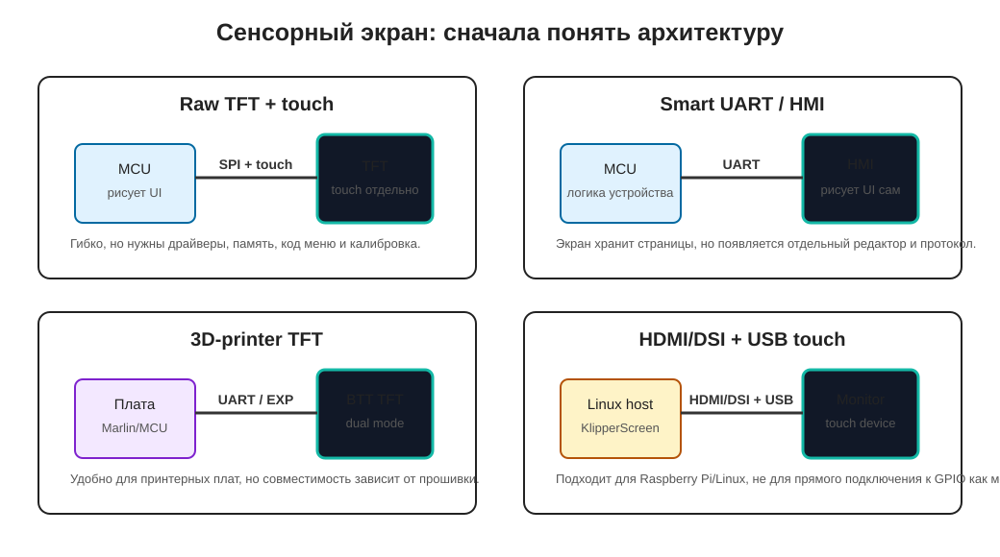

# Écrans tactiles

Un écran tactile n'est pas seulement un affichage. C'est un affichage plus l'entrée utilisateur. Il doit non seulement montrer la température ou un bouton, mais indiquer à l'appareil où vous avez touché.

Pour cette raison, un écran tactile est presque toujours plus complexe que OLED. Vous devez choisir non seulement la taille et la résolution, mais comprendre qui dessine l'interface, qui traite les touches, quelle interface est utilisée et si votre micrologiciel choisi le supporte.

## Quand l'écran tactile est utile

Un écran tactile a du sens si l'appareil a besoin d'une interface locale complète :

- choisir le mode de séchage ;
- définir la température et l'heure ;
- liste des profils de matériau ;
- confirmer les erreurs ;
- contrôle manuel du ventilateur, éclairage ou amortisseur ;
- configuration Wi-Fi ;
- affichage du statut sans téléphone ni ordinateur.

Si vous avez seulement besoin de montrer la température, l'erreur et le mode, généralement OLED, quelques boutons, encodeur ou interface Web suffit. Un écran tactile ajoute coût, puissance, espace d'enceinte, micrologiciel, câbles et un autre point de défaillance.

## Question principale : Qui dessine l'interface

Avant d'acheter, répondez à la question principale : où vit l'interface utilisateur.

Il y a plusieurs classes d'écran différentes :

TFT brut est un simple écran avec un contrôleur comme `ILI9488`, `ST7789`, `XPT2046`, plus un contrôleur tactile séparé comme `FT5x06` ou `FT5x06`. Votre microcontrôleur ou micrologiciel dessine l'interface. C'est flexible mais nécessite du code, de la mémoire, des pilotes et un étalonnage.

L'affichage intelligent UART/HMI est un écran avec son propre micrologiciel et éditeur d'interface, comme Nextion. Le microcontrôleur envoie des commandes via UART, et l'écran affiche les pages et les éléments. Cela réduit la charge MCU mais lie votre projet aux outils et au protocole de cet écran.

Le TFT de l'imprimante, comme BTT TFT35, a souvent son propre mode d'écran tactile via UART et l'émulation LCD classique 12864 via les connecteurs EXP. Cet écran est pratique pour les cartes Marlin/imprimante 3D, mais ce n'est pas un panneau universel pour n'importe quel appareil DIY.

L'écran HDMI/DSI/USB pour l'hôte Linux fonctionne comme un moniteur régulier et un périphérique tactile pour Raspberry Pi ou un autre ordinateur Linux. Cela convient à KlipperScreen mais ne se connecte pas directement à un petit ESP32 comme module simple.

## Interfaces de connexion

Les écrans tactiles utilisent des interfaces différentes.

Options courantes :

- SPI - souvent sur petit TFT pour ESP32/Arduino ;
- I2C - souvent sur contrôleurs tactiles capacitifs, parfois sur contrôleurs tactiles ;
- UART - sur les affichages intelligents et certains TFT d'imprimante 3D ;
- EXP1/EXP2/EXP3 - sur les écrans compatibles avec les cartes d'imprimante 3D ;
- HDMI + USB - sur les écrans Linux pour Raspberry Pi ;
- DSI - sur certains écrans Raspberry Pi ;
- RGB/8080 parallèle - sur TFT plus rapide, mais plus de fils et d'exigences.

Vous ne pouvez pas choisir un écran par diagonale seule. Deux écrans `3,5"` peuvent être complètement différents : un module SPI pour ESP32, deuxième panneau UART avec son propre micrologiciel, troisième écran HDMI pour Raspberry Pi.

## Tactile résistif et capacitif

La partie tactile varie également.

Écran résistif :

- répond au doigt, au stylet ou à la pression de l'ongle ;
- nécessite souvent un étalonnage ;
- généralement pire pour les gestes ;
- peut être moins cher ;
- trouvé avec des contrôleurs comme `XPT2046`.

Écran capacitif :

- répond à un doigt ;
- généralement plus agréable à utiliser ;
- peut supporter les touchs multiples ;
- a souvent un contrôleur séparé comme les familles `FT5x06`, `GT911` ;
- fonctionne moins bien avec les gants épais et certains couvercles de protection.

Pour un appareil d'atelier, l'écran tactile résistif est parfois plus pratique car vous pouvez l'appuyer avec un ongle ou un stylet. Pour un beau panneau sur l'enceinte, le tactile capacitif semble généralement plus moderne.

## Puissance, rétroéclairage et courant

Un écran TFT consomme plus qu'un petit OLED. Le consommateur de puissance principal est le rétroéclairage.

Avant de connecter, vérifiez :

- tension d'alimentation de l'écran ;
- courant du rétroéclairage ;
- si vous avez besoin d'une source 5V séparée ;
- si la luminosité du rétroéclairage est ajustable ;
- si les niveaux logiques sont compatibles ;
- si l'écran surcharge le régulateur de la carte ;
- si l'alimentation baisse lorsque le rétroéclairage s'allume.

Si l'écran blanchit, scintille, redémarre le contrôleur ou perd les événements tactiles, vérifiez d'abord l'alimentation et la masse, pas le code d'interface.

Pour un appareil avec un radiateur, l'écran ne devrait pas tirer d'une broche aléatoire faible. Il devrait faire partie d'une structure d'alimentation appropriée avec une marge claire.

## Micrologiciel et compatibilité

Un bel écran est inutile si votre micrologiciel choisi ne le supporte pas.

Pour l'approche ESP32/Arduino, vous devez vérifier :

- existe-t-il un pilote d'affichage ;
- existe-t-il un pilote de contrôleur tactile ;
- y a-t-il assez de GPIO ;
- y a-t-il assez de RAM/PSRAM pour le tampon ;
- quel cadre de graphiques est utilisé ;
- qui écrira le menu.

Pour ESPHome, vérifiez le support du pilote d'affichage spécifique et du composant écran tactile. Par exemple, les affichages ILI9xxx et le tactile XPT2046 nécessitent SPI et une configuration séparée, et le tactile résistif nécessite un étalonnage.

Pour Klipper, il y a généralement deux mondes différents :

- petits affichages connectés à MCU et décrits dans la configuration Klipper ;
- KlipperScreen sur l'hôte Linux, où l'écran fonctionne comme un moniteur et un périphérique tactile.

KlipperScreen a généralement besoin d'un écran où Linux peut montrer un bureau ou une console. Ce n'est pas la même chose qu'un petit TFT UART connecté à une carte d'imprimante.

Pour les cartes Marlin/imprimante, vérifiez si l'écran spécifique supporte le mode nécessaire : mode d'écran tactile UART, émulation 12864, EXP1/EXP2/EXP3, type de contrôleur spécifique dans la configuration du micrologiciel.

## Affichage intelligent et écrans de type Nextion

L'affichage intelligent est pratique car l'écran stocke les pages, les boutons, les polices et les images. Le contrôleur envoie des commandes via UART et reçoit les événements tactiles.

Avantages :

- moins de charge sur le microcontrôleur ;
- moins de code de graphiques dans le micrologiciel principal ;
- vous pouvez dessiner l'interface dans l'éditeur d'écran ;
- seul UART et l'alimentation nécessaires.

Inconvénients :

- vous devez apprendre un éditeur et un protocole séparés ;
- l'interface est souvent stockée dans l'écran ;
- plus difficile de garder les versions d'interface et de micrologiciel de l'appareil en synchronisation ;
- tous les éléments ne se comportent pas comme dans une application régulière ;
- remplacer l'écran peut nécessiter une refonte.

Pour un appareil simple, l'affichage intelligent peut être une bonne solution si vous avez besoin d'un beau panneau sans hôte Linux. Mais ce n'est pas un « moniteur normal » : c'est un module séparé avec sa propre logique.

## Cas, câbles et maintenance

Un écran tactile est quelque chose que les utilisateurs vont toucher avec leurs mains. Donc, la mécanique est importante, pas seulement les câbles.

Vérifiez à l'avance :

- l'écran n'est pas dans une zone chaude ;
- il y a un cadre ou un montage de protection ;
- le câble ne se plie pas fortement lors de l'ouverture du couvercle ;
- le câble peut être déconnecté pour la maintenance ;
- le connecteur ne peut pas entrer à l'envers ;
- le boîtier n'appuie pas sur l'écran ;
- il y a accès à la carte SD ou USB pour les mises à jour si nécessaire ;
- l'utilisateur ne touche pas les pièces sous tension en utilisant l'écran ;
- le câblage tactile/affichage est séparé des câbles du radiateur.

Pour les appareils avec un radiateur, il est préférable de déplacer l'écran vers la zone utilisateur, loin de l'air chaud et des pièces sous tension.

## Quoi vérifier avant d'acheter

Avant d'acheter un écran tactile, vérifiez :

- diagonale et résolution ;
- type d'affichage : TFT brut, UART intelligent, TFT d'imprimante, HDMI/DSI ;
- interface d'affichage ;
- interface tactile ;
- contrôleur d'affichage : par exemple `ILI9341`, `ILI9488`, `ST7789` ;
- contrôleur tactile : par exemple `XPT2046`, `FT5x06`, `GT911` ;
- puissance et courant du rétroéclairage ;
- niveaux logiques ;
- support dans le micrologiciel ;
- disponibilité de la documentation et des exemples ;
- disponibilité des bibliothèques ;
- exigences RAM/PSRAM ;
- dimensions de la carte, trous et câble ;
- température de fonctionnement ;
- méthode de mise à jour du micrologiciel/interface.

Si la description du produit ne contient pas de contrôleur d'affichage, d'interface, de puissance et d'exemples de connexion, il est préférable de ne pas utiliser un tel écran pour votre premier projet.

## Erreurs typiques

- acheté un écran « pour Arduino », mais le projet est KlipperScreen sur Linux ;
- acheté un écran HDMI et essayé de le connecter directement à ESP32 ;
- acheté un affichage UART intelligent mais s'attendait à ce qu'il fonctionne comme un TFT régulier ;
- choisi TFT brut mais n'a pas planifié le temps pour le menu et le code de graphiques ;
- pas assez de GPIO pour l'affichage SPI et le contrôleur tactile ;
- pas assez de RAM pour le tampon d'écran ;
- n'a pas vérifié le contrôleur tactile ;
- n'a pas étalonné le tactile résistif ;
- l'écran scintille à cause d'une alimentation de rétroéclairage faible ;
- le câble tourne près des fils d'alimentation du radiateur ;
- écran monté dans une zone chaude ;
- l'interface semble bien mais l'erreur principale est difficile à voir.

## Point principal

Choisissez un écran tactile par architecture, pas par diagonale. D'abord, décidez qui dessine l'interface : microcontrôleur, l'écran lui-même, micrologiciel d'imprimante ou hôte Linux. Ensuite, vérifiez l'interface, l'alimentation, le contrôleur tactile, le support du micrologiciel et la mécanique de l'enceinte.

Pour un simple radiateur, sécheur ou filtre, généralement OLED, boutons ou interface Web suffit. Utilisez un écran tactile lorsque les utilisateurs ont vraiment besoin d'une interface locale.

## Matériaux de référence

- [KlipperScreen: Hardware](https://klipperscreen.github.io/KlipperScreen/Hardware/) - exigences et exemples d'écran pour KlipperScreen, y compris les options HDMI/DSI/Raspberry Pi.
- [BIGTREETECH TouchScreenFirmware](https://github.com/bigtreetech/BIGTREETECH-TouchScreenFirmware) - micrologiciel et modes BTT TFT : mode tactile, émulation Marlin/12864, connecteurs EXP et paramètres.
- [BIGTREETECH TFT35 V3.0 repository](https://github.com/bigtreetech/BIGTREETECH-TFT35-V3.0) - documentation et fichiers pour TFT35 populaire d'imprimante 3D.
- [Adafruit 3.5 inch TFT Touchscreen Breakout](https://learn.adafruit.com/adafruit-3-5-color-320x480-tft-touchscreen-breakout) - exemple de TFT brut avec modes SPI/8 bits, tactile séparé et bibliothèques.
- [ESPHome: Touchscreen Components](https://esphome.io/components/touchscreen) - documentation sur les composants tactiles, l'étalonnage et la liaison des coordonnées tactiles brutes aux coordonnées d'affichage.
- [ESPHome: ILI9xxx TFT LCD Series](https://esphome.io/components/display/ili9xxx/) - exemple de support d'affichage TFT brut sur ESPHome et limitations de mémoire importantes.
