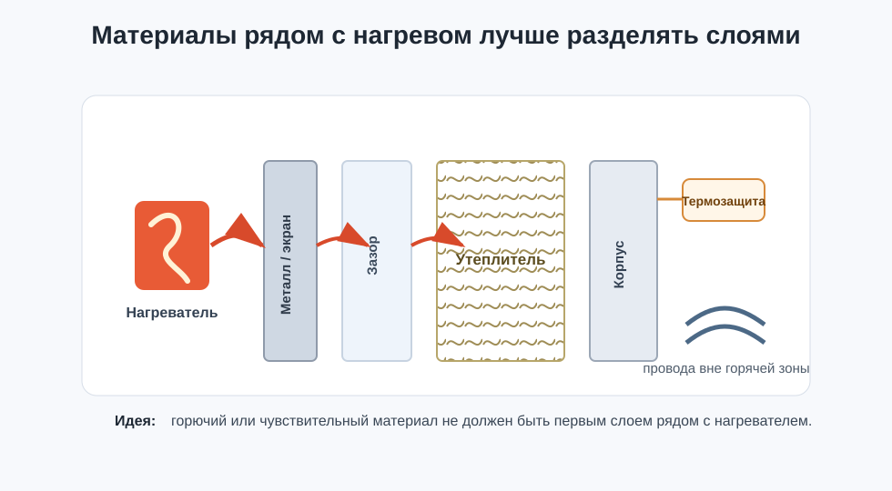

# Materials, Flammability, and Harmful Emissions

Material for chamber, dryer, filter, housing, or air duct cannot be chosen only by price, thickness, and ease of cutting.

In a heated device, material must withstand not only normal operation, but also reasonable failures: fan stoppage, sensor error, stuck switch, poor contact, overheated terminal, or localized hot stream.

## What "Suitable for Heating" Means

Material is suitable not because it "does not melt immediately". For a heated device, several different properties matter:

- maximum continuous working temperature;
- softening temperature or thermal deformation temperature;
- flammability;
- smoke generation;
- toxicity of combustion products;
- resistance of glue, foil, coating, or lamination;
- behavior when in contact with hot air;
- manufacturer requirements for assembly.

Melting temperature by itself is almost useless. Plastic can lose stiffness and shape long before melting. Insulation can change dimensions. Glue can peel off. A printed part can warp under load.

## Working Temperature and Safety Margin

First, you need to understand what the temperature will be not "on average in the chamber", but in specific places:

- near the heater;
- at hot air outlet;
- near terminals and wires;
- on metal fasteners;
- on inner wall;
- on printed parts;
- under insulation;
- on outer surface.

If the chamber holds `45°C`, it does not mean all parts inside are also `45°C`. Near the heater or in the air duct it can be significantly hotter.

Practical rule: material must have a safety margin for continuous working temperature exactly for the place where it is located. For zone next to heater, margin must be larger than for outer decorative panel.

## Flammability - It Is Not One Word

Documentation may contain different classification systems.

For plastics, UL 94 is often indicated:

- `HB` - horizontal sample burns slower than specified limit;
- `V-2`, `V-1`, `V-0` - vertical sample must self-extinguish within specified time, differences include dripping behavior;
- `5VB`, `5VA` - more stringent tests for certain applications;
- `HBF`, `HF-1`, `HF-2` - classes for foam materials.

Important: UL 94 is a small-scale laboratory test on samples. It helps compare materials, but does not prove that a homemade chamber is safe under any failure.

In Russian-language building material documentation, you may encounter:

- `НГ` - non-flammable material;
- `Г1-Г4` - flammability groups;
- `В1-В3` - ignitability;
- `Д1-Д3` - smoke-generating ability;
- `Т1-Т4` - toxicity of combustion products;
- `РП1-РП4` - flame spread across surface.

If a seller writes "self-extinguishing", this does not replace the datasheet. Material can still smoke, drip, char, deform, or release hazardous products when overheated.

## Example: XPS, EPS, and PIR

Building insulation materials often seem convenient for chamber or dryer: they are light, flat, cheap, cut well, and insulate well. But they must be viewed as building materials with their own limitations, not as universal parts for a heater.

| Material | Where It May Be Appropriate | Main Risks | What to Check |
| --- | --- | --- | --- |
| XPS, extruded polystyrene | external insulation of cold zones if separated from hot part | limited working temperature, deformation, flammability, smoke in fire | technical description, maximum temperature, fire characteristics, protective layer |
| EPS, expanded polystyrene | only cautiously and far from hot zones | low thermal resistance, flammability, deformation, smoke | material datasheet, no direct heating, cover with non-flammable layer |
| PIR / polyiso | building-type insulation, sometimes better fire behavior than polystyrene sheets | not automatically non-flammable, depends on facing and specific product | technical description, working temperature, reaction to fire class, manufacturer limitations |
| Mineral wool | thermal insulation where fibers are permissible and high thermal resistance is needed | dust, fibers, compression, moisture, need to seal airflow | permissible temperature, binder, protective facing, assembly |
| Metal | screen, inner wall, heat spreader | thermal bridges, hot outer surface, sharp edges | grounding for mains section, temperature, wire insulation |
| 3D-printed plastic | fasteners and shrouds outside hot zone | softening, creep under load, flammability | material, deformation temperature, actual part temperature |

For XPS in manufacturer technical data, maximum service temperature around `74°C` (`165°F`) is often listed. This does not mean all XPS are the same, but shows the order of limitation: this material cannot automatically be placed next to a heater or hot air.

For EPS, recommendations to keep working temperatures around `75°C` are found; above this the material can lose dimensional stability. Again, the exact value must be taken from the specific product documentation.

PIR/polyiso may have a higher permissible range in individual products, but this does not eliminate checking fire properties, facing, glue, smoke, and manufacturer recommendations.

## Safe Material "Stack"

For a heated chamber, it is often better to think not of a "wall material" but of layers.

Example of more sound logic:

- inside hot zone - metal, ceramics, glass, or other material that withstands temperature and does not catch fire from local overheat;
- further - air gap or insulation if it is really needed;
- outside - housing that does not heat to dangerous temperature;
- wires and terminals do not touch insulation and are not hidden in zones where overheating would go unnoticed;
- there is independent overheat protection if control failure could lead to dangerous heating.

Insulation should not be the first material that sees the heater.

## 3D-Printed Parts Near Heat

Printed plastic is convenient for brackets, shrouds, sensor holders, and air ducts. But in a heated chamber it can behave worse than it seems from the spool.

Typical risks:

- PLA quickly loses stiffness when heated and under load;
- PETG is better than PLA, but can also creep and deform;
- ABS/ASA usually tolerate warm chamber better, but require actual temperature verification;
- PC and engineering materials can withstand more, but require proper printing and still do not eliminate fire assessment.

For parts near heater, you cannot rely only on plastic name. Important are filament brand, print settings, thickness, load, layer direction, ventilation, and actual part temperature.

## What to Read Before Buying

Look for technical documents, not marketing:

- technical description or product datasheet;
- SDS/MSDS if material can heat, be cut, sanded, or burn;
- fire classification / reaction to fire;
- UL 94 or other flammability class for plastics;
- maximum continuous working temperature;
- assembly limitations;
- limitations on contact with heat sources;
- requirements for covering with facing, metal, drywall, or other layer.

If material is sold only as "insulation sheet" without proper datasheet, it should not be placed in a homemade heated device.

## What Is Definitely Not Normal

Bad solutions:

- gluing foam or XPS directly next to heater;
- directing hot stream at unknown plastic;
- covering terminals and wires with insulation;
- placing flammable material next to mains section `110-230V AC`;
- relying on a single temperature sensor;
- treating building material as safe for chamber without verification;
- using "self-extinguishing" as replacement for independent overheat protection;
- doing first warm-up without observation and measurements.

## Conclusion principale

Material safety is not one parameter. You need to look at working temperature, flammability, smoke, toxicity of combustion products, glues, facings, and real failure scenarios.

If material has no clear documentation, it cannot be placed near heater as primary protection. If material is flammable, it must be removed from hot zone, covered with suitable layer, and verified by measurement in real operating mode.

## Matériaux sur le Topic

- [UL Solutions: Combustion Fire Tests for Plastics](https://www.ul.com/services/combustion-fire-tests-plastics) - explanation of UL 94, vertical/horizontal tests, classes for plastics and foam materials.
- [UL Solutions Code Authorities: UL 94 Rating Certifications and Limitations](https://code-authorities.ul.com/about/blog/understanding-ul-94-rating-certifications-and-limitations/) - limitations of UL 94 application to real products and large parts.
- [Russian Emergency Ministry: Federal Law No. 123-FZ, Technical Regulations on Fire Safety Requirements](https://mchs.gov.ru/uploads/document/2022-04-08/c907f456516c1f21009131cfdb944deb.pdf) - Russian fire hazard classification of materials: flammability, ignitability, smoke, toxicity, flame spread.
- [DuPont: Styrofoam Brand XPS Product Information Sheet](https://www.dupont.com/content/dam/dupont/amer/us/en/performance-building-solutions/public/documents/en/styrofoam-brand-ultra-sl-pis-43-D100087-enUS.pdf) - example of XPS technical description with maximum service temperature `165°F`.
- [IKO: EPS Insulation in an IKO Roof System](https://www.iko.com/comm/documents/bulletin-eps-insulation-in-an-iko-roof-system/) - example of EPS working temperature limitation and dimensional stability.
- [Prusa Knowledge Base: Material table](https://help.prusa3d.com/materials) - practical reference for thermal resistance of popular 3D printing materials.
