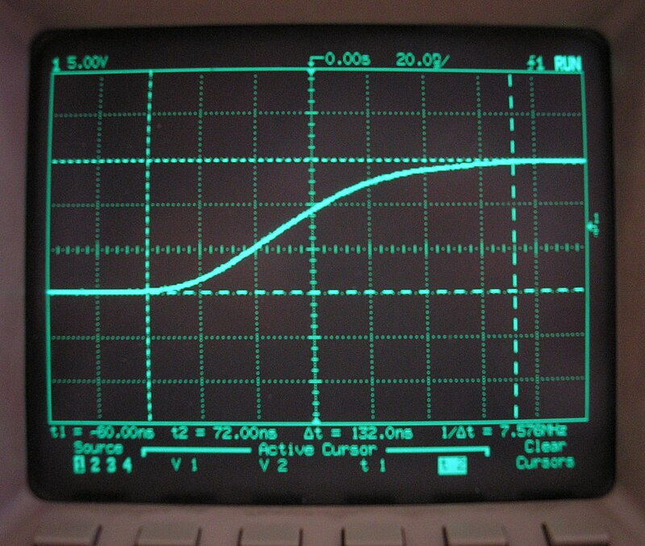
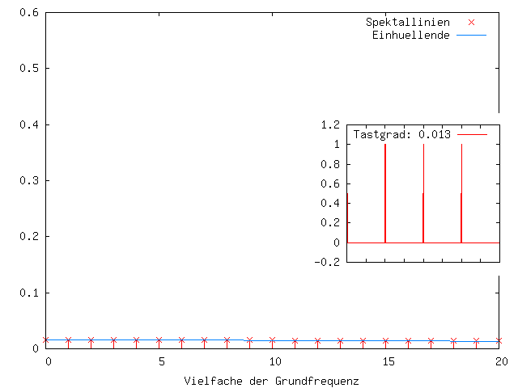

# Oscilloscope

Un oscilloscope montre comment un signal change au fil du temps.

Un multimètre peut afficher « environ 3.3V » ou « il y a de la fréquence ». Un oscilloscope montre la forme du signal : impulsions, fronts, affaissement, bruit, rebond, paquets UART, PWM.

*Source: [Wikimedia Commons](https://commons.wikimedia.org/wiki/File:Digital_oscilloscope.jpg), premek.v, Public Domain*

Un signal PWM sur l'écran d'oscilloscope ressemble à ceci :

*Source: [Wikimedia Commons](https://commons.wikimedia.org/wiki/File:Pwm.gif), Mik81, CC0 Public Domain*

Vous n'en avez pas besoin pour chaque build simple. Mais quand un appareil se comporte de manière instable, un oscilloscope peut révéler en minutes ce qu'un multimètre ne peut pas voir.

## Ce que vous pouvez voir

Dans les appareils de type iDryer, un oscilloscope est utile pour visualiser :

- PWM du ventilateur ;
- PWM du module MOSFET ;
- UART `TX/RX` ;
- affaissement 5V ou 3.3V au démarrage du servo ;
- bruit de l'alimentation ;
- rebond du bouton ;
- signal du ventilateur tachométrique ;
- des pépites brèves que le multimètre lisse.

Un oscilloscope répond non seulement « y a-t-il de la tension » mais « qu'arrive-t-il au signal au fil du temps ».

## L'avertissement le plus important

La plupart des oscilloscopes de paillasse ont la terre de la sonde connectée à la terre de protection secteur.

Cela signifie : le clip de terre de la sonde n'est pas « juste un autre fil ».

Si vous attachez le clip de terre à un point qui n'est pas `GND` du circuit basse tension, vous pouvez créer un court-circuit via l'oscilloscope.

C'est particulièrement dangereux d'aller dans la partie secteur 110-230V AC, SSR, alimentation ou sections haute tension avec une sonde d'oscilloscope normale.

Vous ne pouvez pas :

- déconnecter la terre de l'oscilloscope pour la mesure « flottante » ;
- connecter la terre de la sonde à la phase ou à un autre point de tension ;
- mesurer la tension secteur avec une sonde normale sans comprendre le circuit ;
- supposer que les deux canaux sont complètement indépendants : les terres des canaux sont souvent connectées ensemble.

Pour les mesures flottantes, les mesures haute tension et les mesures haute tension, vous avez besoin de méthodes appropriées : sonde différentielle, appareil isolé ou une autre approche sûre.

## Comment connecter une sonde

Pour circuits basse tension :

1. Connectez la sonde à l'oscilloscope.
2. Connectez la terre de la sonde à `GND` de l'appareil.
3. Connectez la pointe de la sonde au signal.
4. Sélectionnez le bon réglage de la sonde : `1x` ou `10x`.
5. Assurez-vous que l'oscilloscope est réglé au même facteur.

Pour la plupart des signaux numériques, utilisez `10x` : la sonde charge le circuit moins et montre généralement mieux la forme du signal.

## PWM

PWM est un signal d'impulsion.

L'oscilloscope montre :

- fréquence ;
- rapport cyclique ;
- niveau logique haut ;
- niveau logique bas ;
- fronts ;
- gigue ;
- bruit.

Pour un ventilateur ou MOSFET, cela aide à comprendre :

- si la broche produit un signal du tout ;
- si le niveau 3.3V ou 5V est suffisant ;
- si la fréquence correspond au réglage ;
- si le rapport cyclique change sur commande ;
- si le signal ne s'affaisse pas quand la charge est connectée.

## UART

UART sur l'oscilloscope ressemble à une séquence d'impulsions.

L'oscilloscope aide à voir :

- s'il y a de l'activité sur `TX` ;
- si les niveaux logiques ne sont pas permutés ;
- quel est le niveau d'inactivité ;
- s'il y a du bruit fort ;
- si la vitesse de débit correspond à peu près.

Pour décoder le texte, un analyseur logique ou un adaptateur USB-UART est plus pratique. Mais un oscilloscope montre rapidement si le signal est physiquement actif.

## Affaissement de l'alimentation

Un multimètre peut ne pas voir un affaissement bref.

Par exemple, lorsqu'un servo démarre, une ligne 5V peut tomber pendant quelques millisecondes. Le multimètre affiche presque 5V normal, mais le contrôleur a déjà redémarré.

Un oscilloscope vous laisse voir :

- combien la tension baisse ;
- combien de temps l'affaissement dure ;
- s'il y a des pics ;
- si un condensateur aide ;
- si la situation change avec une alimentation ou des fils différents.

Cela est particulièrement utile pour ESP32, servos, ventilateurs et DC-DC.

## Bruit et interférence

Le bruit sur les lignes d'alimentation ou de signal peut casser les capteurs et la communication.

Un oscilloscope aide à voir :

- ondulation DC-DC ;
- pics du moteur ;
- bruit près du chauffage ;
- rebond du bouton ;
- interférence sur un long fil.

Mais comprenez les limites : une mauvaise connexion de terre de sonde peut ajouter du bruit à l'affichage lui-même. Un court ressort de terre de sonde ou un court fil de terre donne généralement une image plus honnête qu'un long clip.

## Multimètre avec mesure de fréquence

Parfois, un oscilloscope n'est pas nécessaire pour les vérifications initiales.

Certains multimètres peuvent mesurer la fréquence du signal. Dans les spécifications, cela peut être appelé `Hz`, `fréquence` ou `compteur de fréquence`.

C'est utile si vous avez besoin de comprendre rapidement :

- s'il y a un signal PWM du tout ;
- si la fréquence change avec l'ajustement ;
- si la sortie du contrôleur fonctionne ;
- s'il y a de l'activité sur une simple ligne numérique.

Par exemple, si un contrôleur doit produire PWM à un ventilateur ou un module MOSFET, un multimètre mesurant fréquence peut montrer que le signal existe et sa fréquence correspond à peu près à la valeur attendue.

Mais un multimètre ne montre pas la forme du signal. Il ne montrera pas :

- niveau logique haut ;
- largeur d'impulsion ;
- rapport cyclique PWM ;
- fronts de signal ;
- creux brefs ;
- bruit et interférence ;
- distorsion de ligne.

Donc un multimètre mesurant fréquence est un bon outil pour les vérifications rapides, mais pas un remplacement d'oscilloscope complet.

## Ce qu'il faut vérifier avant la mesure

Avant de connecter une sonde :

1. Qu'est-ce que `GND` dans le circuit ?
2. Ce point est-il connecté à la terre de protection secteur ?
3. Il n'y a pas de tension secteur ?
4. La sonde est-elle évaluée pour la tension ?
5. `10x` est-il sélectionné si nécessaire ?
6. La sonde et le canal sont-ils réglés de la même façon ?
7. Les terres des canaux ne se connectent-elles pas à des points différents du circuit ?
8. Pouvez-vous d'abord vérifier le signal du côté basse tension ?

Si vous avez des doutes sur 110-230V AC, ne connectez pas l'oscilloscope.

## Erreurs courantes

- clip de terre attaché à un point de tension, pas `GND` ;
- tentative de « déconnecter » la terre de l'oscilloscope secteur ;
- mesure de la tension secteur avec une sonde normale sans différentielle ;
- oubli que les terres des canaux sont connectées ;
- sonde réglée à `10x`, oscilloscope réglé à `1x` ;
- utilisation d'une long terre de sonde et visualisation de bruit supplémentaire ;
- regarder seulement avec un multimètre et manquer un affaissement bref ;
- penser qu'un problème UART est un logiciel quand il n'y a pas de signal physique sur la ligne.

## Les éléments essentiels

- Un oscilloscope montre la forme du signal au fil du temps.
- C'est utile pour PWM, UART, affaissement d'alimentation, bruit et pépites brèves.
- Une terre d'oscilloscope de paillasse normale est connectée à la terre de protection secteur.
- Vous ne pouvez pas connecter la terre de la sonde à un point arbitraire du circuit.
- Pour les mesures secteur et flottantes, des méthodes sûres spéciales sont nécessaires.
- Un multimètre mesurant fréquence est utile, mais pas un remplacement d'oscilloscope.

## Matériaux de référence

- [SparkFun: How to Use an Oscilloscope](https://learn.sparkfun.com/tutorials/how-to-use-an-oscilloscope/introduction) - introduction pratique de base aux oscilloscopes, signaux et contrôles.
- [Tektronix: How to Use an Oscilloscope](https://www.tek.com.cn/documents/primer/how-to-use-an-oscilloscope) - mise à la terre, configuration, contrôles et utilisation basique de l'oscilloscope.
- [Tektronix: ABCs of Probes Primer](https://www.tek.com/en/documents/whitepaper/abcs-probes-primer) - avertissements sur la terre de la sonde, terre secteur et danger des mesures flottantes avec un oscilloscope normal.
- [Tektronix: Floating Oscilloscope Measurements and Operator Protection](https://www.tek.com/en/documents/technical-brief/floating-oscilloscope-measurements-and-operator-protection) - pourquoi déconnecter la terre secteur de l'oscilloscope est dangereux et quelles alternatives sûres existent.
- [Keysight: Floating an oscilloscope](https://docs.keysight.com/kkbopen/how-can-i-float-an-infiniium-or-infiniivision-x-oscilloscope-isolating-it-from-mains-power-607258715.html) - Keysight ne recommande pas de contourner la mise à la terre et suggère des sondes différentielles.
