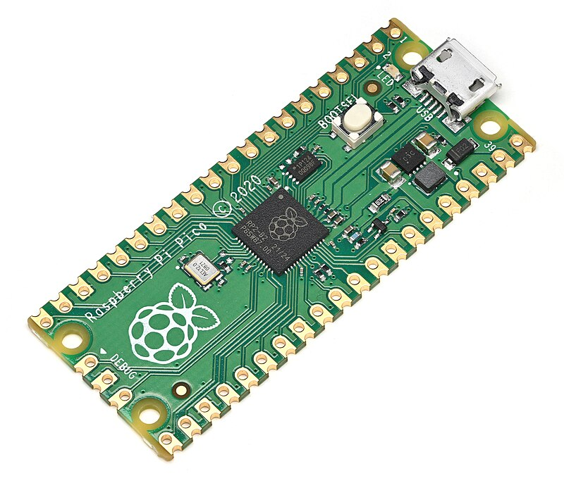

# RP2040 コントローラ

RP2040 は Raspberry Pi マイクロコントローラです。これに基づいた最も有名なボードは Raspberry Pi Pico です。

3D プリンタ周辺の DIY ペリフェラル向けに、RP2040 は最も実用的なオプションの 1 つです: 安価で、よく文書化されており、`3.3V` ロジックで動作し、USB 経由でフラッシュするのに便利であり、Klipper の追加 MCU として適しています。

## RP2040 が有用な場所

RP2040 は以下に適しています:

- Klipper の追加 I/O ボード
- MOSFET/ドライバー経由のファン コントローラ
- サーモアセンブルとシンプルなアナログ センサーの読み取り
- I2C 経由の OLED 接続
- SPI または UART 経由の RFID/NFC 接続
- PWM 信号でサーボを制御
- Wi-Fi なしのシンプルなスタンドアロン ボード
- センサーとインターフェースのテストベンチ

すぐにネットワーク接続が必要な場合は、ESP32 または Pico W を見る方が簡単です。Klipper の追加有線 MCU が必要な場合、RP2040 の方が便利なことが多い。

## Raspberry Pi Pico が便利な理由

Raspberry Pi Pico は RP2040 ベースの既製開発ボードです。既に USB、フラッシュ メモリ、電源レギュレータ、`BOOTSEL` ボタン、公開ピンを備えています。

Pico の利点:

- 低コスト
- 十分なドキュメントとピンアウト
- フラッシング と通信用の USB
- 多くの GPIO
- `3.3V` ロジック
- 2 UART、2 SPI、2 I2C
- 16 PWM チャネル
- Pico ピン上の 3 ADC 入力
- 非標準インターフェース用の PIO
- USB マス ストレージ経由の便利な UF2 フラッシング

最初のプロジェクトでは、ベアな RP2040 チップより、はんだ付けされたピン付きの Pico または Pico H を取得する方が良いです。ベア チップは カスタムボード、フラッシュメモリ、パワー、USB、ルーティング、テストが必要です。

## BOOTSEL と UF2

Pico の強みの 1 つは、シンプルなフラッシング プロセスです:

1. `BOOTSEL` ボタンを押し続けます。
2. USB をコンピュータに接続します。
3. ボードが USB ドライブとして表示されます。
4. `.uf2` ファームウェア ファイルをコピーします。
5. ボードが新しいファームウェアで再起動します。

これは MicroPython、CircuitPython、C/C++ プロジェクト、Klipper ファームウェアに便利です。初心者にとって、この方法は通常、ST-Link、DFU、または個別の USB-UART よりも理解しやすい。

## RP2040 と Klipper

RP2040 は Klipper の追加 MCU の候補としては良い選択肢です。

典型的なスキーム:

*出典: [Wikimedia Commons](https://commons.wikimedia.org/wiki/File:Raspberry_Pi_Pico_oblique.jpg)、Phiarc、CC BY-SA 4.0*

考え方は:

- Klipper を備えた Linux ホストは主要なコントローラのままです
- Pico/RP2040 は Klipper MCU ファームウェアでフラッシュされます
- メイン または追加 `[mcu]` セクションが `printer.cfg` に追加されます
- RP2040 ピンはファン、センサー、PWM、その他のペリフェラル に使用できます
- 電力負荷は依然として MOSFET、ドライバー、リレー、または SSR 経由で接続されます

これは、ペリフェラルの一部を個別のブロックに分離する必要がある場合に有用です: たとえば、ファン、カメラ センサー、フィルター、バックライティング、ボタン、リミット スイッチ、またはサービス出力です。

## GPIO と 3.3V ロジック

RP2040 は `3.3V` ロジックで動作します。これは以下を意味します:

- GPIO に `5V` を印加しないでください
- `5V` モジュール向けにはレベル コンバーター が必要な場合があります
- I2C プルアップは `3.3V` に向かう べきです
- GPIO は負荷に直接電力を供給しないでください
- ファン、LED ストリップ、リレー、またはヒーター は外部スイッチ/ドライバーが必要です

モジュールが "Arduino 互換" であることは、RP2040 に安全であることを意味しません。入力レベルとプルアップをチェックする必要があります。

## 電源

Pico は通常、USB または `VSYS` ピン経由で電力を供給されます。ボード には マイクロコントローラへの電力を供給するためのレギュレータがあります。

実践的なルール:

- Pico の `3V3` ピンからモーター、サーボ、リレー に電力を供給しないでください
- 負荷に個別の電源を使用してください
- 低電圧ドライバー との共通 GND を接続してください
- `VSYS` と USB への電力がどこから来ているかをチェックしてください
- Pico 自体だけでなく、外部モジュールの電流を考慮してください

サーボまたはファンが起動するときに Pico がリセットされる場合、問題はほぼ常に電源、グラウンド、またはノイズです。

## Pico 上の ADC

Pico には シンプルなアナログ タスクに使用できる ADC 入力があります:

- 電圧分圧器経由のサーモアセンブル
- ポテンショメータ
- 光センサー
- 電圧分圧器経由の低電圧測定

制限事項:

- ADC 入力は安全な GPIO 電圧を超えてはいけません
- `12V` または `24V` を測定するには ディバイダー と保護が必要です
- サーモアセンブル には正しい抵抗値、テーブル/モデル、機械的な接触が必要です
- ADC は マルチメータ または産業用メータ に取って代わりません

ヒーター について、覚えておいてください: ADC はセンサーのみを読みます。加熱の安全性は電源スイッチ、ファームウェア制限、ヒューズ、独立した熱保護によって提供されます。

## シンプルな用語での PIO

PIO は Programmable I/O です。RP2040 には、メイン コードに常に負荷をかけずに非標準信号を生成または読み取ることができるプログラム可能なブロックがあります。

初心者は PIO で開始する必要がありません。しかし、これは RP2040 がインターフェース、タイミング、非標準ペリフェラル で人気である理由の 1 つです。

シンプルな iDryer のようなデバイスの場合、通常、正規 GPIO、PWM、I2C、SPI、UART、ADC で十分です。

## Pico、Pico W、Pico 2

ボードを混同しないことが重要です:

- **Pico / Pico H** — Wi-Fi なしの経典的な RP2040 ボード
- **Pico W / Pico WH** — ボード上に Wi-Fi/Bluetooth モジュール付きの RP2040
- **Pico 2 / Pico 2 W** — RP2350 ベースの新世代、これは RP2040 ではありません

記事またはプロジェクトが RP2040 と言うと、通常は最初の世代 Pico または互換性のあるボードを意味します。Pico 2 は概念的に似ていますが、異なるマイクロコントローラであり、ファームウェア/ピン互換性を別途チェックする必要があります。

## 購入前にチェックすること

RP2040 ベースのボードを購入する前に、チェックしてください:

- オリジナルの Pico、Pico W、またはクローンであるかどうか
- ピンがはんだ付けされているかどうか
- 必要な USB コネクタを持っているかどうか
- 適切なピンアウトがあるかどうか
- どの GPIO が利用可能か
- Wi-Fi が必要かどうか
- ボードが Klipper ファームウェアに適しているかどうか
- ボードと負荷にどのように電力が供給されるか
- タスク用に十分な ADC/PWM/I2C/SPI/UART があるか
- エンクロージャに取り付けるための余地があるか

Klipper MCU を計画する場合、事前に特定のボードと フラッシング 方法の既存の指示をチェックしてください。

## 一般的な間違い

- RP2040 GPIO に `5V` を印加する
- `3V3` からサーボまたはリレーに電力を供給する
- MOSFET/ドライバー との共通 GND を忘れる
- Pico W が正規の Pico であり、使用されたリソース/Wi-Fi パワー を考慮していないと考える
- 正確な RP2040 動作を期待する Pico 2 を購入する
- ディバイダー なしで ADC で `12V`/`24V` を測定する
- ヒーター をピンに直接接続する
- 通常の Pico に Wi-Fi がない場合、Wi-Fi タスク向けに RP2040 を選択する
- 特定のクローンの ピンアウト をチェックしない

## キーポイント

RP2040 と Raspberry Pi Pico は、有線 DIY ペリフェラル と Klipper の追加 MCU の強い選択肢です。ボードは安価で、理解しやすく、よく文書化されており、フラッシング に便利です。

しかし RP2040 は `3.3V` マイクロコントローラであり、電源コントローラ ではありません。負荷はドライバー、MOSFET、リレー、または SSR 経由で接続されます。Wi-Fi タスク向けには、Pico W または別のネットワーク コントローラ が必要です。

## 関連資料

- [Raspberry Pi: RP2040 specifications](https://www.raspberrypi.com/products/rp2040/specifications/) — 公式 RP2040 仕様: CPU、SRAM、UART/SPI/I2C、PWM、USB、PIO
- [Raspberry Pi Documentation: Pico-series microcontrollers](https://www.raspberrypi.com/documentation/microcontrollers/raspberry-pi-pico.html) — Pico、Pico W、Pico 2、GPIO、ADC、PWM、ボード バリアント の違い
- [RP2040 Datasheet](https://datasheets.raspberrypi.com/rp2040/rp2040-datasheet.pdf) — マイクロコントローラー、ペリフェラル、PIO、GPIO、ADC の詳細な技術説明
- [Raspberry Pi Pico Datasheet](https://datasheets.raspberrypi.com/pico/pico-datasheet.pdf) — Pico ボード自体のドキュメント: 電力、USB、公開 GPIO、ボード制限
- [Raspberry Pi Documentation: C/C++ SDK - Your First Binaries](https://www.raspberrypi.com/documentation/microcontrollers/c_sdk.html#your-first-binaries) — BOOTSEL、USB マス ストレージ `RPI-RP2`、Pico への UF2 コピー の公式例
- [Klipper Configuration Reference](https://www.klipper3d.org/Config_Reference.html) — Klipper の RP2040 サポートのコンテキスト と I2C のようなペリフェラル の設定
