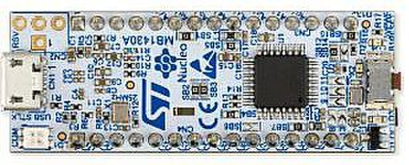

# STM32 コントローラ

STM32 は STMicroelectronics の Arm Cortex-M ベースの 32 ビット マイクロコントローラの大規模なファミリーです。単一のボードやチップではなく、STM32 という名前の下には数十のシリーズと数百のモデルがあります。

3D プリンタの世界では、STM32 は非常に一般的です。多くのプリント済みプリンタボード、エクスパンションボード、CAN ボード、およびコントローラが STM32 を使用しています。Klipper およびプリンタペリフェラルの場合、特定のボードで作業する準備ができている場合、最も実用的なオプションの 1 つです。

## STM32 が役立つ場合

STM32 は以下に最適です:

- メイン 3D プリンタボード;
- Klipper のアディショナル MCU;
- ファン、センサー、および出力制御ボード;
- CAN ボード またはツールヘッドボード;
- より本格的なカスタムボード;
- タイマー、PWM、ADC、UART、SPI、I2C、CAN、または USB が必要なタスク;
- 既製の産業用エコシステムおよびドキュメントが必要なプロジェクト。

RP2040 がシンプルで明確な開始であれば、STM32 はほぼあらゆるタスク用にチップを選択できるコントローラの広大な世界です。ただし、柔軟性には複雑さという代償が伴います。

## STM32 はファミリーです

「STM32 を入手しました」と言って選択を終了することはできません。正確なモデルを知る必要があります。

シリーズの例:

- **STM32F0 / STM32C0 / STM32G0** — 予算およびマスマーケットシリーズ;
- **STM32F1** — 古いが非常に有名なシリーズ、Blue Pill および古いボードでよく見られます;
- **STM32F4** — より強力なシリーズ、コントローラで人気;
- **STM32G4** — コントロール、タイマー、およびアナログペリフェラルタスクに興味深い;
- **STM32H7** — 強力なハイエンドコントローラ;
- **STM32L / STM32U** — 低消費電力に焦点を当てたシリーズ。

典型的なユーザーにとって、シリーズのマーケティングではなく、特定のことが重要です:

- 必要なファームウェアでサポートがあるか;
- ボード上に実際に露出している GPIO の数;
- USB、CAN、UART、I2C、SPI があるかどうか;
- フラッシュと RAM の量;
- その書き込み方法;
- 適切なピンアウトとシェマティックがあるかどうか。

## ボードがチップ名より重要です

同じ STM32 は非常に異なるボード上にある可能性があります。

一般的なバリアント:

- **Blue Pill / Black Pill** — 安価な小型ボード、多くの場合 STM32F103 または STM32F4 クラス、ただし クローン品質は異なります;
- **STM32 Nucleo** — 内蔵 ST-LINK を備えた公式 ST 開発ボード;
- **プリント済み 3D プリンタボード** — すでにドライバー、コネクタ、MOSFET 出力、サーミスタ入力、ヒューズ、および電源コネクタがあります;
- **ツールヘッド/CAN ボード** — プリンタヘッドまたはリモートモジュール用の専用ボード;
- **カスタムボード** — 完全な電力、USB、SWD、保護、およびルーティング設計が必要です。

最初の実用的なプロジェクトでは、ベアな STM32 またはシェマティックなしのランダムなクローンよりも、ドキュメント付きの既製ボードを入手する方が通常は簡単です。

## STM32 および Klipper

STM32 は Klipper MCU の主なパスの 1 つです。

典型的なアーキテクチャ:

*ソース: [Wikimedia Commons](https://commons.wikimedia.org/wiki/File:Nucleo-board.jpg), Avandalen, CC BY-SA 4.0*

Klipper ホストは Linux デバイス上で実行され、STM32 ボードは物理的にピンを制御します: MOSFET 出力を切り替え、サーミスタを読み取り、ファンを制御し、リミットスイッチ信号を受け取り、USB、UART、または CAN 経由でホストと通信します。

iDryer のようなペリフェラルの場合、STM32 は以下の場合に意味があります:

- デバイスが Klipper 設定の一部である必要があります;
- 電力出力を備えた既製プリンタボードが必要です;
- CAN が必要です;
- より産業用ボードアプローチが必要です;
- すでに STM32 ボードと既知の設定があります。

いくつかのピンとセンサーをすばやく追加する必要がある場合、RP2040 の方が多くの場合シンプルです。コネクタとドライバーを備えた既製の強力なボードが必要な場合、STM32 ボードの方が良い場合があります。

## フラッシング: USB、DFU、UART、SWD、ST-LINK

STM32 にはすべてのボード用の普遍的なフラッシング方法がありません。

オプション:

- **USB ブートローダ / DFU** — ボードとチップでサポートされている場合は、内蔵 USB ブートローダ経由でのフラッシング;
- **UART ブートローダ** — 正しい BOOT モードでシリアルピン経由でのフラッシング;
- **SWD via ST-LINK** — プログラマ経由でのフラッシュおよびデバッグの信頼できる方法;
- **Nucleo の内蔵 ST-LINK** — 開発に便利;
- **プリンタボード上のブートローダ** — 時々フラッシングは SD カード、USB、または製造業者の特別なブートローダ経由で行われます。

したがって、ボードを購入する前に、チップデータシートだけでなく、その特定のボードの命令を探す必要があります。Klipper の場合、既製のボード設定のコメントと製造業者の命令を読むことは特に重要です。

## Nucleo、Blue Pill、およびプリンタボード

**STM32 Nucleo** ボードは学習およびプロトタイピングに便利です。通常、内蔵 ST-LINK、Arduino Uno V3 コネクタ、および より多くの信号へのアクセスを提供する ST morpho ピンがあります。STM32 を学びたい場合、公式のフラッシングツールを持っている場合、これは良い選択肢です。

**Blue Pill / Black Pill** は価格とサイズで魅力的ですが、クローンは多くの場合問題があります: 間違ったチップ、弱いレギュレータ、貧弱な USB、適切なシェマティックなし、奇妙なブートローダ。実験には有用ですが、信頼性のあるデバイスの場合は、検証後のみです。

**既製の 3D プリンタボード** は、電力セクションが既にルーティングされているため、ヒーター、ファン、およびセンサーに対してより実用的である場合が多いです: ターミナル、MOSFET 出力、サーミスタ入力、電力、ヒューズ、またはそれらのための部屋があります。ただし、既製のボードでも、電流、コネクタ、冷却、および安全性の確認が必要です。

## 3.3V ロジックおよび GPIO

ほとんどの STM32 は `3.3V` ロジックで動作します。

重要です:

- チップデータシートがこのピンが `5V` を受け入れることを具体的に述べていない限り、ピンに `5V` を適用しないでください;
- Nucleo の Arduino シールド互換性は、すべての信号が `5V` Arduino Uno のように安全であることを意味しません;
- I2C プルアップは通常 `3.3V` です;
- GPIO は直接負荷に電力を供給してはいけません;
- ファン、LED ストリップ、ヒーター、リレー、およびサーボはドライバーと別の電力経由で接続されます。

一部の STM32 ピンが `5V` を受け入れる場合でも、これはすべてを接続する許可ではありません。特定のチップのピンアウトテーブルと電気特性を確認する必要があります。

## STM32 がプリンタでよく選択される理由

STM32 は多くの有用なペリフェラルを備えているため、3D プリンタボードに適しています:

- ファン、ヒーター、および信号用のタイマーおよび PWM;
- サーミスタおよびセンサー用の ADC;
- ステッパードライバーおよびモジュール用の UART/SPI;
- ディスプレイおよびセンサー用の I2C;
- ホストとの通信用の USB;
- 一部のシリーズおよびボードの CAN;
- リアルタイム MCU タスクに対する十分なパフォーマンス。

ただし、マイクロコントローラ自体はボードを安全にしません。ヒーター、パワー MOSFET、SSR、ヒューズ、コネクタ、および熱保護は別のエンジニアリングタスクのままです。

## 購入前に確認すること

STM32 ボードを購入する前に、以下を確認してください:

- 正確なマイクロコントローラモデル;
- Klipper または必要なファームウェアでサポートがあるか;
- フラッシュと RAM の量;
- ボードのフラッシング方法;
- USB、CAN、UART、またはその他の必要なインターフェースがあるかどうか;
- 公式のピンアウトとシェマティックがあるかどうか;
- LED、USB、発振子、ブートモード、または SWD によって占有されているピン;
- どのピンが 5V 耐性で、どちらがそうでないか;
- ボード上にある電力出力とその定格電流;
- ヒューズ、ターミナル、および適切な電力があるかどうか;
- 製造業者のドキュメントがどの程度理解しやすいか。

ボードが素敵な写真のみで販売されシェマティックがない場合、ヒーター付きデバイスの良好な基盤ではありません。

## 一般的な間違い

- STM32 が 1 つの特定のボードであると思う;
- Blue Pill クローンを購入し、公式ボードの動作を期待する;
- 正確なチップモデルをチェックしない;
- ボードのフラッシング方法を理解しない;
- DFU、BOOT0、UART、および ST-LINK を混同する;
- `5V` モジュールを `5V` 非耐性ピンに接続する;
- SWD ピンを通常の GPIO として使用し、フラッシュ/デバッグの能力を失う;
- GPIO が電力出力であると思う;
- ヒーター用シェマティックなしのボードを選択する;
- 購入する前に準備ができた Klipper 設定をチェックしない。

## 要点

STM32 は、特に 3D プリンタボードおよび Klipper MCU 用に、強力で実用的なマイクロコントローラファミリーです。ただし、「一般的に STM32」ではなく、特定のボード、特定のチップ、ピンアウト、フラッシング方法、およびドキュメントを選択する必要があります。

最初のシンプルなコントローラの場合、RP2040 の方が多くの場合簡単です。既製のプリンタエレクトロニクス、CAN ボード、およびより本格的なペリフェラルの場合、STM32 は多くの場合正しい選択です。

## 関連資料

- [STMicroelectronics: STM32 32-bit Arm Cortex MCUs](https://www.st.com/en/microcontrollers-microprocessors/stm32-32-bit-arm-cortex-mcus.html) — STM32 ファミリー、シリーズ、パフォーマンス、およびツールの公式概要。
- [STMicroelectronics: STM32 Mainstream MCUs](https://www.st.com/en/microcontrollers-microprocessors/stm32-mainstream-mcus.html) — マスマーケットシリーズ STM32C0、G0、F0、F1、G4 の概要およびそのポジショニング。
- [STMicroelectronics: STM32CubeProgrammer](https://www.st.com/en/development-tools/stm32cubeprog.html) — ST-LINK/SWD、UART、USB DFU、I2C、SPI、および CAN ブートローダ経由の公式 STM32 フラッシングツール。
- [STMicroelectronics: NUCLEO-F103RB](https://www.st.com/en/product/nucleo-f103rb) — 内蔵 ST-LINK、Arduino Uno V3 コネクタ、および ST morpho ピン付きの公式 Nucleo ボードの例。
- [ST UM1724: STM32 Nucleo-64 boards user manual](https://www.st.com/resource/en/user_manual/dm00105823-stlink-v2-in-circuit-debugger-programmer-for-stm8-and-stm32-stmicroelectronics.pdf) — Nucleo-64、コネクタ、ST-LINK、および `3.3V` I/O に関する警告のドキュメント。
- [Klipper: Code overview](https://www.klipper3d.org/Code_Overview.html) — Klipper アーキテクチャおよび MCU バックエンドコンテキスト、ソースツリーの STM32 を含む。
