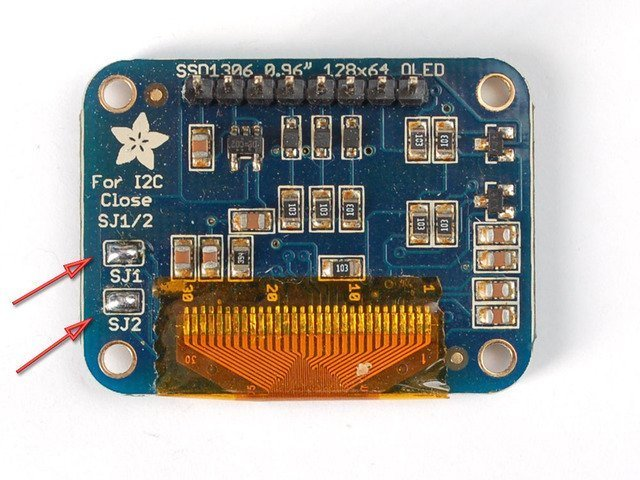

# Display OLED

An OLED display is a small screen for showing text, numbers, simple icons and device status. Unlike regular LCD, OLED lights itself and doesn't need separate backlight. So small OLED modules are readable, take little space and are convenient for simple DIY devices.

In an iDryer-like device, an OLED can show temperature, humidity, working mode, error, Wi-Fi status, remaining filament or current drying phase.

## When OLED Is Useful

An OLED is worth adding if users need to see device status right on the enclosure:

- current chamber temperature;
- humidity;
- target temperature;
- working mode;
- timer;
- sensor error;
- fan or heater status;
- connection status;
- simple menu without a large screen.

If the device is always managed through Klipper, a web interface or mobile app, a separate OLED may be unnecessary. It adds wiring, enclosure space, code and another failure point.

## Typical Sizes and Controllers

The most common small OLED modules:

- `128x32` pixels;
- `128x64` pixels;
- diagonal about `0.91"` or `0.96"`;
- monochrome: white, blue, yellow-blue;
- with controller `SSD1306` or similar `SH1106`.

`SSD1306` and `SH1106` look similar but are not always fully compatible in code. If a library is set for `SSD1306` but the module is actually `SH1106`, the screen may show a shifted picture, garbage or not work.

Before buying, it's important to check not just screen size but controller, interface and supply voltage.

## I2C and SPI

Small OLED modules usually connect by I2C or SPI.

An I2C module usually has 4 contacts:

- `VCC`;
- `GND`;
- `SDA`;
- `SCL`.

An SPI module usually needs more lines:

- `VCC`;
- `GND`;
- `SCK`/`CLK`;
- `MOSI`/`DIN`;
- `CS`;
- `DC`;
- sometimes `RST`.

I2C is simpler to wire and usually enough for status, temperature and simple menu. SPI is faster and better if the screen redraws often, but for a small status display this is rarely critical.

*Source: [Adafruit Learning System](https://learn.adafruit.com/adafruit-128x64-oled-featherwing/), CC BY-SA 3.0*

## Power and Logic Levels

An OLED module may be rated for `3.3V`, for `5V`, or have a regulator and level shifting on the board. Externally such modules can look almost identical.

Before connecting, check:

- what power is listed on the module or product page;
- whether `SDA`/`SCL` lines are compatible with controller logic;
- whether the module has I2C pull-ups;
- whether pull-ups don't conflict with controller voltage.

For ESP32 and most modern microcontrollers, it's safer to assume `3.3V` logic. If an OLED module pulls I2C to `5V`, it can be problematic for a 3.3V controller.

Many popular I2C OLED modules work from `3.3V` and connect fine to ESP32 directly, but you need to check the specific module.

## I2C Address

I2C OLED often has addresses:

- `0x3C`;
- `0x3D`.

If the screen doesn't respond, the address is the first thing to check after power and wires. Some modules let you change the address via jumper or soldering a small jumper on the board.

Signs of wrong address:

- sketch or firmware starts but screen is blank;
- I2C scanner sees device at different address;
- library initializes display without visible result;
- changing `0x3C` to `0x3D` makes it work.

## What to Show on a Small Screen

A `128x32` or `128x64` OLED has very little space. Don't try to make a full smartphone interface on it.

Good set for a dryer or heater:

- large current temperature;
- target temperature;
- humidity if there's a sensor;
- mode: `HEAT`, `DRY`, `IDLE`, `ERROR`;
- small fan/heat icon;
- error code or short message.

Bad set:

- long sentences;
- tiny tables;
- many menu items on one screen;
- constantly scrolling text;
- decorative animation instead of useful status.

For a device with a heater, it's more important to quickly see an error than a pretty splash screen.

## Burn-in and Brightness

OLED pixels age from glowing. If you show the same bright text in one place for many hours, a trace may eventually appear.

For a DIY device, this isn't always critical, but it's better to:

- not keep brightness at maximum without need;
- turn off screen after idle time;
- occasionally move static elements;
- not show white fill constantly;
- use brief updates instead of extra animation.

In a warm chamber or near a heater, OLED also lives worse. It's better to keep electronics in a zone with controlled temperature not exceeding the module's range.

## Wire Length and Interference

I2C doesn't like long wires, especially near motors, heaters and power lines. If OLED is on a door or removable panel, a long flexible cable can become a noise source.

Practical rules:

- keep `SDA` and `SCL` short;
- route them away from heater power wires;
- use common `GND`;
- don't make a connector that goes in backward;
- for a removable cover, use a proper connector and strain relief;
- if I2C is unstable, first shorten the wires and check pull-ups.

SPI usually tolerates higher update speed better, but has more wires and connection errors are more common.

## OLED or Touchscreen

OLED is good for showing status. It doesn't solve the input problem without buttons, encoder or other control.

If users often need to change settings right on the device, you might need:

- encoder + OLED;
- several buttons + OLED;
- TFT display;
- touchscreen;
- web interface or app.

Don't install a touchscreen just because OLED seems small. For simple devices, a small OLED with one button is sometimes more reliable and clear.

## What to Check Before Buying

Before buying an OLED module, check:

- size: `128x32`, `128x64` or other;
- controller: `SSD1306`, `SH1106`, `SH1107`;
- interface: I2C or SPI;
- power: `3.3V`, `5V` or range;
- logic level;
- I2C address if listed;
- reset pin support;
- support in chosen firmware or library;
- physical board dimensions and mounting holes;
- connector location;
- operating temperature;
- color and readability at the angle you need.

For an ESP32 device, I2C OLED `128x64` on `SSD1306` with address `0x3C` is usually most convenient. For a Klipper board, check whether the specific board supports your chosen bus and how the display is described in configuration.

## Typical Errors

- mixed up `SDA` and `SCL`;
- connected power to wrong voltage;
- didn't check I2C address;
- selected `SSD1306` in code but module is `SH1106`;
- made I2C wires too long;
- forgot common `GND`;
- connected 5V pull-up module to 3.3V controller without checking;
- selected SPI module expecting 4 pins like I2C;
- put screen in hot zone;
- added display without understanding what problem it solves for users.

## Main Point

An OLED display is good for short status and simple local interface. For most DIY devices, an I2C OLED `128x64` is enough if compatible by power and supported by chosen firmware.

Before connecting, check the display controller, interface, power, I2C address and wire length. If the device is already convenient via web interface, OLED may not be needed.

## Reference Materials

- [Adafruit: Monochrome OLED Breakouts](https://learn.adafruit.com/monochrome-oled-breakouts) - practical guide to small SSD1306 OLED, I2C/SPI connection, sizes and examples.
- [SparkFun: Qwiic Micro OLED Hookup Guide](https://learn.sparkfun.com/tutorials/qwiic-micro-oled-hookup-guide) - example of I2C OLED module, library and text/graphics output.
- [ESPHome: SSD1306 OLED Display](https://esphome.io/components/display/ssd1306) - documentation on `ssd1306_i2c`, `ssd1306_spi`, addresses, SSD1306/SH1106 models and configuration.
- [Klipper Configuration Reference: display](https://www.klipper3d.org/Config_Reference.html#display) - display support in Klipper, including `ssd1306` and `sh1106`.
- [SSD1306 Datasheet: Solomon Systech](https://www.radiolocman.com/datasheet/pdf.html?di=168297) - technical description of SSD1306 controller: resolution, I2C/SPI/parallel interfaces and commands.
