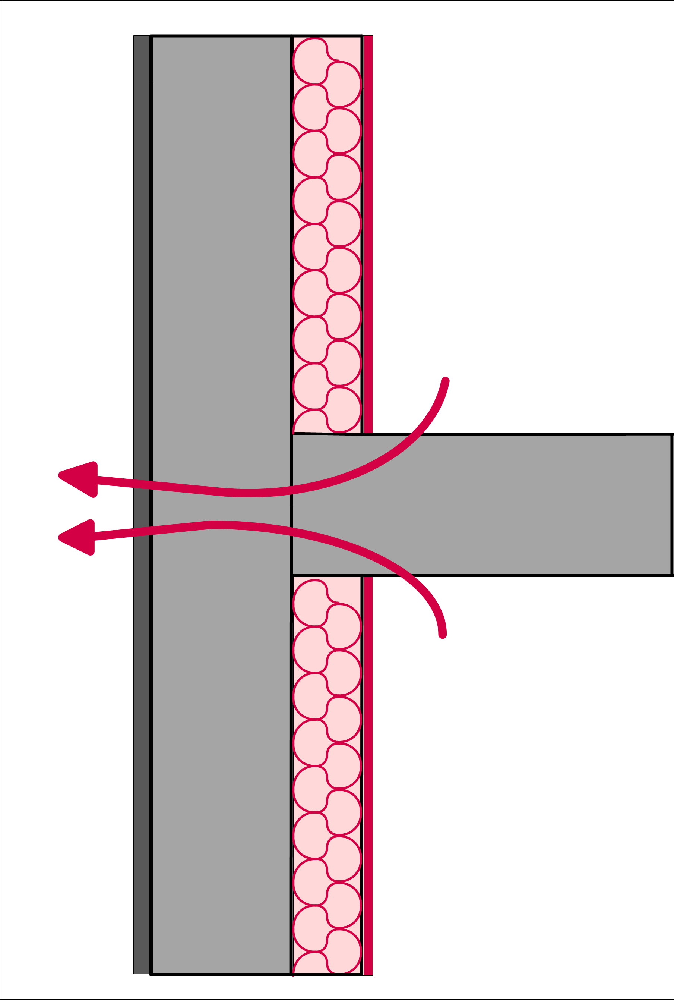

# Condutividade Térmica

Thermal conductivity shows how easily a material transfers heat through itself.

For a homemade dryer, chamber, filter, air duct, or housing, this is not abstract physics. Thermal conductivity determines whether heat will escape outward, whether a hot spot will appear near the heater, how much the outer wall will heat up, and whether a printed part will soften.

## Simple Idea

Heat always tends to escape from a hotter zone to a colder one. The higher the thermal conductivity of a material, the easier heat passes through it.

The rate of heat transfer is affected by:

- material;
- wall thickness;
- contact area;
- temperature difference;
- quality of contact between parts;
- presence of air, gaps, and insulation.

A thin aluminum plate can quickly spread heat throughout the housing. A thick layer of mineral wool or foam insulation, on the contrary, prevents heat from escaping.

## Material Reference Values

The values below are only for understanding orders of magnitude. For a real build, check the datasheet of the specific material.

| Material | Approximate Thermal Conductivity, `W/(m*K)` | What It Means in Practice |
| --- | ---: | --- |
| Copper | about `400` | excellent heat conductor, suitable for heat dissipation, but quickly transfers heat where it is not always needed |
| Aluminum | about `200-240` | distributes heat well, useful as a plate, radiator, or heat spreader |
| Steel | about `15-60` | conducts heat worse than aluminum, but screws and posts can still be thermal bridges |
| Glass | about `1` | conducts heat much worse than metal, but is not insulation in the conventional sense |
| Common plastics | about `0.1-0.5` | conduct heat poorly, but can soften and be flammable |
| Mineral wool, fiberglass | about `0.04` | effectively reduces heat loss, but requires protection from dust, moisture, and mechanical damage |
| Expanded polystyrene / polyurethane foam | about `0.03` | good insulation, but near heat, working temperature and fire properties are important |
| Air | about `0.026` | conducts heat poorly by itself, but transfers heat via convection when moving |

The main conclusion: metal and insulation differ not by a factor of two, but by orders of magnitude. Therefore, even a small metal part can significantly change the thermal picture.

## Thermal Bridge

A thermal bridge is a path through which heat escapes more easily than through the rest of the structure.

*Source: [Wikimedia Commons](https://commons.wikimedia.org/wiki/File:Pont_thermique_classique.png), AmisDeLaThermique, CC BY-SA 3.0*

Typical thermal bridges:

- metal screw through an insulated wall;
- aluminum plate connected to the outer housing;
- metal post between hot chamber and outer panel;
- terminal block or fastener near the heater;
- air duct that directly touches a hot part.

A thermal bridge is not always bad. Sometimes it is needed to dissipate heat from a power switch, radiator, or hot node. The problem starts when the bridge is accidental: the chamber loses heat, the outer surface becomes hot, and plastic near the bridge heats up more than expected.

## Metal: Heat Sink or Accidental Heating

Metal is convenient to use in heated devices:

- as a screen between heater and plastic;
- as a heat distribution plate;
- as a base for heater mounting;
- as a radiator for power electronics;
- as a non-flammable inner surface.

But metal does not make a device safe automatically. If a metal plate touches a hot zone and the outer housing, it can conduct heat outward. If plastic is screwed to it, that plastic can heat up through the fastener. If wires pass through it, near the edge you need feedthroughs, protection from chafing, and temperature margin for insulation.

## Insulation: Lower Loss, More Responsibility

Insulation reduces heat loss, but it does not eliminate temperature control.

When you insulate a chamber:

- it is easier for the heater to raise the temperature;
- the housing may become colder on the outside;
- cooling time increases;
- local temperature near the heater may rise;
- fan failure or stuck switch becomes more dangerous.

Therefore, insulation cannot be added as an "improvement" without testing again. After insulation, you need to remeasure temperatures inside the chamber, at the heater, at wires, at terminals, and on the outer surface.

## Air Gap Also Works

Stationary air conducts heat poorly. Therefore, air gaps, double walls, and foam materials can reduce heat transfer.

But if air starts to move, convection kicks in. Then heat is transferred by the air stream, not just thermal conduction. Therefore, a gap through which a hot stream flows can heat the housing more than a thick wall without flow.

In practice, this means:

- do not leave accidental gaps near the heater;
- do not direct hot flow straight at plastic;
- do not treat air gaps as protection if a stream passes through them;
- check temperature in real operating mode, not just on a cold device.

## What to Look for in Material Datasheet

For material near heat, thermal conductivity is not the only thing that matters.

Check:

- maximum continuous working temperature;
- softening temperature or thermal deformation temperature;
- flammability and fire behavior class;
- permissibility of contact with hot air;
- behavior of glue layer, foil, coating, or lamination;
- manufacturer recommendations for use;
- availability of SDS/safety datasheet if material can heat up or be processed.

If a material has no clear documentation, do not place it near the heater and do not use it as the only protection.

## Practical Verification Order

For housing, chamber, or dryer, it is convenient to proceed as follows:

1. Identify the hot zone: heater, air outlet, terminals, power switch.
2. Separate the hot zone from plastic with metal, ceramics, or another suitable material.
3. Check where the metal conducts heat.
4. Add insulation only where it does not cover dangerous hot nodes.
5. Measure temperature at several points after warm-up.
6. Check fan failure mode if the heater depends on airflow.
7. Add independent overheat protection where overheat is dangerous.

One temperature sensor in the chamber does not show the entire thermal picture. You need measurements near the heater, on fasteners, on wires, on the housing, and on printed parts.

## Main Takeaway

Thermal conductivity helps you understand where heat will really go. Metal can be a useful heat sink or an accidental thermal bridge. Insulation can improve efficiency, but at the same time amplify the consequences of failure.

Any change to the housing, insulation, fasteners, or air duct must be verified by measuring temperature in real operating mode.

## Materials on the Topic

- [Engineering ToolBox: Thermal Conductivity of Common Materials](https://www.engineeringtoolbox.com/thermal-conductivity-d_429.html) - reference values of thermal conductivity for metals, plastics, air, glass, and insulation.
- [Engineering ToolBox: Conductive Heat Transfer](https://www.engineeringtoolbox.com/conductive-heat-transfer-d_428.html) - relationship between heat flow, material, wall thickness, area, and temperature difference.
- [NASA Glenn Research Center: Heat Transfer](https://www1.grc.nasa.gov/beginners-guide-to-aeronautics/heat-transfer-3/) - basic explanation of heat transfer from hot body to cold.
- [U.S. Department of Energy: Principles of Heating and Cooling](https://www.energy.gov/energysaver/principles-heating-and-cooling) - simple explanation of thermal conduction, convection, radiation, and role of insulation.
- [Prusa Knowledge Base: Material table](https://help.prusa3d.com/materials) - practical reference for temperature behavior of popular 3D printing materials.
