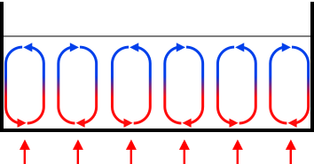

# Convecção e Fluxo de Ar

Convecção é a transferência de calor por fluxo de ar. Num secador, câmara de impressora, filtro aquecido ou dispositivo tipo iHeater, o ar frequentemente determina se o calor atinge onde é necessário.

Um aquecedor por si só apenas converte energia elétrica em calor. O ventoinha e o conduto de ar determinam se este calor é distribuído uniformemente por toda a câmara ou permanece um pequeno ponto quente perigoso.

## Três Modos de Um Aquecedor

O mesmo aquecedor de `100 W` pode funcionar completamente diferente.



*Fonte: [Wikimedia Commons](https://commons.wikimedia.org/wiki/File:Convection_cells.svg), McSush, CC BY-SA 3.0*

Sem fluxo de ar:

- o aquecedor aquece fortemente na zona local;
- o ar próximo aquece, mas se mistura mal;
- a parte distante da câmara pode permanecer fria;
- plástico, terminais ou isolamento próximos podem sobrequecer;
- o sensor de temperatura pode não mostrar o que acontece perto do aquecedor.

Com fluxo fraco ou impróprio:

- algum calor entra na câmara;
- ocorre mistura;
- mas o fluxo pode contornar o aquecedor;
- filtro, tela ou canal estreito podem reduzir muito o fluxo de ar;
- pontos quentes ainda permanecem.

Com fluxo normal:

- o ar passa através da zona quente;
- o calor escapa do aquecedor para a câmara;
- a temperatura torna-se mais uniforme;
- o controle PID funciona mais previsibilmente;
- partes próximas sobrequecem menos localmente.

O fluxo de ar não cria potência adicional. Ajuda a remover o calor já gerado e transferi-lo para o local certo.

## Convecção Natural e Forçada

Existem dois modos úteis:

- convecção natural - o ar quente sobe por si só;
- convecção forçada - o fluxo é criado por um ventoinha, soprador ou ventoinha centrífugo.

Para pequenos dispositivos aquecidos, a convecção natural é frequentemente insuficiente. É lenta, depende da forma da carcaça e facilmente cria zonas de temperatura.

A convecção forçada é geralmente melhor se você precisar:

- remover rapidamente o calor do aquecedor;
- aquecer a câmara uniformemente;
- passar ar através de um filtro;
- secar filamento;
- arrefecer eletrônica de potência;
- manter o sensor de temperatura em fluxo de ar significativo.

## Ventilador Não É Apenas Tamanho

A frase "vou colocar um ventoinha de 40 mm" diz quase nada sobre o resultado.

Para um dispositivo real, o importante é:

- fluxo de ar;
- pressão estática;
- ponto operacional após instalação na carcaça;
- direcção do fluxo;
- resistência de telas, filtros e condutas de ar;
- temperatura do ar no ventoinha;
- ruído e vibração;
- recurso sob carga;
- corrente de arranque;
- tacómetro ou controle de rotação.

O catálogo frequentemente lista o fluxo máximo e a pressão estática máxima. Num dispositivo real, o ventoinha não funciona nestes pontos ideais. Filtro, tela, canal estreito, volta de conduto de ar e aquecedor denso criam resistência, portanto o fluxo real pode ser muito menor.

Se o ar deve passar através de um filtro, radiador, favos, ou canal estreito, frequentemente você precisa não apenas de "mais CFM" mas de um ventoinha ou soprador centrífugo com pressão estática apropriada.

## Caminho do Ar

Um bom design responde quatro questões:

1. De onde o ar é retirado?
2. O que passa?
3. Onde liberta o calor?
4. Onde retorna?

Para câmara ou secador, a circulação em circuito fechado é útil:

```text
câmara -> ventoinha -> aquecedor -> fluxo quente -> câmara -> retorno
```

Para um filtro, lógica diferente pode aplicar-se:

```text
câmara -> filtro -> ventoinha -> exaustão ou retorno
```

O importante é que o fluxo não tome o caminho mais fácil e inútil contornando o aquecedor ou filtro. O ar sempre escolhe o caminho com menor resistência.

## Sensor de Temperatura Deve Ver o Local Correcto

Opções ruins:

- sensor está diretamente no aquecedor e vê sobreaquecimento local;
- sensor está em zona morta e vê canto frio;
- sensor toca parede de metal e mede a parede, não o ar;
- sensor está localizado antes do aquecedor, embora a temperatura depois seja importante;
- sensor é soprado por um fluxo que não reflecte a temperatura da câmara.

Para câmara, é geralmente útil medir ar onde a temperatura deve ser controlável, mas não diretamente no aquecedor. Para protecção de sobreaquecimento perto do aquecedor, um sensor separado ou termóstato/corte térmico independente é necessário.

Um sensor para controle e um elemento de emergência independente é muito melhor do que um sensor responsável por tudo.

## Filtros e Telas Podem Matar o Fluxo

Um filtro, tela, grelha decorativa ou lacuna estreita adiciona resistência.

Erros típicos:

- colocar filtro denso em ventoinha axial fraco;
- bloquear meia entrada com tela decorativa;
- fazer volta acentuada diretamente após ventoinha;
- posicionar aquecedor para que ar o contorne;
- esquecer que o filtro entope com pó e a resistência cresce;
- não deixar acesso para manutenção do filtro.

Se o dispositivo depende de fluxo, verifique não apenas "o ventoinha está a rodar" mas também que o ar realmente passa pelo caminho certo.

## O Que Acontece Se o Ventilador Falhar

Cenário mais perigoso para aquecedor com fluxo de ar:

```text
ventoinha parou -> aquecedor continua funcionando -> temperatura local sobe rapidamente
```

Portanto, aquecedor que depende de fluxo de ar precisa de medidas:

- protecção de sobreaquecimento independente perto da zona quente;
- limitação de potência;
- material com margem de temperatura;
- distância do aquecedor para plástico e isolamento;
- controle de tacómetro do ventoinha se o ventoinha é crítico;
- verificação de firmware para aquecimento se usar Klipper ou similar;
- primeiro teste sob observação.

Firmware ajuda mas não substitui protecção física. MOSFET, SSR ou relé pode falhar no estado conectado.

## Verificação Mínima Após Montagem

Após construir um dispositivo aquecido, verifique:

- direcção do fluxo;
- há fluxo na saída, não apenas rotação do ventoinha;
- temperatura no aquecedor;
- temperatura após aquecedor;
- temperatura na parte distante da câmara;
- temperatura de fios, terminais e peças impressas;
- temperatura do ventoinha;
- comportamento com filtro parcialmente bloqueado;
- aquecimento desliga se sensor falha;
- protecção de sobreaquecimento independente dispara em cenário perigoso.

Faça primeiro aquecimento sob observação. As medições são melhores feitas após estabilização e após funcionamento prolongado, porque a carcaça, fixadores e isolamento aquecem mais lentamente que o ar.

## Conexão a Klipper

Em Klipper, vários mecanismos são úteis:

- `heater_fan` - ventoinha liga-se com aquecedor ou quando temperatura é atingida;
- `temperature_fan` - ventoinha é controlado por sensor de temperatura separado;
- `verify_heater` - verifica que o aquecedor funciona como esperado;
- `tachometer_pin` para ventoinha - permite ver RPM se o ventoinha suporta sinal de tacómetro.

Isto não é um esquema de segurança completo, mas um bom nível de controle para dispositivo onde a temperatura e o fluxo são importantes.

## Conclusão Principal

Num dispositivo aquecido, o que importa não é apenas a potência do aquecedor mas o caminho do ar. Um bom fluxo remove o calor do aquecedor e transfere-o para a câmara. Fluxo fraco deixa um ponto quente, engana o sensor e aumenta o risco de sobreaquecimento de material.

Se o aquecedor depende do ventoinha, a falha do ventoinha deve ser um cenário de emergência separado, não uma surpresa.

## Materiais sobre o Tópico

- [Engineering ToolBox: Convective Heat Transfer](https://www.engineeringtoolbox.com/amp/convective-heat-transfer-d_430.html) - explicação de convecção natural e forçada.
- [SANYO DENKI: Fan Airflow and Static Pressure](https://techcompass.sanyodenki.com/en/training/cooling/fan_basic/004/index.html) - por que o fluxo máximo e a pressão máxima do catálogo não igualam a operação de dispositivo real.
- [SANYO DENKI: Guideline in Selecting a Fan](https://products.sanyodenki.com/info/sanace/en/technical_material/select.html) - abordagem prática para escolher ventoinha por potência térmica, aumento de temperatura e testes reais.
- [DigiKey: Selecting a Fan](https://www.digikey.com/en/articles/selecting-a-fan) - diferença entre ventoinhaes axiais e centrífugos, impacto da carcaça e resistência do fluxo.
- [Klipper Documentation: Configuration Reference](https://www.klipper3d.org/Config_Reference.html) - parâmetros para `heater_fan`, `temperature_fan`, `verify_heater` e tacómetro do ventoinha.

## Ver Também

- [iDryer docs: Connecting a Fan](../06-practical-guides/01-connecting-fan.md) - instrução local sobre potência do ventoinha, MOSFET, GND comum e exemplos de Klipper.
