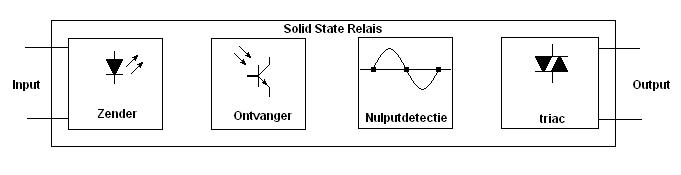

# Relé de Estado Sólido

Um relé de estado sólido, ou SSR, é um relé sem contatos mecânicos. Você aplica um sinal de controle fraco do controlador à entrada do SSR e a saída do SSR liga ou desliga uma carga.

Em dispositivos simples para impressoras 3D, o SSR é mais frequentemente usado para um aquecedor de rede: câmara, secadora, mesa ou módulo de aquecimento separado. É uma forma conveniente de controlar uma carga `110-230V AC` a partir de electrónica de baixa tensão, mas não uma forma de tornar a rede segura.

Se o projecto tem `110-230V AC`, a secção de potência deve ser montada num invólucro, com um fusível, terminais normais, isolamento, alívio de tensão do cabo e compreensão da segurança eléctrica.

## Como SSR difere de um relé comum

Um relé electromagnético comum clica porque os contatos se movem fisicamente dentro. A bobine do relé precisa de energia, muitas vezes precisa de um controlador de transístor, diodo de protecção e os contatos podem centelhar, chocalhar e desgastar.

O SSR comuta a carga usando semicondutores. Portanto, não tem clique, não tem desgaste de contatos mecânicos e é mais adequado para ciclos frequentes de ligação/desligação de aquecedor.

Mas SSR não é "relé sem desvantagens".

SSR tem suas próprias limitações:

- aquece;
- frequentemente requer dissipador;
- pode ter pequena corrente de fuga no estado desligado;
- tolera sobrecargas e picos pior do que um contactor devidamente escolhido;
- pode falhar no estado "ligado";
- deve ser escolhido para carga CA ou CC;
- não substitui fusível, invólucro e protecção térmica de emergência.

Para ciclos de energia infrequentes, um relé comum ou contactor pode ser mais apropriado. Para controle frequente de aquecedor resistivo, SSR é muitas vezes mais prático.

## O que está dentro do SSR CA

Um SSR CA geralmente contém:

- circuito de entrada do sinal de controle;
- isolamento óptico;
- circuito de disparo;
- TRIAC de potência ou par de tiristores;
- circuito suppressivo ou outra protecção contra picos;
- terminais de potência para a carga.

Em termos simples, é um circuito TRIAC pronto em um invólucro. Portanto, SSR é conveniente onde você não deseja calcular TRIAC optoisolado, TRIAC, suppressivo, espaçamento de placa e secção de rede sozinho.

Um invólucro pronto não elimina a necessidade de verificação. Especialmente se o SSR é barato, não tem especificação técnica ou tem uma classificação de corrente suspeitosamente alta no invólucro.

## SSR CA e SSR CC

O SSR deve ser escolhido de acordo com o tipo de carga:

- **SSR CA** - para corrente alternada, por exemplo aquecedor de rede `110-230V AC`;
- **SSR CC** - para corrente contínua, por exemplo carga CC `12V` ou `24V`.

São dispositivos diferentes. O SSR CA não pode ser automaticamente colocado num aquecedor CC `24V`: pode não desligar. O SSR CC não pode ser considerado adequado para `230V AC`: pode ser perigoso e não classificado para tal circuito.

Você precisa verificar não apenas o rótulo `AC` ou `CC`, mas também a gama de tensão de saída.

Exemplos de marcações:

```text
Entrada: 3-32V CC
Saída: 24-380V CA
```

Isto significa:

- entrada é controlada por sinal CC de baixa tensão;
- saída comuta carga CA na gama especificada;
- você não precisa alimentar a carga do lado da entrada através do SSR.

Antes de comprar, verifique as linhas `Input`, `Output`, `Load voltage`, `Load current` e o diagrama de ligação do fabricante.

## Esquema de ligação típico

O SSR é geralmente colocado na ruptura da linha de alimentação da carga. O controlador conecta-se apenas à entrada do SSR, enquanto o circuito de rede passa pela saída do SSR.



*Fonte: [Wikimedia Commons](https://commons.wikimedia.org/wiki/File:SSR.png), Thomas Verdyck, CC BY-SA 3.0*

Pontos importantes:

- entrada e saída do SSR são lados diferentes do dispositivo;
- lado de baixa tensão não deve ser conectado ao lado de rede;
- SSR é colocado na ruptura da linha de alimentação da carga, geralmente `Line`;
- aterramento protector `PE` não é quebrado através do SSR;
- fusível deve proteger a fiação e a carga;
- aquecedor precisa de protecção térmica independente;
- toda a secção de rede deve ser fechada do toque.

O SSR não é considerado um desligador de serviço. Para manutenção, você precisa de uma maneira física de cortar a energia: interruptor, disjuntor, conector ou outra ruptura padrão de circuito. Na prática, pode haver esquemas diferentes de acordo com as regras locais, tipo de potência, aterramento protector e invólucro. Se não tem a certeza, uma pessoa qualificada deve verificar o circuito.

## Cruzamento zero, ligação aleatória e controle

O SSR CA vem com diferentes métodos de ligação.

**SSR de cruzamento zero** liga a carga perto do cruzamento zero da tensão de rede. Esta é uma boa opção para ligação/desligação simples de um aquecedor resistivo: menos ruído e comutação mais suave.

**SSR de ligação aleatória** liga a saída quase imediatamente após o sinal de controle ser aplicado. Este tipo é usado onde lógica diferente é necessária, controle de fase ou requisitos de carga específicos.

Para uma câmara, secadora ou aquecedor simples, controle rápido de dimmer geralmente não é necessário. Frequentemente, controle lento é suficiente: por exemplo, ligar o aquecedor por segundos, não agitar centenas de vezes por segundo.

Nem todos os SSR são adequados para controle de fase. Se você especificamente precisa de um regulador de potência de fase, esse é um tipo de dispositivo separado e um tópico separado com ruído, aquecimento e requisitos de carga.

## Corrente de fuga

SSR pode passar uma pequena corrente mesmo quando está "desligado". Isto é chamado corrente de fuga.

Para um aquecedor poderoso, essa corrente geralmente não cria aquecimento perceptível, mas para uma lâmpada pequena, controlador LED, fonte de alimentação ou carga muito pequena, pode ser perceptível: indicador pode brilhar fracamente, entrada de fonte de alimentação pode se comportar estranhamente.

Portanto, SSR não deve ser considerado um interruptor de circuito ideal. Antes da primeira ligação do aquecedor, verifique se a carga não aquece quando o sinal de controle é removido. É melhor testar primeiro a saída SSR com uma carga pequena segura, lâmpada ou multímetro, não imediatamente com o aquecedor principal.

Para manutenção, desligamento de emergência e isolamento completo, você precisa de um interruptor, disjuntor, fusível, conector ou outra maneira física de cortar a energia.

## Aquecimento e dissipador

SSR aquece durante a operação. No estado ligado, existe uma queda de tensão através do elemento de potência, o que significa que o calor é gerado.

Você precisa verificar:

- corrente de carga;
- corrente máxima SSR em temperatura real;
- queda de tensão na saída;
- requisitos de dissipador;
- temperatura dentro do invólucro;
- orientação de dissipador e fluxo de ar;
- qualidade do contato térmico entre SSR e dissipador;
- temperatura de terminais e fios após o teste.

O rótulo `25A` ou `40A` não significa que o SSR suportará essa corrente sem dissipador num invólucro fechado e quente ao lado de um aquecedor. Os fabricantes geralmente especificam corrente sob condições específicas de arrefecimento.

Recomendação prática para um projeto simples: não escolha SSR exatamente para corrente de carga. Planeje uma reserva, use um dissipador, leia a especificação técnica e verifique a temperatura no invólucro real. `50%` de margem é o limite inferior para estimativa inicial, não é uma garantia para qualquer instalação.

## SSR não protege o aquecedor

SSR é um interruptor de potência, não um sistema de segurança.

Um aquecedor precisa de camadas independentes:

- fusível ou disjuntor para fiação e carga;
- sensor de temperatura correcto;
- limites de temperatura de software;
- verificação de aquecimento no firmware;
- termostato independente, fusível térmico ou interruptor bimetal;
- invólucro feito de material que suporta temperaturas reais;
- primeiro teste sob supervisão.

Modo de falha importante: SSR pode quebrar e ficar ligado. Portanto, protecção térmica de emergência deve ser capaz de cortar a energia do aquecedor independentemente do controlador e SSR.

## Que cargas são adequadas

SSR é mais fácil usar com cargas resistivas CA:

- aquecedor;
- almofada de aquecimento de silicone;
- lâmpada incandescente;
- carga térmica simples sem electrónica incorporada.

Tenha cuidado com:

- motores;
- ventiladores CA;
- transformadores;
- solenóides;
- fontes de alimentação;
- controladores electrónicos;
- cargas com corrente de arranque elevada.

Cargas indutivas e electrónicas podem requerer um tipo diferente de SSR, suppressivo, varistor, contactor ou circuito separado. Você não pode escolher SSR apenas pelo rótulo `40A`.

## O que verificar antes de comprar

Antes de comprar SSR, verifique:

- carga CA ou CC;
- tensão de carga;
- corrente de carga e potência;
- tensão de entrada de controle;
- compatibilidade de entrada com controlador: `3.3V`, `5V`, `12V` ou outro nível;
- tipo de ligação: cruzamento zero ou aleatório;
- corrente máxima no arrefecimento necessário;
- é necessário dissipador;
- existe especificação técnica;
- existe diagrama de ligação normal;
- terminais e distâncias de isolamento;
- qualidade do fabricante;
- onde o fusível está colocado;
- onde a protecção térmica independente será colocada.

Se não há documentação e o SSR deve controlar um aquecedor de rede, é uma má escolha.

## Erros comuns

- entrada e saída SSR confundidas;
- comprado SSR CC em vez de SSR CA ou vice-versa;
- não verificado intervalo de tensão de saída;
- conectado SSR CA ao aquecedor CC e ficou surpreso que não desliga;
- escolhido SSR exatamente para corrente de carga;
- instalado SSR sem dissipador;
- instalado SSR num invólucro fechado e quente;
- não considerado corrente de fuga;
- usar SSR como única forma de desligamento de emergência;
- esquecido de fusível;
- não instalada protecção térmica independente;
- deixados terminais de rede acessíveis;
- controle de SSR com PWM demasiado rápido sem compreender tipo de SSR e carga.

## O ponto principal

SSR é conveniente para controle frequente silencioso de carga, especialmente aquecedor resistivo de rede. Mas SSR deve ser escolhido para tipo de carga, tensão, corrente, método de ligação e ponto operacional térmico.

Para carregar `110-230V AC`, SSR não elimina a segurança elétrica. Você precisa de invólucro, composição, teto normal, dissipador se necessário e proteção térmica de isolamento independente.

## Materiais de referência

- [Omron: Overview of Solid-state Relays](https://www.ia.omron.com/support/guide/18/introduction.html) - design SSR, isolamento óptico, tipos e princípios de aplicação geral.
- [Omron: SSR glossary and installation notes](https://www.ia.omron.com/support/guide/18/further_information.html) - definições de `load voltage`, `leakage current`, `output ON voltage drop`, cruzamento zero, suppressivo e notas sobre dissipação de calor.
- [Panasonic: SSR Principle of Operation](https://industry.panasonic.com/global/en/products/control/relay/solid-state/principle_operation) - diferença entre SSR de cruzamento zero e aleatório, comportamento com cargas CA resistivas e indutivas.
- [Sensata/Crydom: HS Series Heat Sinks](https://www.sensata.com/products/relays/solid-state-relays/ssr-accessories/hs-series-heat-sinks) - porque SSR gera calor e porque o dissipador deve corresponder a corrente e temperatura.
- [DigiKey: Solid State Relays - A Basic Overview](https://www.digikey.com/en/blog/solid-state-relays-a-basic-overview) - breve visão geral de tipos de saída SSR, cruzamento zero, ligação aleatória e limitações comparadas com relés mecânicos.
