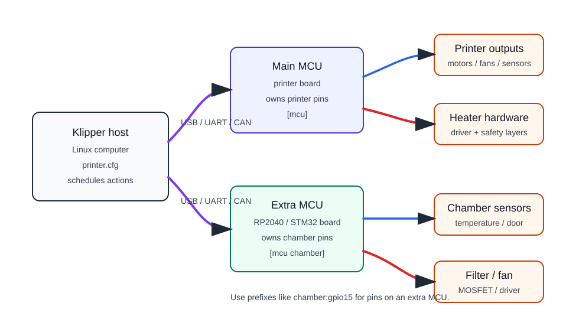

# MCU em Klipper

Klipper consiste em duas partes principais:

- **host** — um computador Linux com Klipper, como Raspberry Pi, Orange Pi, mini-PC ou outro dispositivo;
- **MCU** — uma placa microcontroladora que controla fisicamente os pinos.

O host toma decisões de alto nível, lê a configuração, processa o código G e planeja ações. O MCU executa comandos precisos no hardware: alterna saídas, lê entradas, conta o tempo, gera PWM e relata o status ao host.

## O que é um MCU no Klipper

MCU significa unidade microcontroladora.

No contexto do Klipper, é uma placa específica:

- placa principal da impressora 3D;
- separate RP2040 board;
- separate STM32 board;
- CAN/toolhead board;
- additional I/O board.

Um MCU não “pensa como a impressora inteira”. Ele executa comandos de baixo nível enviados pelo host. Essa separação torna o Klipper flexível: você pode adicionar um segundo ou terceiro MCU e usar seus pinos em uma configuração compartilhada.

## Como parece

Simplified scheme:



O host se comunica com o MCU via USB, UART ou CAN. Na configuração do Klipper, cada MCU obtém sua própria seção, e os pinos desse MCU são então usados ​​nas configurações do ventilador, sensor, aquecedor, saída e outras configurações do módulo.

## O que o anfitrião faz

O anfitrião:

- armazena e lê `printer.cfg`;
- aceita código G e comandos do usuário;
- maintains high-level logic;
- schedules actions over time;
- sincroniza a comunicação com o MCU;
- decide quando trocar um ventilador, aquecedor ou outra saída;
- recebe leituras e status do MCU.

O host não aplica corrente a um ventilador nem lê um termistor diretamente se esses pinos estiverem em uma placa externa. Diz ao MCU o que fazer.

## O que o MCU faz

O MCU:

- physically controls GPIO;
- lê entradas e sensores;
- generates PWM;
- executa comandos na hora certa;
- relata os resultados ao host;
- entra em desligamento devido a erros se o firmware e a configuração estiverem configurados dessa maneira.

Por exemplo, se a configuração possui uma ventoinha no pino `PA8`, é o MCU com esse pino que muda seu estado. O host apenas envia o comando.

## O que significa `[mcu]`

Em `[mcu]`, a seção `[mcu]` descreve o microcontrolador ao qual o Klipper deve se conectar.

Exemplo para USB/serial:

```ini
[mcu]
serial: /dev/serial/by-id/usb-Klipper_stm32f446xx_...
```

Para um MCU adicional, você usa um nome:

```ini
[mcu chamber]
serial: /dev/serial/by-id/usb-Klipper_rp2040_...
```

Depois disso, os pinos do MCU adicional podem ser especificados com um prefixo:

```ini
[temperature_sensor chamber_air]
sensor_type: Generic 3950
sensor_pin: chamber:gpio26

[fan_generic chamber_fan]
pin: chamber:gpio15
```

A lógica é simples: `gpio15` significa “pino `chamber` no MCU chamado `chamber`”.

## Nomes e prefixos de pinos

Klipper uses hardware pin names.

Exemplos:

- for STM32: `PA4`, `PB0`, `PC13`;
- for RP2040: `gpio15`, `gpio26`;
- para Arduino/AVR pode haver seus próprios aliases.

Antes do nome de um pino pode haver símbolos:

- `!` — inverte a lógica;
- `^` — habilita pull-up se o MCU suportar;
- `~` — habilite o menu suspenso se o MCU suportar.

Exemplo:

```ini
[gcode_button chamber_door]
pin: ^chamber:gpio12
```

Esta não é uma “mágica do Klipper”, mas uma configuração específica de um pino de entrada em um MCU específico. Portanto, a pinagem da placa deve ser precisa.

## Por que MCU adicional é necessário

MCU adicional é útil quando você precisa separar periféricos em um bloco separado.

Exemplos de dispositivos semelhantes ao iDryer:

- sensores de temperatura e umidade da câmara;
- circulation fan;
- filter fan;
- backlighting;
- door button;
- lid sensor;
- damper servo;
- módulo separado com célula de carga;
- additional OLED or RFID;
- entrada de emergência que é mais conveniente para rotear perto do dispositivo.

Essa abordagem é conveniente se o dispositivo fizer parte de um sistema Klipper, e não de uma caixa Wi-Fi separada.

## MCU approach or standalone controller

Existem dois caminhos diferentes.

**MCU in Klipper**:

- o dispositivo é controlado por `printer.cfg`;
- os pinos são visíveis para o Klipper;
- você pode usar seções existentes como `temperature_sensor`, `heater_generic`, `output_pin`, `output_pin`;
- o estado é visível na interface do Klipper;
- a comunicação com o host é necessária.

**Standalone controller**:

- o dispositivo toma suas próprias decisões;
- may have Wi-Fi, web interface, MQTT;
- não precisa depender da impressora;
- requer seu próprio firmware e lógica de segurança;
- não se conecta como um `[mcu]` normal no Klipper.

O ESP32 costuma ser bom para um dispositivo Wi-Fi independente. RP2040 e STM32 costumam ser mais convenientes como MCU com fio no Klipper.

## USB, UART e CAN

A comunicação entre o host e o MCU pode ser diferente.

**USB** — a opção mais comum e simples para uma ou duas placas próximas ao host. Conveniente para placas Pico, STM32 e muitas placas de impressora.

**UART** — comunicação serial por meio de pinos TX/RX separados. Pode ser útil em algumas placas, mas requer conexão cuidadosa de nível, aterramento e velocidade.

**CAN** — conveniente para módulos remotos, placas de cabeçote de ferramentas e arquitetura com fio mais estável. Mas o CAN requer um microcontrolador compatível, um transceptor CAN, um barramento adequado, terminadores e configuração de interface Linux.

Para um primeiro controlador adicional, o USB geralmente é mais simples. CAN faz sentido quando há um motivo real: fiação mais longa, vários nós, placa de cabeçote ou infraestrutura CAN existente.

## MCU não protege a seção de energia

Importante: adicionar um MCU não torna a carga segura.

Se um MCU controlar um ventilador, aquecedor ou SSR, você ainda precisará de:

- correct power switch;
- proper power supply;
- fios e terminais para corrente;
- fuse;
- proteção térmica independente para o aquecedor;
- recinto seguro;
- verificação do comportamento se a comunicação for perdida ou o host for desligado.

Se o host perder a comunicação com o MCU, o Klipper poderá desligar o sistema, mas isso não substitui a proteção do hardware. Um aquecedor deve ser projetado de modo que uma única falha de firmware, sensor, SSR ou comunicação não leve a um modo inseguro.

## O que verificar antes de escolher um MCU

Antes de comprar uma placa para Klipper MCU, verifique:

- se o microcontrolador é compatível com Klipper;
- se existe configuração pronta ou instruções para a placa;
- qual método de comunicação é necessário: USB, UART ou CAN;
- como a placa pisca;
- whether you have enough GPIO, ADC, PWM, I2C, SPI, UART;
- quais pinos estão realmente expostos;
- qual lógica GPIO: geralmente `3.3V`;
- se drivers/MOSFET/SSR são necessários para cargas;
- se há documentação para alimentação e pinagem;
- o que acontece se a comunicação com o MCU for perdida.

Para um primeiro MCU adicional, geralmente é mais fácil escolher RP2040/Pico ou uma placa STM32 bem conhecida com instruções claras.

## Erros comuns

- pensar que o MCU contém toda a lógica do Klipper;
- host confuso e MCU;
- adicionando `chamber:`, mas especificando pinos sem o prefixo `chamber:`;
- tirar um alfinete da pinagem de outra pessoa;
- piscando o tipo de microcontrolador errado em `make menuconfig`;
- não verificar o deslocamento do bootloader e o método de flashing da placa;
- usando um cabo USB instável;
- conectando `3.3V` à entrada `3.3V`;
- alimentando uma carga do GPIO;
- pensar que o desligamento do software substitui um fusível e um fusível térmico.

## Pontos principais

No Klipper, um MCU é uma placa que controla fisicamente os pinos e o host planeja e coordena o trabalho. MCU adicional permite expandir o sistema e mover periféricos para mais perto do dispositivo.

Para tarefas semelhantes ao iDryer, isso é conveniente para ventiladores, sensores, filtros, iluminação de fundo, botões e alguns atuadores. Mas a seção de energia e a segurança do aquecedor permanecem uma tarefa separada de hardware.

## Related materials

- [Klipper: Code overview](https://www.klipper3d.org/Code_Overview.html) — Klipper architecture, division of host code and micro-controller code, timing model, and GPIO.
- [Klipper: Configuration reference - Micro-controller configuration](https://www.klipper3d.org/Config_Reference.html#micro-controller-configuration) — `[mcu]`, additional `[mcu name]`, pin name format, and prefixes.
- [Klipper: Installation - Building and flashing the micro-controller](https://www.klipper3d.org/Installation.html#building-and-flashing-the-micro-controller) — general process of `make menuconfig`, building, and flashing the MCU.
- [Klipper: Bootloaders](https://www.klipper3d.org/Bootloaders.html) — why different boards have different flashing methods and why bootloader matters.
- [Klipper: CANBUS](https://www.klipper3d.org/CANBUS.html) — CAN communication, `canbus_uuid`, USB-to-CAN bridge, and hardware requirements.
