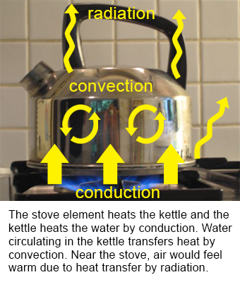

# Física térmica e materiais

Esta secção é necessária para dispositivos com aquecedor, câmara, secador de filamento, filtro com ar quente, condutas de ar, ventiladors, isolamento ou peças impressas próximas de temperaturas altas.

Não encontrará aqui um curso acadêmico de física. O objetivo é prático: entender para onde o calor vai, por que o caixa aquece de forma desigual e por que um material serve para a parede da câmara enquanto outro pode amolecer, emitir fumaça ou se tornar risco de incêndio.

## Por que isso importa

Em um dispositivo aquecido simples, não dá para pensar apenas assim:

```text
coloquei um aquecedor -> ficou quente
```

Na prática, é preciso responder a outras perguntas:

- para onde vai o calor do aquecedor;
- onde aparecerão pontos quentes;
- o que o sensor de temperatura realmente mede;
- se o material suporta aquecimento prolongado;
- o que acontece se a ventilador falhar;
- o que acontece se um MOSFET/SSR travar ligado;
- se fio, terminal ou plástico podem ficar na zona de superaquecimento;
- se existe proteção independente contra superaquecimento.

Um dispositivo pode mostrar `45°C` na ecrã, mas perto do aquecedor, de um terminal ou dentro do duto de ar a temperatura pode ser muito maior. Por isso, não importa apenas a temperatura-alvo da câmara, mas também a temperatura local das peças.

## Três formas de propagação do calor

O calor se transfere de três formas principais:



*Fonte: [Wikimedia Commons](https://commons.wikimedia.org/wiki/File:Kettle-convection-conduction-radiation.png), P.wormer, CC BY-SA 3.0*

**Condução térmica** - o calor passa através de um material. Por exemplo, um suporte metálico transfere rapidamente calor de uma zona quente para o caixa.

**Convecção** - o calor é transportado pelo fluxo de ar. Por exemplo, uma ventilador retira calor do aquecedor e o espalha pela câmara.

**Radiação** - uma superfície quente transfere calor por radiação infravermelha. Por exemplo, um elemento muito aquecido pode aquecer plástico próximo mesmo sem contato direto.

Em um dispositivo real, os três mecanismos quase sempre atuam ao mesmo tempo.

## O material faz parte do sistema térmico

O material do caixa, parede, duto de ar ou suporte afeta o regime térmico.

Metal:

- conduz bem o calor;
- pode dissipar calor da zona quente;
- pode deixar a superfície externa quente;
- por si só não resolve isolamento nem segurança elétrica.

Plástico:

- conduz mal o calor;
- pode ser conveniente para um caixa;
- pode amolecer e perder resistência;
- pode ser inflamável ou emitir fumaça quando superaquecido.

Isolamento:

- reduz perda de calor;
- ajuda a manter a temperatura da câmara;
- pode aumentar superaquecimento local;
- exige camada protetora e verificação de segurança contra incêndio.

Não existe um "melhor material" universal. Existe material adequado para um local, temperatura, carga e cenário de falha específicos.

## Temperatura de trabalho não é temperatura de fusão

Principiantes muitas vezes olham apenas para a temperatura de fusão. Isto é um erro.

Um material pode se tornar inadequado antes disso:

- amolecer;
- perder forma;
- encolher;
- perder resistência;
- começar a cheirar;
- liberar procondutas de decomposição;
- tornar-se mais inflamável.

Para caixa, suporte ou duto de ar, a temperatura de trabalho permitida, a temperatura de amolecimento, as propriedades contra fogo e as recomendações do fabricante importam mais.

## O ar precisa se mover corretamente

Um ventilador em um dispositivo aquecido não está ali "para enfeitar". Ela determina como o calor sai do aquecedor.

Sem fluxo correto:

- o aquecedor pode superaquecer localmente;
- a câmara aquece de forma desigual;
- o sensor pode não mostrar a temperatura correta;
- peças próximas podem ficar mais quentes que o esperado;
- o controlo PID se comporta pior.

Mas a ventilador também precisa ser escolhida e instalada corretamente: fluxo, pressão estática, direção, filtro, ecrã e duto de ar podem mudar completamente o resultado.

## O que verificar em qualquer dispositivo aquecido

Antes da montagem e do primeiro teste, verifique:

- potência do aquecedor;
- temperatura perto do aquecedor;
- temperatura do ar depois do aquecedor;
- temperatura de terminais e fios;
- temperatura do caixa e das peças impressas;
- se o material suporta a temperatura de trabalho com margem;
- se há material inflamável perto da zona quente;
- se existe fusível;
- se existe proteção independente contra superaquecimento;
- o que acontece se a ventilador falhar;
- o que acontece se o sensor de temperatura falhar.

O primeiro teste deve ser feito sob observação e com possibilidade de desligar a alimentação rapidamente.

## Como ler esta seção

A seção consiste em três tópicos práticos:

- [Condutividade térmica](02-thermal-conductivity.md) - por que metal, plástico, vidro e isolamento se comportam de forma diferente.
- [Materiais, inflamabilidade e emissões nocivas](03-material-safety.md) - como escolher material perto de calor e o que ler no datasheet.
- [Convecção e fluxo de ar](04-convection-and-airflow.md) - por que o mesmo aquecedor funciona de formas diferentes com fluxos de ar diferentes.

## Ideia principal

Um dispositivo aquecido não é apenas aquecedor e sensor. É um sistema térmico: aquecedor, ar, caixa, materiais, fios, terminais, ventilador, sensores e proteção de emergência.

Se um material é conveniente, barato e fácil de cortar, isso não significa que ele possa ficar perto de um aquecedor. Primeiro verifique temperatura, transferência de calor, propriedades contra fogo, documentação e cenários de falha.

## Materiais sobre o tema

- [U.S. Department of Energy: Principles of Heating and Cooling](https://www.energy.gov/energysaver/principles-heating-and-cooling) - explicação simples de condução térmica, convecção e radiação.
- [NASA Glenn Research Center: Heat Transfer](https://www1.grc.nasa.gov/beginners-guide-to-aeronautics/heat-transfer-3/) - explicação básica da transferência de calor de um corpo mais quente para um mais frio.
- [Engineering ToolBox: Conductive Heat Transfer](https://www.engineeringtoolbox.com/conductive-heat-transfer-d_428.html) - condução térmica, gradiente de temperatura, espessura do material e paredes multicamadas.
- [UL Solutions: Combustion Fire Tests for Plastics](https://www.ul.com/services/combustion-fire-tests-plastics) - por que materiais plásticos são comparados pelo comportamento ao queimar, não apenas pela temperatura de fusão.

## Ver também

- [iDryer docs: Heaters](../03-common-components/02-heaters.md) - artigo local sobre escolha do aquecedor, chave de potência, sensor e proteção independente contra superaquecimento.
