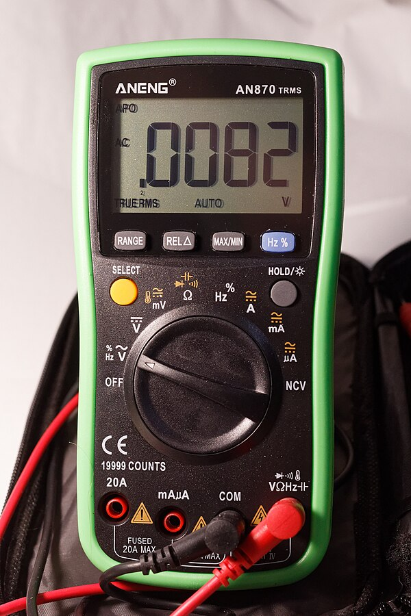

# Verificação de um Termistor

A thermistor is a temperature sensor that changes resistance when heated or cooled.

In 3D printers, dryers, and chamber heaters, the most common type is an NTC thermistor rated at `100K`. NTC means that resistance decreases as temperature increases.

You need to check a thermistor if:

- temperature readings are unrealistic;
- temperature jumps around;
- the heater enters an error state;
- firmware reports `MINTEMP`, `MAXTEMP`, `Thermal runaway`, or similar;
- the thermistor was replaced, moved, or re-crimped;
- the device was assembled for the first time.

## First, turn off power

Resistance is measured only on de-energized circuits.

Before checking:

1. Turn off the device.
2. Disconnect power from the mains or power supply.
3. Wait for the heater to cool down.
4. Disconnect the thermistor from the board if you need to measure the sensor itself.

If you measure resistance while the thermistor is connected to the board, readings may be distorted by other circuit components. If you measure resistance with power on, you can damage the multimeter or board.

## What an NTC 100K should have

A typical NTC `100K` has a resistance of about `100 kOhm` at `25°C`.

This does not mean the multimeter will always show exactly `100.0 kOhm`.

It is normal for the reading to differ slightly at room temperature:

- in a cool room resistance will be higher;
- in a warm room resistance will be lower;
- different thermistor types have different tables;
- long wires and poor contacts can affect measurement.

The main check is simple: a 100K NTC at room temperature should read tens or around a hundred kilohms, not `0 Ohm` or `OL`.

## Measuring with a multimeter

Set your multimeter to resistance mode `Ohm`.

If your multimeter is not autoranging, select a range above `100 kOhm`, such as `200 kOhm` or `2 MOhm`.

Then:

1. Disconnect the thermistor from the board.
2. Touch the multimeter probes to the two thermistor wires.
3. Do not hold the metal ends of the probes and wires simultaneously: your body can add parallel resistance.
4. Wait for the reading to stabilize.
5. Record the value.



*Source: [Wikimedia Commons](https://commons.wikimedia.org/wiki/File:Aneng_AN870_multimeter_02.jpg), Retired electrician, CC0 Public Domain*

## Quick heat test with your finger

After measuring at room temperature, you can carefully warm the sensor with your fingers.

For an NTC thermistor, resistance should start to decrease.

For example:

- was around `100 kOhm` at room temperature;
- became lower after finger heating.

Exact numbers do not matter here. The direction of change matters.

If resistance does not change at all, jumps randomly, or disappears when the wire moves, the problem may be in the sensor, wire, crimp, or connector.

## Breakage and short circuit

A multimeter helps quickly distinguish a normal sensor from an obvious failure.

Typical signs:

- `OL`, `over limit`, `1` on the left of the display, or infinite resistance - open circuit;
- nearly `0 Ohm` - short circuit;
- value jumps significantly when the wire moves - poor contact or broken conductor;
- value around `100 kOhm` at room temperature and decreases with heating - looks like a healthy NTC 100K.

Different multimeters use different designations for open circuit. Usually it is `OL` or a value beyond the selected range.

## Checking the wiring

The thermistor may be fine while the problem is in the wiring.

Check:

- the connector is fully inserted;
- pins have not come out of the connector housing;
- wires are not frayed;
- no insulation damage near the heater;
- no wire tension when axes or cover move;
- the cable does not run right next to heater power wires without reason;
- the crimp location is secure.

If readings change when you move the wire, this is not a "sensor feature". This is a contact problem that must be fixed before turning on the heater.

## Checking in Klipper

In Klipper the sensor type is set in the configuration.

Example for a typical chamber temperature sensor:

```ini
[temperature_sensor chamber]
sensor_type: Generic 3950
sensor_pin: PA0
min_temp: 0
max_temp: 100
```

Example for a chamber heater:

```ini
[heater_generic chamber_heater]
gcode_id: C
heater_pin: PA8
sensor_type: Generic 3950
sensor_pin: PA0
control: watermark
min_temp: 0
max_temp: 90
```

Pin names here are typical. In a real device, check your board's pinout.

Important: `sensor_type` must match the real sensor. Two thermistors may look identical but have different tables. If you choose the wrong type, temperature can be noticeably inaccurate, especially in the working heating range.

## What to watch in the interface

After connecting, check the temperature in the Klipper interface, Mainsail, Fluidd, or other UI.

At room temperature, the reading should be close to the actual room temperature.

Suspicious signs:

- reads significantly lower than reality;
- reads significantly higher than reality;
- temperature jumps by tens of degrees;
- temperature changes when you move the wire;
- temperature does not rise when heating is on;
- temperature rises very slowly;
- temperature rises even though the heater is off.

If the sensor is on the heater, do not start extended heating until readings look reasonable.

## Firmware errors

In 3D printer firmware, temperature errors are not a minor issue but part of safety.

For a typical circuit with an NTC and on-board pull-up:

- sensor breakage often looks like too low temperature or `MINTEMP`;
- short circuit often looks like too high temperature or `MAXTEMP`;
- poor thermal contact may cause `Heating failed` or `Thermal runaway`;
- strong cooling of the heating block may cause an error because temperature rises too slowly or does not hold.

Error names depend on the firmware, but the meaning is the same: the controller no longer trusts the temperature or sees that heating is not working as expected.

Do not disable thermal protection just to "check". If protection trips, first look for the cause in the sensor, wiring, mounting, heater, PID settings, and cooling.

## Thermal contact

An electrically working thermistor does not guarantee correct temperature.

The sensor must transfer heat well from the part it is measuring.

Check:

- the sensor sits fully in the sleeve or hole;
- there is normal clamping;
- no gap between sensor and surface;
- thermal paste has not dried or flaked out if used;
- fasteners are not loose;
- the sensor has not come out of its seat;
- wires are not pulling the sensor out.

Poor contact is dangerous because the sensor reads temperature lower than reality. The controller continues heating while the real part may already be overheated.

## Mini-checklist

Before first heating:

- thermistor resistance looks as expected;
- NTC resistance decreases with finger heating;
- no open circuit or short circuit;
- wires do not react with jumps when moved;
- connector is inserted correctly;
- correct `sensor_type` is chosen in firmware;
- temperature in interface looks like room temperature;
- sensor is securely mounted in the right location;
- `min_temp` and `max_temp` are set reasonably for the device.

## Common mistakes

- measuring resistance with the board powered;
- not disconnecting the sensor from the board and getting strange values;
- confusing a `100K` thermistor with another sensor type;
- choosing the wrong `sensor_type`;
- seeing `OL` and thinking it means "100K";
- assuming any 100K NTC is identical;
- leaving the thermistor loose next to the heater;
- overtightening a glass thermistor with a screw;
- pulling the wire so the sensor comes out of the sleeve;
- disabling thermal protection instead of fixing the error cause.

## Key points

- Resistance is measured only on de-energized circuits.
- A typical NTC 100K is about `100 kOhm` at `25°C`.
- When heated, NTC resistance decreases.
- `OL` usually means open circuit, nearly `0 Ohm` means short circuit.
- Firmware must have the correct sensor type selected.
- Good thermal contact is as important as working wiring.
- Do not start the heater if temperature readings look wrong.

## Related reading

- [Klipper Configuration Reference: Temperature sensors](https://www.klipper3d.org/Config_Reference.html#temperature-sensors) - official `sensor_type`, `sensor_pin`, `pullup_resistor` parameters and list of common thermistors.
- [Marlin Configuration: Temperature Ranges and Thermal Protection](https://marlinfw.org/docs/configuration/configuration.html#temperature-ranges) - explanation of `MINTEMP`, `MAXTEMP`, and thermal runaway protection.
- [Marlin Troubleshooting: Heating Failed](https://marlinfw.org/docs/basics/troubleshooting.html#heating-failed) - typical heating error causes: thermistor, slow temperature rise, thermal runaway.
- [RepRap Wiki: Thermistor](https://reprap.org/wiki/Thermistor) - basic description of NTC/PTC thermistors and room-temperature resistance checking.
- [Fluke: How to Measure Resistance with a Digital Multimeter](https://www.fluke.com/en-us/learn/best-practices/test-tools-basics/digital-multimeters/how-to-measure-resistance) - safe procedure for measuring resistance with a digital multimeter.
