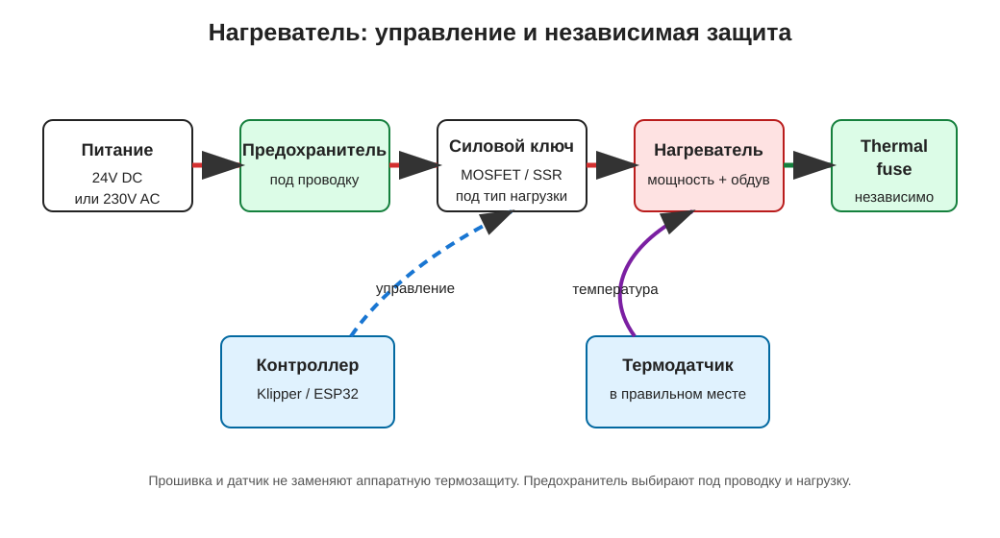

# Нагреватели для сушилки филамента и термокамеры

Нагреватель задаёт скорость прогрева и пределы безопасности всей сушилки филамента или активной термокамеры. Здесь разобраны типы нагревателей, выбор мощности, управление через MOSFET или SSR и ошибки, которые могут привести к перегреву.

Нагреватель - это нагрузка, которая превращает электрическую энергию в тепло. В простом самодельном устройстве это самый опасный компонент: ошибка в вентиляторе обычно даёт плохой обдув, а ошибка в нагревателе может дать перегрев, расплавленный корпус, повреждённую проводку или пожарный риск.

В 3D-принтерах и iDryer-подобных устройствах нагреватели встречаются в хотэнде, столе, камере, сушилке филамента, воздушном канале или отдельном модуле подогрева.

## Где используется

Типичные задачи:

- нагрев хотэнда;
- нагрев стола;
- подогрев камеры принтера;
- сушка филамента;
- подогрев воздуха перед фильтром или каналом;
- поддержание температуры в маленьком технологическом объёме.

Это разные задачи. Нагреватель для металлического хотэнда, силиконовая грелка стола и воздушный PTC-модуль не взаимозаменяемы без пересчёта мощности, крепления, обдува и защиты.

## Типы нагревателей

Частые варианты:

- картриджный нагреватель;
- силиконовая грелка;
- PTC-нагреватель;
- керамический нагревательный элемент;
- готовый fan heater module;
- нагревательная пластина;
- сетевой нагревательный стол;
- нихромовая или резистивная сборка в готовом корпусе.

Картриджный нагреватель обычно вставляют в металлический блок. Ему нужен хороший тепловой контакт с металлом и надёжное крепление термодатчика.

Силиконовая грелка обычно клеится или прижимается к плоской поверхности. Ей важны ровная поверхность, нормальная адгезия, датчик температуры и защита от отрыва.

PTC-нагреватель частично сам ограничивает рост температуры за счёт своих свойств, но это не отменяет контроллер, датчик, предохранитель, корпус и проверку обдува. PTC не делает устройство автоматически безопасным.

Готовый fan heater module объединяет нагреватель и обдув, но его всё равно нужно проверять по напряжению, мощности, температуре, материалам корпуса и аварийной защите.

## Напряжение, мощность и ток

Перед подключением нужно найти:

- рабочее напряжение;
- мощность;
- ток;
- тип тока: DC или AC;
- максимальную температуру;
- рабочую температуру проводов;
- способ крепления;
- требования к обдуву;
- допустимый способ управления.

Ток считается по формуле:

```text
ток = мощность / напряжение
```

Примеры:

```text
24V 120W -> 5A
24V 240W -> 10A
24V 300W -> 12.5A
230V 300W -> около 1.3A
```

Низковольтный мощный нагреватель безопаснее по напряжению, но требует больших токов. Большие токи требуют нормального блока питания, проводов, клемм, MOSFET/SSR и предохранителя.

Сетевой нагреватель на `110-230V AC` может дать большую мощность при меньшем токе, но риск поражения током намного выше. Для сетевой части нужны знания электробезопасности, корпус, клеммы, изоляция, заземление там, где оно требуется, предохранители и гальваническая развязка управления.

## Управление нагревателем

Контроллер не должен питать нагреватель напрямую от GPIO. GPIO только даёт управляющий сигнал.

Типовые варианты силового управления:

- MOSFET - для DC-нагревателей `12V`/`24V`;
- DC SSR - для DC-нагревателей, если оно действительно рассчитано на DC;
- AC SSR - для сетевых AC-нагревателей;
- механическое реле - для редкого включения/выключения, но не для частого PID/PWM;
- готовый силовой выход платы - только если он рассчитан на нужный ток и напряжение.

AC SSR и DC SSR - разные устройства. Неправильный тип может не выключать нагреватель или работать опасно.

Обычный MOSFET-модуль для Arduino/ESP32 нельзя использовать как выключатель `110-230V AC`. Если модуль не предназначен именно для сетевой нагрузки, его нельзя подключать к сети.

## Слои безопасности

Нагреватель нельзя проектировать как "контроллер включил - контроллер выключил". Нужны несколько слоёв защиты.



Минимальная логика:

- силовое питание рассчитано на ток;
- предохранитель выбран под проводку и нагрузку;
- силовой ключ подходит под тип нагрузки;
- термодатчик закреплён в правильном месте;
- прошивка имеет `min_temp`, `max_temp` и проверку нагрева;
- есть независимая аппаратная термозащита: thermal fuse, термостат или биметаллический выключатель;
- корпус и материалы выдерживают реальную температуру;
- первый тест делается под наблюдением.

Аппаратная термозащита должна работать независимо от контроллера. В простом случае её ставят последовательно в силовую цепь нагревателя, чтобы она могла физически разорвать питание. Это не просто ещё один датчик для прошивки.

Если контроллер завис, датчик отвалился, MOSFET пробит или SSR залип, защита должна разорвать питание нагревателя.

## Датчик температуры

Нагреватель сам не знает температуру. Контроллер принимает решение по датчику.

Если датчик:

- плохо прижат;
- стоит не там;
- отвалился;
- выбран не тот тип в прошивке;
- имеет плохой тепловой контакт;
- измеряет воздух вместо критической детали;

контроллер может продолжать греть, хотя реальная температура уже опасная.

Для хотэнда важен контакт датчика с металлическим блоком. Для воздушного нагревателя важно понимать, что измеряется: температура элемента, температура воздуха после элемента, температура камеры или температура рядом с катушкой. Это разные точки, и они могут сильно отличаться.

## Обдув и передача тепла

Нагреватель выделяет мощность, но эта мощность должна безопасно уйти туда, куда задумано.

Для воздушного нагревателя обдув критичен:

- без потока элемент может перегреться локально;
- слабый вентилятор не снимает тепло;
- забитый фильтр меняет режим нагрева;
- воздуховод из пластика может размягчиться;
- датчик температуры может видеть не то, что происходит на элементе.

Для нагревателя камеры важно проверять не только целевую температуру воздуха, но и температуру рядом с нагревателем, проводами, SSR/MOSFET, клеммами и пластиковыми деталями.

## Провода, клеммы и разъёмы

Нагреватель часто работает долго и потребляет заметный ток. Слабый контакт превращается в источник тепла.

Проверяй:

- сечение провода;
- температурный класс изоляции;
- допустимый ток клемм;
- качество обжима;
- затяжку винтов;
- наличие наконечников на многожильных проводах;
- разгрузку натяжения;
- расстояние от горячих частей;
- отсутствие оголённых проводников.

Если клемма потемнела, пахнет, размягчила пластик или стала горячей - питание нужно выключить и искать причину. Нельзя просто поставить предохранитель больше или "докрутить потом".

## Что проверить перед покупкой

Перед покупкой нагревателя проверь:

- какую среду он должен греть: металл, воздух, стол, камеру;
- напряжение и тип тока;
- мощность;
- ток;
- рабочую температуру;
- максимальную температуру поверхности;
- требования к обдуву;
- способ крепления;
- материал проводов и изоляции;
- совместимый силовой ключ;
- место для термодатчика;
- место для независимой термозащиты;
- корпус и материалы вокруг;
- наличие технического описания или понятной документации.

Если на странице товара нет напряжения, мощности, температуры и способа применения, такой нагреватель не подходит для безопасного первого проекта.

## Первый тест

Первый нагрев делают коротко и под наблюдением.

Порядок:

1. Проверить сопротивление нагревателя и сравнить с расчётом `R = U^2 / P`, если известны напряжение и мощность.
2. Проверить отсутствие короткого замыкания там, где это применимо.
3. Если есть металлический корпус или защитное заземление `PE`, проверить, что нагреватель не коротит на корпус.
4. Проверить напряжение питания без нагревателя.
5. Проверить, что управляющий ключ выключает нагрузку.
6. Проверить, что датчик температуры показывает разумное значение.
7. Для `12V`/`24V` нагревателя по возможности начать через лабораторный блок питания с ограничением тока или временный предохранитель.
8. Включить нагрев на малой мощности или коротко.
9. Смотреть, растёт ли температура в правильном месте.
10. Проверить, что выключение команды реально выключает нагрев.
11. Проверить нагрев проводов, клемм, MOSFET/SSR и корпуса.
12. Проверить аварийную защиту по сценарию, который можно безопасно имитировать.

Не оставляй новый нагреватель без присмотра на первом запуске.

## Типовые ошибки

- подключили нагреватель не к тому напряжению;
- не посчитали ток;
- питают нагреватель через слабый разъём;
- используют MOSFET для сетевого AC-нагревателя;
- перепутали AC SSR и DC SSR;
- поставили SSR без радиатора, хотя он нужен;
- забыли предохранитель;
- нет независимой термозащиты;
- плохо закрепили термодатчик;
- сделали корпус из PLA рядом с нагревателем;
- не учли обдув и забитый фильтр;
- проверили на столе, но не проверили в корпусе;
- оставили сетевую часть открытой;
- увеличили предохранитель вместо поиска причины срабатывания.

## Главное

Нагреватель выбирают по задаче, напряжению, мощности, способу передачи тепла и безопасности. Нельзя рассматривать его как обычную "нагрузку на два провода".

Сначала считай ток, выбирай силовой ключ, проводку и предохранитель. Потом обеспечивай датчик температуры, прошивочную защиту, независимую аппаратную термозащиту, нормальный корпус и проверку в реальном режиме.

## Материалы по теме

- [Klipper Configuration Reference: heater_generic and verify_heater](https://www.klipper3d.org/Config_Reference.html#heater_generic) - настройки нагревателей, датчиков температуры, `min_temp`, `max_temp` и проверки нагрева в Klipper.
- [Marlin Configuration: Temperature Ranges and Thermal Protection](https://marlinfw.org/docs/configuration/configuration.html#temperature-ranges) - температурные пределы, `MINTEMP`, `MAXTEMP` и thermal protection в Marlin.
- [Omron: Overview of Solid-state Relays](https://www.ia.omron.com/support/guide/18/introduction.html) - базовое объяснение SSR, типов, применения и необходимости тепловых мер.
- [Sensata/Crydom: SSR Heat Sink Reference](https://www.sensata.com/resources/brochure-solid-state-relays-heat-sink-reference) - почему SSR нужен радиатор и как тепловой режим связан с током нагрузки.
- [Omega: Cartridge Heaters](https://www.omega.nl/prodinfo/cartridge-heaters.html) - практические замечания по применению картриджных нагревателей, тепловому контакту и выбору мощности.
