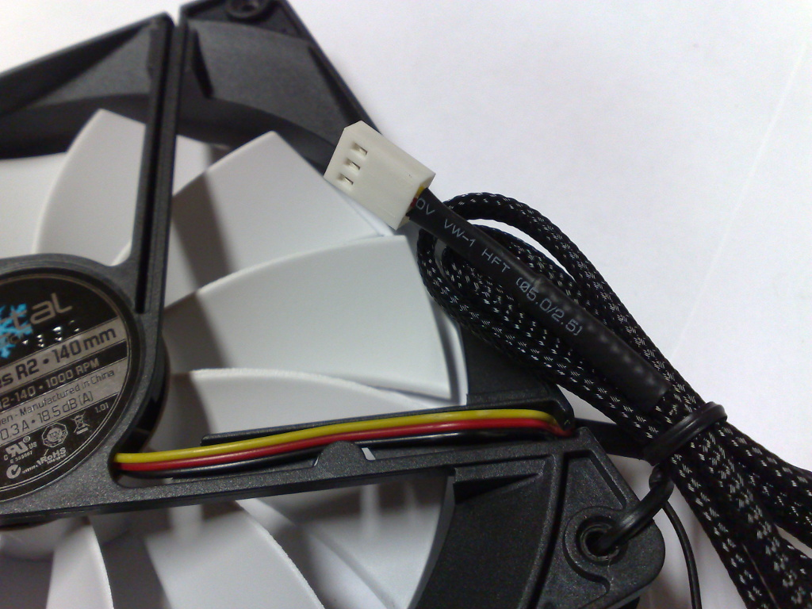

# Вентиляторы и воздушный поток в сушилке филамента

Вентилятор не просто гоняет воздух: он распределяет тепло, уменьшает перегрев локальных зон и помогает филаменту сушиться равномерно. Эта страница помогает выбрать вентилятор и понять, как воздушный поток влияет на корпус, нагреватель и датчик температуры.

Вентилятор - это мотор с крыльчаткой, который перемещает воздух. В устройствах вокруг 3D-принтера он нужен не "чтобы дуло", а чтобы воздух проходил через нужную зону: нагреватель, катушку, фильтр, радиатор, камеру или отсек электроники.

Одинаковые по размеру вентиляторы могут работать совершенно по-разному. Один хорошо гонит воздух в свободном пространстве, другой лучше продавливает воздух через фильтр или воздуховод, третий тише, но слабее под сопротивлением.

## Где используется

В iDryer-подобных проектах вентиляторы используют для:

- циркуляции воздуха внутри сушилки;
- переноса тепла от нагревателя в камеру;
- вытяжки воздуха из камеры принтера;
- фильтрации через HEPA/угольный фильтр;
- охлаждения электроники;
- охлаждения радиатора;
- выравнивания температуры внутри корпуса.

Для нагревателя камеры вентилятор особенно важен. Нагреватель выделяет тепло, а поток воздуха снимает это тепло с элемента и переносит его дальше. Без нормального обдува нагреватель может перегреваться локально, а камера при этом прогреваться плохо.

## Воздушный поток и статическое давление

В техническом описании вентилятора обычно встречаются два важных параметра:

- воздушный поток - часто в `CFM` или `m3/h`;
- статическое давление - часто в `mmH2O`, `Pa` или `inch H2O`.

Воздушный поток показывает, сколько воздуха вентилятор может прокачать в идеальных условиях с малым сопротивлением.

Статическое давление показывает, насколько вентилятор способен проталкивать воздух через сопротивление: фильтр, решётку, радиатор, узкий канал или длинный воздуховод.

Практическое правило:

- для открытой циркуляции важнее воздушный поток;
- для фильтра, радиатора, плотной решётки и воздуховода важнее статическое давление;
- для реального корпуса важна рабочая точка, а не только максимальная цифра из технического описания.

Если поставить тихий корпусной вентилятор на плотный фильтр, он может почти не прокачивать воздух, хотя в свободном пространстве поток кажется сильным.

## Осевой и радиальный вентилятор

Осевой вентилятор гонит воздух вдоль оси вращения. Это типичные квадратные вентиляторы `40x40`, `60x60`, `80x80`, `120x120 mm`.

Радиальный вентилятор забирает воздух сбоку и выбрасывает через узкий выход. Он часто лучше подходит для каналов, сопел, фильтров и мест, где нужно давление.

Для свободной циркуляции внутри камеры обычно удобен осевой вентилятор. Для компактного воздуховода, фильтра или направленного потока иногда лучше радиальный вентилятор.

## 2-pin, 3-pin и 4-pin

Вентиляторы часто различаются по числу проводов.

*Источник: [Wikimedia Commons](https://commons.wikimedia.org/wiki/File:Three-pin_connector_on_a_computer_fan.jpg), Dsimic, CC BY-SA 4.0*

2-pin:

- `+V`;
- `GND`.

Такой вентилятор просто получает питание. Управлять скоростью можно изменением питания или PWM по силовой линии, если это поддерживает плата и вентилятор.

3-pin:

- `+V`;
- `GND`;
- тахометрический сигнал (`tach`/`sense`).

Третий провод обычно выдаёт сигнал оборотов. Он не управляет скоростью сам по себе.

4-pin PWM:

- `GND`;
- `+V`;
- тахометрический сигнал (`tach`/`sense`);
- PWM-сигнал управления.

У 4-pin PWM вентилятора питание обычно подаётся постоянно, а скорость задаётся отдельной PWM-линией. Это не то же самое, что быстро включать и выключать питание вентилятора.

## PWM и тахометр

PWM - это управляющий сигнал, который задаёт желаемую скорость. У компьютерных 4-pin PWM вентиляторов типичная частота около `25 kHz`, а питание остаётся постоянным.

Если PWM-провод не подключён, многие 4-pin вентиляторы работают на полной скорости.

Тахометрический сигнал показывает обороты. Он нужен, если устройство должно понимать:

- вентилятор крутится или остановился;
- скорость соответствует команде;
- фильтр или воздуховод не создаёт слишком большое сопротивление;
- вентилятор не заклинил.

Тахометр не заменяет контроль температуры. В устройстве с нагревателем нужно следить и за температурой, и за состоянием обдува, если отказ вентилятора опасен.

## Напряжение и ток

Перед подключением проверь:

- напряжение вентилятора: `5V`, `12V`, `24V`;
- рабочий ток;
- пусковой ток;
- тип разъёма;
- распиновку;
- есть ли PWM;
- есть ли тахометр;
- рабочую температуру;
- направление потока;
- уровень шума;
- ресурс и тип подшипника.

Вентилятор нельзя питать от GPIO контроллера. GPIO - это сигнал, а не силовой выход. Ток вентилятора должен идти от блока питания, силового выхода платы или MOSFET-модуля.

При старте вентилятор может кратковременно потреблять больше тока, чем в обычном режиме. Если на один выход подключено несколько вентиляторов, их токи складываются.

## Шум, вибрация и подшипник

Шум зависит не только от оборотов.

На звук влияют:

- форма крыльчатки;
- балансировка;
- тип подшипника;
- крепление;
- решётка;
- воздуховод;
- фильтр;
- резонанс корпуса;
- несколько вентиляторов рядом.

В техническом описании шум указывают в `dB(A)`, но в реальном корпусе вентилятор может звучать иначе. Решётка с плохой геометрией, близкая стенка или жёсткое крепление к тонкой панели могут сделать хороший вентилятор шумным.

Для устройства, которое работает часами, лучше выбирать вентилятор не только по цене и размеру, но и по ресурсу, подшипнику и температуре.

## Температура и место установки

Вентилятор, который нормально работает на столе, может быстро деградировать в горячей камере.

Проверь:

- рабочую температуру вентилятора;
- температуру воздуха рядом с нагревателем;
- расстояние от нагревательного элемента;
- не попадает ли горячий поток прямо на мотор;
- не размягчается ли крепление;
- не пересыхают ли провода;
- не забивается ли вентилятор пылью или волокнами.

Если вентилятор отвечает за обдув нагревателя, его отказ должен быть учтён в логике безопасности. Нельзя строить нагреватель так, что остановка вентилятора сразу создаёт опасную температуру без аварийного отключения.

## Фильтры и воздуховоды

Фильтр, решётка и воздуховод могут заметно уменьшить полезный поток.

Типовые признаки:

- вентилятор шумит, но поток слабый;
- фильтр почти не продувается;
- воздух идёт в обход фильтра через щели;
- температура около нагревателя растёт быстрее, чем температура камеры;
- после установки крышки поток стал хуже, чем на столе.

Для фильтрации камеры принтера важно не просто поставить вентилятор, а обеспечить путь воздуха через фильтр. Если воздуху проще пройти через щель, он пойдёт через щель.

## Что проверить перед покупкой

Перед покупкой вентилятора проверь:

- размер и толщину;
- напряжение;
- ток;
- тип: осевой или радиальный;
- воздушный поток;
- статическое давление;
- шум;
- обороты;
- тип подшипника;
- 2-pin/3-pin/4-pin;
- рабочую температуру;
- ресурс;
- направление потока;
- разъём и распиновку;
- подходит ли он для фильтра, воздуховода или свободной циркуляции.

Для фильтра и узкого канала не выбирай вентилятор только по CFM. Смотри статическое давление и тестируй в реальной сборке.

## Типовые ошибки

- подключили 12V вентилятор к 24V;
- подключили 24V вентилятор к 12V и решили, что он сломан;
- питают вентилятор от GPIO;
- не сделали общую землю для внешнего MOSFET/PWM;
- не учли пусковой ток;
- подключили несколько вентиляторов к слабому выходу;
- выбрали вентилятор только по размеру;
- поставили вентилятор для свободного потока на плотный фильтр;
- считают tach-провод управляющим;
- считают 4-pin PWM таким же, как 2-pin;
- регулируют 4-pin PWM вентилятор постоянным включением/выключением питания;
- поставили вентилятор в горячую зону без проверки температуры;
- не проверили поток после установки крышки, фильтра и воздуховода.

## Главное

Вентилятор выбирают под задачу: свободная циркуляция, фильтр, воздуховод, радиатор, нагреватель или охлаждение электроники. Для открытого пространства важен поток, для фильтров и каналов - давление.

Проверь напряжение, ток, тип проводов, PWM/тахометр, рабочую температуру и сопротивление реальной конструкции. В устройстве с нагревателем вентилятор должен быть частью безопасной тепловой системы, а не декоративной деталью.

## Материалы по теме

- [Noctua: Microcontroller guide for PWM and RPM monitoring](https://www.noctua.at/en/support/faqs/microcontroller-guide-pwm-setup-and-rpm-monitoring) - практическое объяснение 4-pin PWM, тахометра, питания и частоты PWM около 25 kHz.
- [Noctua: Fan pin configuration](https://www.noctua.at/faq-redirects/en/support/solutions/articles/101000081757-what-pin-configuration-do-noctua-fans-use-) - стандартная распиновка 4-pin вентиляторов и поведение при подключении только питания.
- [SANYO DENKI: Fan Airflow and Static Pressure](https://techcompass.sanyodenki.com/en/training/cooling/fan_basic/004/index.html) - объяснение связи воздушного потока, статического давления, рабочей точки и сопротивления системы.
- [DigiKey: Selecting A Fan](https://www.digikey.ca/en/articles/selecting-a-fan) - выбор типа вентилятора, кривая вентилятора, сопротивление системы и отличие осевого вентилятора от радиального.
- [Klipper Configuration Reference: Fans](https://www.klipper3d.org/Config_Reference.html#fans) - официальные секции Klipper для вентиляторов: `fan`, `heater_fan`, `temperature_fan`, `controller_fan` и `fan_generic`.
