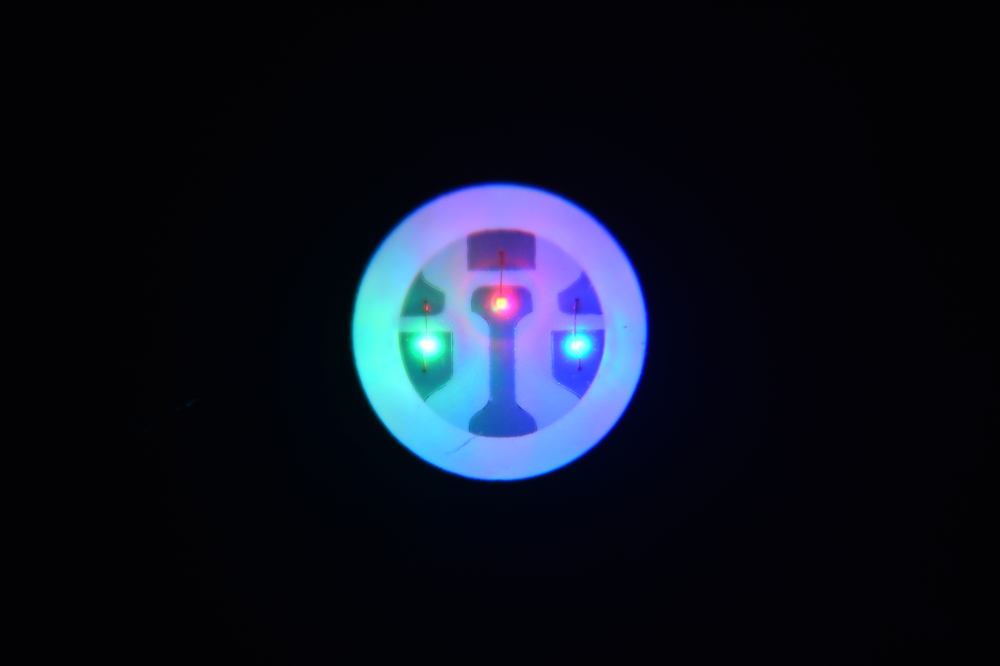

# LED-ленты

LED-лента - это гибкая плата со светодиодами и дорожками питания. В принтере, сушилке или небольшом самодельном устройстве её обычно используют для подсветки камеры, индикации состояния, подсветки рабочей зоны или декоративной подсветки корпуса.

Главная ошибка новичка - относиться к LED-ленте как к маленькому светодиоду. Даже короткая лента может потреблять больше тока, чем вентилятор, а длинная лента уже становится полноценной силовой нагрузкой.

## Где используется

В DIY-устройствах вокруг 3D-принтера LED-лента полезна для:

- подсветки камеры принтера;
- подсветки сушилки филамента;
- индикации режима: нагрев, сушка, ошибка, ожидание;
- подсветки рабочей зоны внутри корпуса;
- мягкой ночной подсветки без включения основного света;
- визуального сигнала при окончании печати или аварии.

Для служебной подсветки обычно лучше простая белая лента. Для индикации режимов удобна RGB или адресная лента, но она сложнее по питанию и управлению.

## Напряжение: 5V, 12V или 24V

LED-ленты бывают на разное напряжение:

- `5V` - часто адресные ленты типа WS2812/NeoPixel;
- `12V` - распространённые белые и RGB-ленты;
- `24V` - удобны для более длинных участков и устройств с 24V питанием.

Напряжение ленты должно совпадать с источником питания. Ленту на `12V` нельзя подключать к `24V`. Лента на `24V` от `12V` может светить тускло или не работать. Лента на `5V` от `12V` или `24V` почти наверняка будет повреждена.

Если в принтере уже есть `24V`, не значит, что любую ленту можно подключить к этому питанию. Нужно покупать именно `24V` ленту или ставить DC-DC преобразователь на нужное напряжение.

## Обычная и адресная лента

Есть два основных типа LED-лент.

Обычная лента светит вся сразу. Это может быть:

- одноцветная белая лента;
- тёплая/холодная белая лента;
- RGB-лента, у которой вся длина меняет цвет одновременно;
- RGBW-лента с отдельным белым каналом.

У такой ленты нет микросхемы на каждом светодиоде. Яркость регулируют включением/выключением питания или PWM через MOSFET, LED-контроллер или подходящий выход платы.

Адресная лента имеет микросхему управления для отдельных светодиодов или групп светодиодов. Она позволяет зажигать разные участки разными цветами. Типичные примеры: WS2812B, SK6812, NeoPixel-совместимые ленты.

Адресная лента требует:

- питание нужного напряжения;
- общий `GND` с контроллером;
- провод данных `DIN`;
- правильное направление данных по стрелке на ленте;
- часто - 5V уровень сигнала данных;
- аккуратное питание без больших просадок.

Для простой подсветки камеры адресная лента обычно избыточна. Для красивой индикации и эффектов она удобна, но требует больше внимания к питанию.

## Ток и мощность

LED-ленту выбирают не только по цвету и длине. Нужно знать её мощность.

На странице товара обычно указывают:

- напряжение: например `12V` или `24V`;
- мощность на метр: например `4.8 W/m`, `9.6 W/m`, `14.4 W/m`;
- количество светодиодов на метр;
- тип светодиодов: например `3528`, `5050`, `2835`;
- ширину ленты;
- степень защиты: без покрытия, силиконовая оболочка, IP65/IP67;
- допустимую длину одного участка.

Ток считается просто:

```text
ток = мощность / напряжение
```

Пример: есть `2 м` ленты `24V` мощностью `9.6 W/m`.

```text
общая мощность = 2 м × 9.6 W/m = 19.2 W
ток = 19.2 W / 24 V = 0.8 A
```

Для такой ленты блок питания, MOSFET, провода и разъём должны уверенно выдерживать больше `0.8 A`. Практически лучше закладывать запас хотя бы `30-50%`, особенно если лента будет работать долго.

Для RGB-ленты нужно учитывать максимальный ток всех каналов. Белый цвет у RGB обычно означает, что одновременно включены красный, зелёный и синий каналы.

Для адресных 5V лент часто встречается грубая оценка до `60 mA` на один RGB-пиксель при полном белом цвете. В реальном эффекте ток может быть меньше, но блок питания и проводку нельзя рассчитывать только на "обычно не на полной яркости".

## Почему нельзя питать ленту от GPIO

GPIO контроллера - это сигнальный выход, а не источник питания.

Нельзя подключать LED-ленту напрямую к пину микроконтроллера. GPIO не рассчитан на ток ленты. Так можно повредить плату, получить перезагрузки, нестабильную работу или перегрев дорожек.

Правильная логика:

- ток ленты идёт от блока питания;
- контроллер только управляет включением, яркостью или данными;
- силовую коммутацию делает MOSFET, LED-драйвер, LED-контроллер или штатный выход платы;
- земли контроллера и питания ленты соединены, если есть управляющий сигнал.

## Подключение простой одноцветной ленты

Для белой `12V` или `24V` ленты часто используют low-side MOSFET: плюс ленты подключён к плюсу питания, а минус ленты коммутируется MOSFET-модулем.



*Источник: [Wikimedia Commons](https://commons.wikimedia.org/wiki/File:LED_strip_closeup.jpg), Akbermamps, CC BY 4.0*

Типовая схема:

1. `+V` блока питания идёт на `+` LED-ленты.
2. `-` LED-ленты идёт на силовой выход MOSFET-модуля.
3. `GND` блока питания идёт на MOSFET-модуль.
4. `GND` контроллера соединяется с `GND` блока питания.
5. Управляющий пин контроллера идёт на вход MOSFET-модуля.

Если плата принтера уже имеет управляемый выход под вентилятор или LED, можно использовать его только если он рассчитан на нужное напряжение и ток. Нельзя подключать длинную ленту к первому попавшемуся разъёму без проверки лимита выхода.

## RGB-лента

Обычная RGB-лента обычно имеет общий плюс и три управляемых минуса:

- `+V`;
- `R`;
- `G`;
- `B`.

Каждый цветовой канал требует отдельного MOSFET-канала или готового RGB-контроллера. Один MOSFET на всю RGB-ленту сможет только включать и выключать её целиком, но не менять цвет.

При выборе MOSFET-модуля для RGB-ленты нужно смотреть ток каждого канала и суммарный ток. Разъём, клемма и провод тоже должны выдерживать нагрузку.

## Адресная лента

У адресной ленты обычно есть:

- `+5V` или другое питание, если это не 5V модель;
- `GND`;
- `DIN` - вход данных;
- иногда `DOUT` - выход данных на следующий участок.

Важные правила:

- подключай данные в сторону стрелки на ленте;
- у контроллера и ленты должна быть общая земля;
- для 5V адресных лент с 3.3V контроллером часто нужен преобразователь уровней;
- перед длинной лентой полезен электролитический конденсатор по питанию;
- в линию данных часто ставят резистор около `300-500 Ohm` рядом со входом ленты;
- питание лучше подавать не только в начало длинной ленты, но и в дополнительные точки.

Если адресная лента питается от отдельного блока питания, нельзя подавать только `DIN` без общего `GND`. Сигнал данных тогда не имеет нормального уровня отсчёта, и лента будет мигать случайно или не работать.

## Просадка напряжения и питание с нескольких точек

Длинная LED-лента может светить ярко в начале и заметно слабее в конце. Это не "плохой контроллер", а падение напряжения на проводах и медных дорожках самой ленты.

Чем ниже напряжение и выше ток, тем сильнее проблема. Поэтому `5V` и `12V` ленты чаще требуют питания с нескольких точек, чем `24V` ленты такой же мощности.

Признаки просадки:

- конец ленты светит тусклее;
- белый цвет у RGB уходит в жёлтый или красноватый;
- адресная лента мигает при ярких эффектах;
- контроллер перезагружается при включении яркости;
- провода, разъём или начало ленты греются.

Решение:

- использовать ленту подходящего напряжения;
- брать провод достаточного сечения;
- подавать питание в начало и конец длинного участка;
- делить длинную ленту на секции;
- ставить предохранитель на силовую линию;
- не прогонять весь ток через слабый разъём или тонкие дорожки.

## Нагрев и монтаж

LED-лента сама выделяет тепло. Это особенно заметно у ярких лент в силиконовой оболочке и у лент, наклеенных внутрь закрытого корпуса.

Плохие места для монтажа:

- рядом с нагревателем;
- на мягком PLA внутри тёплой камеры;
- на поверхности, которая плохо отводит тепло;
- в месте, где лента будет касаться подвижных деталей;
- на крышке, которую часто снимают без разъёма.

Для долгой работы лучше клеить ленту на алюминиевый профиль или другую поверхность, которая отводит тепло. Если лента стоит внутри камеры принтера, учитывай температуру камеры и температуру клеевого слоя.

## Что проверить перед покупкой

Перед покупкой LED-ленты проверь:

- напряжение ленты;
- мощность на метр;
- общую длину;
- цвет: белая, RGB, RGBW, адресная;
- тип управления;
- ширину ленты и место установки;
- температуру места установки;
- нужен ли алюминиевый профиль;
- нужен ли MOSFET-модуль или LED-контроллер;
- выдержит ли блок питания дополнительную нагрузку;
- есть ли нормальный разъём для обслуживания.

Для камеры принтера обычно практичнее `24V` белая лента, если вся система уже на `24V`. Для маленького ESP32-индикатора может быть удобна короткая `5V` адресная лента. Для длинной декоративной RGB-подсветки лучше заранее считать ток и думать о питании с нескольких точек.

## Типовые ошибки

- подключили ленту не к тому напряжению;
- питают ленту от GPIO;
- не посчитали ток всей длины;
- выбрали MOSFET-модуль без запаса;
- подключили длинную ленту тонким проводом;
- забыли общую землю между контроллером и лентой;
- у адресной ленты подключили данные не к `DIN`, а к `DOUT`;
- не поставили преобразователь уровней для 5V адресной ленты от 3.3V контроллера, когда он нужен;
- подали питание только с одного конца длинной ленты;
- поставили ленту в горячую зону без проверки температуры;
- оставили ленту без разъёма на съёмной крышке.

## Главное

LED-лента - это не сигнальный светодиод, а нагрузка. Сначала смотри напряжение и мощность, затем считай ток, выбирай проводку, MOSFET или контроллер и только потом подключай к плате.

Для простой подсветки выбирай обычную белую ленту на напряжение системы. Для эффектов и индикации можно использовать адресную ленту, но там особенно важны питание, общая земля, уровень сигнала и защита от просадок.

## Материалы по теме

- [Adafruit NeoPixel Überguide: Best Practices](https://learn.adafruit.com/adafruit-neopixel-uberguide/best-practices) - практические правила для адресных лент: общая земля, резистор в линии данных, конденсатор и уровень сигнала.
- [Adafruit NeoPixel Überguide: Powering NeoPixels](https://learn.adafruit.com/adafruit-neopixel-uberguide/powering-neopixels) - подробное объяснение питания адресных лент, просадки напряжения и подачи питания в несколько точек.
- [Adafruit RGB LED Strips: Usage](https://learn.adafruit.com/rgb-led-strips/usage) - пример управления обычной RGB-лентой через силовые транзисторы/MOSFET, а не напрямую от микроконтроллера.
- [SparkFun WS2812 Breakout Hookup Guide](https://learn.sparkfun.com/tutorials/ws2812-breakout-hookup-guide/addressable-led-strips) - вводная по адресным WS2812-лентам и их вариантам.
- [QuinLED: 12V vs 24V LED strip and voltage drop](https://quinled.info/2018/08/24/12v-vs-24v-led-strip-or-voltage-drop/) - практическое объяснение, почему длинные ленты страдают от падения напряжения и почему 24V часто удобнее для длинных участков.
