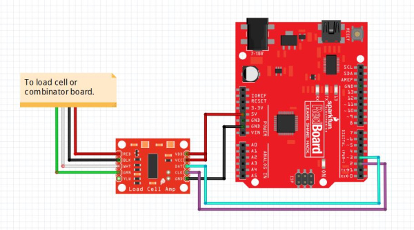

# 连接负载传感器

负载传感器通过金属梁、按钮或平台的微小变形来测量力或重量。

在类似iDryer的设备中，负载传感器可以估计线轴重量、剩余细丝或机制负载。

要点：称重传感器几乎从不直接连接到控制器。它的信号太小。通常，HX711 模块或类似的放大器/ADC 放置在传感器和控制器之间。

## 你需要什么

Minimum set:

- 所需重量范围的称重传感器；
- HX711 module;
- controller: Arduino, ESP32, RP2040, STM32, or other board;
- rigid mechanical mounting;
- 用于校准的已知质量；
- short, neat wires.

如果机械性能较差，电路将无济于事。称重传感器可以完美接线，但由于未对准、游隙或在错误点施加负载而给出毫无意义的读数。

## 连接是如何安排的

称重传感器通过模拟线连接到 HX711。

HX711通过数字线连接到控制器。

典型链条：

```text
load cell -> HX711 -> controller
```

HX711通常有两个侧面：

- 来自称重传感器的输入：`E-`、`A+`、`A-`、`A-` 或类似的；
- 连接到控制器：`GND`、`DT`、`DOUT`/`SCK`、`CLK`/`CLK`。



*Source: [SparkFun Electronics](https://learn.sparkfun.com/tutorials/load-cell-amplifier-hx711-breakout-hookup-guide/all), CC BY-SA 4.0*

## Load cell wires

常见的四线称重传感器通常具有：

- `E+` - bridge supply plus;
- `E-` - bridge supply minus;
- `S+`, `A+`, or `O+` - positive measurement signal;
- `S-`, `A-`, or `O-` - negative measurement signal.

常见配色方案：

- red - `E+`;
- black - `E-`;
- green or blue - `A+`;
- white - `A-`.

但颜色不是法律。不同的传感器可能会有所不同。如果有特定称重传感器的数据表，请遵循该数据表。

如果传感器有第五根电线、箔片或屏蔽，则通常是电磁屏蔽。不要将其与电桥测量线混淆。通常，屏蔽连接到 `A+` 或一侧的外壳（如果文档有说明），但不连接到测量 `A-`/`A-`。

如果没有接线图，请勿“随意”连接称重传感器。首先找到传感器数据表或按照制造商指南圈出电桥：不正确的电线很容易导致读数不稳定或 HX711 输入过载。

## 将 HX711 连接到控制器

在控制器端，通常需要四行：

- `VCC` - module power;
- `GND` - common negative;
- `DT`, `DOUT`, or `DATA` - data;
- `SCK`, `CLK`, or `PD_SCK` - clock.

对于许多 HX711 模块，电源可以是 `5V` 或 `5V`，但请检查具体模块。如果控制器运行在3.3V，则使用与3.3V逻辑兼容的模块和电源会很方便。

引脚 `SCK` 和 `SCK` 通常可以连接到常规 GPIO。这不是通常意义上的I2C或SPI，而是一个简单的两线HX711接口。

## 机械原理比电路更重要

称重传感器必须按照制造商的预期变形。

对于光束传感器，一侧通常安装在固定底座上，另一侧承受负载。如果两侧都刚性地安装到一个部件上，传感器将不会正常弯曲。

检查：

- 传感器的安装面在哪里；
- 应在何处施加负载；
- 力应该朝哪个方向移动；
- 是否需要垫片；
- 运动部件是否离开外壳；
- no misalignment;
- no side loading;
- 螺丝没有拧得过紧；
- 线轴或平台不会落在传感器的工作区域之外。

对于线轴重量，尤其重要的是所有负载都必须通过传感器，而不是部分通过外壳壁、轴、电缆或装饰盖。

## 不要使传感器过载

称重传感器的范围不是建议，而是测量限制。

如果将 1 kg 传感器放置在线轴和支架可能超过此重量的位置，则传感器将工作不良或永久变形。

选择带边距的范围：

- maximum spool weight;
- holder weight;
- possible jerks;
- misalignment;
- 用户错误的安全裕度。

但太大的范围也并不总是好的。 100 公斤传感器对小线轴的感应效果比具有相同机械和电子设备的 5 公斤或 10 公斤传感器差。

## 首次启动

在安装到设备中之前，请在工作台上测试系统：

1. 将称重传感器连接至 HX711。
2. 将 HX711 连接到控制器。
3. Run test code or a library.
4. 确保按下传感器时原始值会发生变化。
5. 卸下负载并检查该值是否相当稳定。
6. 放置一个已知质量并检查是否有变化。

在此阶段，不要求克精度。首先，您需要查看传感器是否处于活动状态、负载方向正确并且读数变化可预测。

如果该值随着权重的增加而减少，通常只需交换 `A-` 和 `A-` 或考虑登录代码即可。

## 皮重和校准

未经校准的称重传感器不知道克是什么。

典型流程：

1. Place empty platform.
2. 皮重：平台重量为零。
3. Place a known mass.
4. Select calibration factor.
5. 检查几个不同的重量。

对于细丝线轴，确定什么算作重量：

- 整个线轴采用塑料；
- 仅剩余塑料，无空线轴重量；
- 重量相对于初始值的变化。

如果不同制造商的空线轴重量不同，则准确的剩余计算需要了解具体的空线轴重量或进行粗略估计。

## 噪音和读数不稳定

HX711 测量非常小的信号，因此系统对噪声和机械问题很敏感。

读数不稳定的原因：

- 从传感器到 HX711 的电线很长；
- poor contacts;
- 信号线旁边的加热器电源线；
- fan or printer vibration;
- soft base;
- play in mounting;
- temperature drift;
- 负载绕过传感器接触外壳。

Practical measures:

- 使 HX711 靠近称重传感器；
- 请勿将信号线与加热器电源线并排走线；
- 固定电线，使其不会拉动传感器；
- 使用测量平均值；
- 安装到外壳后进行校准；
- 如果温度显着影响读数，请在设备预热后去皮。

## 组装后要检查什么

使用前：

- 传感器额定重量为所需重量；
- 负载通过传感器的工作部分；
- 紧固件不阻挡变形；
- HX711 receives correct power;
- `SCK`和`SCK`连接到右侧GPIO；
- common ground exists;
- 原始值在负载下发生变化；
- 无负载时，读数不会漂移太快；
- 已知质量显示校准后的预期重量；
- 电线不会拉动平台；
- 线轴或支架不会越过传感器接触外壳。

## 常见错误

- 将称重传感器直接连接到控制器模拟输入；
- 混淆 `E-`/`A+` 和 `A-`/`A-`；
- 无需数据表即可信任电线颜色；
- forgetting calibration;
- 最终机械安装前去皮重；
- 安装传感器，使其不能弯曲；
- 传感器过载；
- 选择太大的范围而失去灵敏度；
- 由于长电线和干扰而导致不稳定；
- 期望从没有刚性机械结构的柔性塑料体获得克数精度。

## 要点

- 称重传感器通常通过HX711连接，而不是直接连接到控制器。
- 传感器线连接至 `E-`、`A+`、`A-`、`A-`。
- HX711 通过电源、地、`SCK` 和 `SCK` 连接到控制器。
- 机械装置比电路更重要：负载必须正确通过传感器。
- 需要使用已知质量进行皮重和校准。
- 如果没有牢固的安装和适当的机械结构，就不可能获得准确的读数。

## 相关阅读

- [SparkFun: Load Cell Amplifier HX711 Breakout Hookup Guide](https://learn.sparkfun.com/tutorials/load-cell-amplifier-hx711-breakout-hookup-guide/all) - practical HX711 and load cell connection, wire colors, `DT`/`SCK`, and calibration example.
- [SparkFun: Load Cell Amplifier HX711 product page](https://www.sparkfun.com/sparkfun-load-cell-amplifier-hx711.html) - HX711 module description, purpose, and microcontroller interface.
- [DigiKey: HX711 Datasheet by Avia Semiconductor](https://www.digikey.com/en/htmldatasheets/production/1836471/0/0/1/hx711.html) - HX711 technical datasheet: 24-bit ADC, differential bridge input, gain, and digital interface.
- [Phidgets: Load Cell Guide](https://cdn.phidgets.com/docs/Load_Cell_Guide) - practical examples of load cell mechanical installation and load application direction.
- [SparkFun retired HX711 guide: load cell mechanical setup](https://learn.sparkfun.com/tutorials/retired---load-cell-amplifier-hx711-breakout-hookup-guide) - useful illustrations of beam, button, and platform sensor mounting options.
