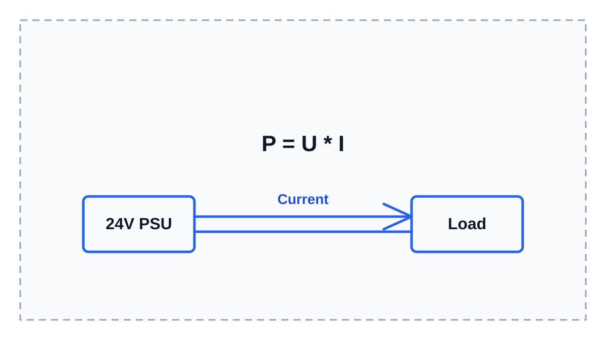

# Ток, напряжение и мощность нагрузки

Если ты собираешься подключать нагреватель, вентилятор, светодиодную ленту, сервопривод или другую нагрузку, которая реально встречается в 3D-принтерах и iDryer-подобных устройствах, сначала нужно понять три базовые вещи:

- напряжение;
- ток;
- мощность.

Без этого легко купить не тот блок питания, перегреть провод, спалить MOSFET-модуль или подключить нагрузку к контроллеру так, что она просто не заработает.

Ещё важно сразу привыкать смотреть параметры устройства не "на глаз", а по маркировке и документации.

Обычно напряжение, ток и мощность можно найти:

- на корпусе компонента;
- на наклейке блока питания;
- на странице товара;
- в datasheet;
- в инструкции или техническом описании модуля.

Если параметр не указан, это уже повод остановиться и проверить, что именно ты подключаешь.

## Нагрузка должна получать правильное напряжение

Любая нагрузка рассчитана на определённое напряжение.

Например:

- вентилятор может быть на 5V, 12V или 24V;
- светодиодная лента может быть на 5V, 12V или 24V;
- нагреватель может быть на 12V, 24V или сетевое напряжение 110-230V AC;
- сервопривод часто рассчитан на 5V или 6V.

Если нагрузка рассчитана на 24V, её нельзя просто подключить к 12V и ожидать нормальной работы. Она может работать слабо, не запускаться или работать нестабильно.

Если нагрузка рассчитана на 12V, её нельзя подключать к 24V. В лучшем случае она быстро перегреется и выйдет из строя. В худшем - повредит другие части устройства.

Главное правило:

**напряжение питания должно соответствовать напряжению, на которое рассчитана нагрузка.**

## Мощность показывает, сколько энергии нужно нагрузке

Мощность показывает, насколько "сильная" нагрузка перед нами.

Небольшой вентилятор потребляет мало мощности. Нагреватель потребляет намного больше. Светодиодная лента может потреблять немного, если она короткая, или много, если она длинная и яркая.

Мощность обычно указывают в ваттах: `W`.

Например:

- `24V 5W` - небольшая нагрузка;
- `24V 60W` - уже заметная нагрузка;
- `24V 120W` - мощная нагрузка, для которой важны блок питания, провода, клеммы и силовой выключатель.

Нагрузка будет нормально работать только тогда, когда получает достаточную мощность при правильном напряжении.

## Ток показывает, насколько тяжело проводам и силовым элементам

Ток показывает, сколько электричества проходит через провода, клеммы, разъёмы и силовые элементы.

Именно ток чаще всего создаёт практические проблемы:

- греются провода;
- плавятся разъёмы;
- темнеют клеммы;
- перегревается MOSFET;
- не хватает блока питания;
- устройство перезагружается при включении нагрузки.

Поэтому недостаточно знать только напряжение. Нужно понимать, какой ток будет потреблять нагрузка.

## Что такое силовой ключ

В электронике слово "ключ" означает не ключ от замка, а управляемый выключатель.

Контроллер не питает мощную нагрузку напрямую. Он только даёт слабый управляющий сигнал. А уже силовой ключ включает или выключает питание нагрузки.

Примеры силовых ключей:

- MOSFET-модуль для DC-нагрузок, например 24V вентилятора или LED-ленты;
- реле;
- SSR, то есть твердотельное реле;
- готовый драйвер нагрузки.

Дальше в документации лучше писать не просто "ключ", а "силовой ключ (управляемый выключатель)" хотя бы при первом упоминании в статье.

## Простая связь: напряжение, ток и мощность

Для первого понимания достаточно одной формулы:

```text
мощность = напряжение * ток
P = U * I
```

Отсюда можно получить ток:

```text
ток = мощность / напряжение
I = P / U
```

Эта формула нужна не для экзамена. Она нужна, чтобы понять, выдержит ли твой блок питания, провод, клемма, MOSFET-модуль или реле реальную нагрузку.

## Запас мощности обязателен

Блок питания, провода, клеммы и силовой модуль нельзя выбирать ровно "впритык".

Если нагрузка потребляет 100W, блок питания на 100W - плохой выбор. Он будет работать на пределе, сильнее греться и хуже переносить запуск нагрузки.

Для этого раздела принимаем простое правило:

**запас мощности должен быть минимум 50%.**

Например, если нагрузка потребляет 100W, блок питания лучше выбирать не слабее 150W. Если документация конкретного компонента требует больший запас, нужно ориентироваться на документацию.

Запас нужен не только блоку питания. Его нужно учитывать и для:

- MOSFET-модуля;
- реле или SSR;
- проводов;
- клемм;
- разъёмов;
- предохранителя и защиты.



> **Иллюстрация для доработки**
>
> Что нарисовать: простую схему, где слева блок питания 24V, справа нагрузка, между ними два провода, а по одному проводу показана стрелка направления тока.
>
> Минимальные подписи внутри картинки: `24V PSU`, `Load`, `Current`, `P = U * I`.
>
> Не переносить в картинку длинные объяснения. Всё, что требует чтения, должно остаться в тексте статьи рядом с изображением.

## Немного про закон Ома

Закон Ома связывает напряжение, ток и сопротивление:

```text
U = I * R
```

Здесь важна не глубокая теория, а простая мысль:

если подать напряжение на нагрузку, через неё пойдёт ток. Сколько тока пойдёт - зависит от самой нагрузки.

Разные нагрузки ведут себя по-разному:

- нагреватель обычно потребляет много тока;
- вентилятор потребляет меньше, но может иметь повышенный ток при запуске;
- светодиодная лента потребляет тем больше, чем она длиннее;
- моторы, вентиляторы и сервоприводы могут давать кратковременный повышенный ток при старте или движении.

## Что нужно проверять перед подключением

Перед тем как подключать нагрузку, ответь на несколько вопросов:

1. На какое напряжение рассчитана нагрузка?
2. Какая у неё мощность или ток?
3. Выдержит ли блок питания эту нагрузку?
4. Выдержат ли провода и клеммы этот ток?
5. Чем ты будешь управлять нагрузкой: MOSFET, реле, SSR или напрямую от платы?
6. Можно ли вообще подключать эту нагрузку напрямую к контроллеру?

Для нагревателей, вентиляторов, LED-лент и моторов ответ почти всегда такой:

**напрямую к GPIO контроллера подключать нельзя.**

Контроллер даёт управляющий сигнал. Нагрузку должен включать силовой элемент: MOSFET-модуль, реле, SSR или готовый драйвер.

## Главное, что нужно запомнить

- Напряжение нагрузки должно совпадать с напряжением питания.
- Мощность показывает, насколько нагрузка "сильная".
- Ток показывает, насколько тяжело будет проводам, разъёмам, клеммам и силовым элементам.
- Нельзя выбирать блок питания, провода и MOSFET "на глаз".
- Параметры нужно искать на корпусе, в маркировке, datasheet или инструкции.
- Для мощности нужен запас минимум 50%, если документация компонента не требует больше.
- Чем больше мощность, тем внимательнее нужно относиться к безопасности.

---

## Заметки для разработки

Короткая заметка для будущей доработки статьи:

- Использовать примеры из контекста 3D-принтеров и iDryer-периферии: нагреватели, вентиляторы, LED-ленты, сервоприводы, экраны, датчики, load cell, RFID-модули.
- Не добавлять случайные примеры вроде помп, если они не нужны для конкретной статьи и не типичны для 3D-принтерного контекста.
- Сразу учить читать маркировку и datasheet: напряжение, ток, мощность, рабочий диапазон, допустимая нагрузка.
- Если используется термин "ключ", обязательно пояснять: это силовой ключ, то есть управляемый выключатель, который включает нагрузку по сигналу контроллера.
- Основная формула: ток = мощность / напряжение.
- Для 24V системы:
  - 24W потребляет примерно 1A;
  - 48W потребляет примерно 2A;
  - 120W потребляет примерно 5A;
  - 240W потребляет примерно 10A.
- Это удобно для пользователей 3D-принтеров, потому что 24V блоки питания там очень распространены.
- Пример:
  - нагреватель 24V 100W;
  - ток = 100W / 24V = примерно 4.2A;
  - блок питания, провода, клеммы и MOSFET должны выдерживать этот ток с запасом.
- Обязательно объяснить запас:
  - не выбирать блок питания ровно впритык;
  - для этого гайда считать минимальным запасом мощности 50%;
  - если datasheet или инструкция требуют больший запас, ориентироваться на документацию;
  - для нагревателей, моторов и вентиляторов учитывать пусковые токи и нагрев контактов.
- Обязательно объяснить, что ток считается для каждой нагрузки и потом суммируется.
- Пример суммирования:
  - нагреватель 100W на 24V: около 4.2A;
  - вентилятор 24V 0.2A;
  - LED-лента 24V 1A;
  - всего около 5.4A;
  - блок питания лучше брать не меньше 7A, а лучше больше, если есть запас по корпусу и охлаждению.
- Обязательно связать расчёт с выбором:
  - блока питания;
  - сечения проводов;
  - клеммников;
  - предохранителя;
  - MOSFET-модуля, реле, SSR или другого силового элемента.

Что должен содержать файл после финальной доработки:

- простую формулу `P = U * I`;
- как из мощности получить ток;
- таблицу быстрых значений для 24V;
- пример с нагревателем;
- пример с несколькими нагрузками;
- почему нужен запас;
- почему слабое место может быть не блок питания, а провод, клемма или MOSFET.

Нужные изображения:

- `../../../img/01-electronics-basics/01-voltage-current-power-placeholder.svg` - простая схема связи напряжения, тока и мощности. Позже заменить на нормальную иллюстрацию.
  - Что нарисовать: блок питания 24V слева, нагрузка справа, провода между ними, стрелка направления тока.
  - Минимальные подписи внутри картинки: `24V PSU`, `Load`, `Current`, `P = U * I`.
  - Длинный русский текст не переносить в изображение. Он должен оставаться рядом с картинкой в статье.
