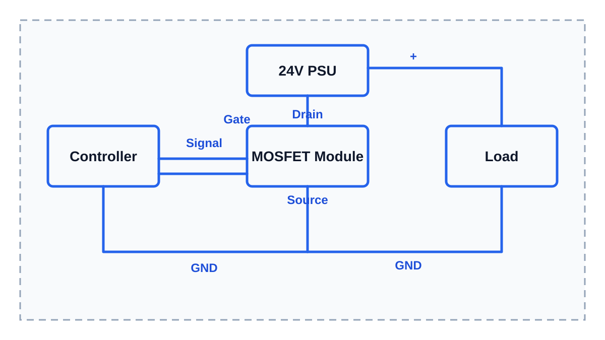

# MOSFET-модуль

MOSFET - это один из типов полевых транзисторов. Сам по себе это электронный компонент, который обычно впаивают в плату и используют как управляемый силовой выключатель.

MOSFET-модуль (MOSFET module) - это готовая маленькая плата с MOSFET, клеммами и иногда дополнительными элементами защиты. Такой модуль удобен тем, что его можно подключить проводами и не разводить свою плату для первого прототипа или простой сборки.

MOSFET-модуль нужен, когда контроллер должен включать или регулировать нагрузку, но сам не может питать её напрямую.

Если объяснять совсем бытово, MOSFET похож на выключатель, рядом с которым стоит исполнитель.

Контроллер говорит: "включи". Исполнитель нажимает выключатель, и ток идёт через нагрузку.

Контроллер говорит: "выключи". Исполнитель отпускает выключатель, и ток перестаёт идти.

У MOSFET тоже есть управляющая часть и силовая часть:

- затвор (gate) - управляющий контакт, сюда приходит команда от контроллера;
- сток (drain) - один силовой контакт;
- исток (source) - второй силовой контакт.

Затвор не должен питать нагрузку. Он только управляет. А основной ток нагрузки идёт через сток и исток.

В 3D-принтерах и iDryer-подобных устройствах это чаще всего:

- вентилятор 12V или 24V, например обдув детали, обдув камеры или вытяжка;
- LED-лента 5V, 12V или 24V;
- 12V или 24V нагреватель;
- небольшая DC-нагрузка, для которой известны напряжение, ток и мощность.

Контроллер даёт только управляющий сигнал. Нагрузку питает блок питания. MOSFET-модуль стоит между ними и работает как силовой ключ, то есть управляемый выключатель.

## Почему нельзя подключать нагрузку напрямую к контроллеру

GPIO-пин контроллера рассчитан на слабый сигнал. Он может включить логику, но не должен питать вентилятор, нагреватель или LED-ленту.

Если подключить нагрузку напрямую к GPIO, можно:

- перегрузить пин;
- повредить контроллер;
- получить нестабильную работу;
- увидеть перезагрузки при включении нагрузки;
- получить нагрев дорожек или разъёмов на плате.

Правильная идея такая:

- контроллер управляет MOSFET-модулем слабым сигналом;
- блок питания отдаёт ток нагрузке;
- MOSFET-модуль включает или выключает этот ток.

## Что делает MOSFET-модуль

MOSFET-модуль не создаёт мощность и не повышает ток.

Он только открывает или закрывает путь для тока от блока питания к нагрузке.

Если совсем просто:

- контроллер говорит: включить;
- MOSFET-модуль открывается;
- ток идёт через нагрузку;
- вентилятор крутится, LED-лента светит, нагреватель греет.

Когда контроллер говорит: выключить, MOSFET-модуль закрывается и нагрузка отключается.

Именно поэтому MOSFET часто называют силовым ключом. Для первого понимания проще думать так: это электронный выключатель, которым управляет контроллер.

## Где это применяется в 3D-принтерах

Типичные применения:

- включение дополнительного вентилятора;
- регулировка скорости вентилятора через PWM;
- управление LED-подсветкой;
- управление 24V нагревателем через внешний силовой модуль;
- разгрузка основной платы, если штатный выход слабый или уже занят.

Например, если у тебя есть 24V вентилятор, контроллер не должен питать его напрямую с GPIO. Контроллер должен подать управляющий сигнал на MOSFET-модуль, а вентилятор должен получать питание от 24V блока питания.

То же самое с LED-лентой. Она может быть на 5V, 12V или 24V, но это не значит, что её можно питать от GPIO. У ленты может быть большой ток, особенно если она длинная или яркая. Контроллер должен только управлять включением или яркостью, а ток ленты должен идти через MOSFET-модуль и подходящий блок питания.

## Как обычно подключают MOSFET-модуль

Часто MOSFET-модуль подключают по минусу. Это называют низковольтным подключением по минусу (low-side switching).

Смысл такой:

- плюс блока питания идёт напрямую на плюс нагрузки;
- минус нагрузки идёт на MOSFET-модуль;
- MOSFET-модуль соединяет или разрывает минус нагрузки;
- земля блока питания и земля контроллера должны быть общими.

Общая земля нужна, чтобы контроллер и MOSFET-модуль "понимали" один и тот же уровень сигнала.

> **Иллюстрация для доработки**
>
> Что нарисовать: слева контроллер, по центру MOSFET-модуль, справа 24V нагрузка, сверху блок питания 24V. Показать, что плюс питания идёт напрямую на нагрузку, минус нагрузки проходит через MOSFET-модуль, а земля контроллера соединена с землёй блока питания.
>
> Минимальные подписи внутри картинки: `Controller`, `MOSFET Module`, `24V PSU`, `Load`, `Gate`, `Drain`, `Source`, `GND`, `Signal`.
>
> Не переносить в картинку длинные объяснения. Главное в картинке - направление подключения и общая земля.

## На что смотреть при выборе

Перед покупкой или подключением MOSFET-модуля нужно смотреть не только на название товара.

Проверь параметры:

- допустимое напряжение нагрузки;
- допустимый ток нагрузки;
- допустимую мощность;
- управляется ли модуль от 3.3V или только от 5V;
- нужен ли радиатор;
- какие клеммы стоят на модуле;
- есть ли описание, схема или datasheet.

Параметры ищи на корпусе модуля, странице товара, в datasheet или инструкции. Если продавец пишет только "MOSFET module for Arduino" и не указывает нормальные характеристики, такой модуль нельзя выбирать для силовой нагрузки вслепую.

## Нужен запас

MOSFET-модуль нельзя выбирать ровно под ток нагрузки.

Если нагрузка потребляет 5A, модуль на 5A - плохой выбор. Он может греться, особенно в закрытом корпусе.

Для этого раздела используем то же правило:

**запас по мощности и току должен быть минимум 50%.**

Например, если нагрузка потребляет 5A, лучше смотреть на модуль, который рассчитан минимум на 7.5A, а на практике часто разумнее взять ещё больше, если модуль будет работать долго или внутри тёплого корпуса.

Запас по току на плате продавца не всегда означает, что модуль выдержит этот ток без радиатора и нормального охлаждения. Поэтому важно смотреть не только красивую цифру в названии, но и реальное исполнение платы.

## 3.3V и 5V управление

Многие контроллеры работают с 3.3V логикой. Например, ESP32 и RP2040 обычно управляют пинами на уровне 3.3V.

Не каждый MOSFET нормально открывается от 3.3V. Если MOSFET открылся не полностью, он может сильно греться даже при вроде бы небольшом токе.

Для 3.3V контроллеров нужен MOSFET с логическим уровнем управления (logic-level MOSFET), который явно поддерживает управление от 3.3V, или модуль с нормальной схемой входа.

Если в описании ничего не сказано про 3.3V, это нужно проверить до подключения.

## MOSFET-модуль не для 110-230V AC

Обычный MOSFET-модуль для Arduino/ESP32 обычно предназначен для DC-нагрузок: 12V или 24V.

Его нельзя использовать как простой выключатель для сетевого напряжения 110-230V AC.

Для сетевого напряжения нужны другие решения, другие правила безопасности и совсем другой уровень ответственности. Обычно там смотрят в сторону реле, SSR для AC-нагрузок, предохранителей, клемм, заземления и нормального корпуса.

## Главное, что нужно запомнить

- MOSFET-модуль - это управляемый силовой выключатель для DC-нагрузок.
- Он не питает нагрузку сам, а только включает или выключает ток от блока питания.
- GPIO контроллера нельзя использовать как питание для вентилятора, нагревателя или LED-ленты.
- Для 24V нагрузки нужен MOSFET-модуль, рассчитанный на нужное напряжение и ток.
- Земля контроллера и земля блока питания должны быть общими.
- Для мощности и тока нужен запас минимум 50%, если документация не требует больше.
- Обычный MOSFET-модуль не предназначен для прямого управления сетевым напряжением 110-230V AC.

---

## Заметки для разработки

Короткая заметка для будущей доработки статьи:

- Использовать примеры из контекста 3D-принтеров и iDryer-периферии: вентиляторы/обдув, LED-ленты 5V/12V/24V, 12V/24V нагреватели, дополнительные DC-нагрузки.
- Не дублировать "вентилятор" и "обдув" как разные сущности. Обдув - это применение вентилятора.
- Для LED-лент всегда указывать разные напряжения 5V/12V/24V и объяснять, что MOSFET нужен из-за тока, а не только из-за напряжения.
- Не добавлять случайные нагрузки, которые не типичны для 3D-принтерного контекста.
- Объяснить отдельно: MOSFET - это один из типов полевых транзисторов, а MOSFET-модуль - готовая плата для удобного подключения проводами без разработки своей PCB.
- Дать бытовую аналогию: MOSFET как выключатель, которым управляет контроллер. Затвор (gate) - команда, сток (drain) и исток (source) - силовой путь для тока нагрузки.
- MOSFET-модуль для Arduino/ESP32 - это готовая плата с силовым транзистором, клеммами и иногда дополнительными элементами защиты.
- Его используют как силовой ключ, то есть управляемый выключатель для DC-нагрузок.
- Важно объяснить: модуль не "создаёт мощность", он только включает и выключает питание нагрузки.
- Возможности зависят от конкретного MOSFET:
  - допустимый ток;
  - допустимое напряжение;
  - сопротивление открытого канала `Rds(on)`;
  - нормально ли он открывается от 3.3V логики ESP32/RP2040.
- Обязательно сказать про MOSFET с логическим уровнем управления (logic-level MOSFET). Не каждый MOSFET нормально управляется от 3.3V.
- Обязательно объяснить низковольтное включение по минусу:
  - плюс питания идёт напрямую на нагрузку;
  - минус нагрузки идёт через MOSFET;
  - земля блока питания и земля контроллера должны быть общими.
- Обязательно предупредить: MOSFET-модуль для Arduino обычно не предназначен для прямого управления сетевым напряжением 110-230V AC.
- Для индуктивных DC-нагрузок нужна защита от выбросов напряжения. В статье позже можно отдельно разобрать, когда нужен защитный диод или готовый драйвер.

Что должен содержать файл после финальной доработки:

- что такое MOSFET-модуль простыми словами;
- чем он отличается от реле и SSR;
- для каких 12V/24V нагрузок он подходит;
- почему важен ток нагрузки;
- почему важен нагрев MOSFET;
- почему нужна общая земля с контроллером;
- как не перепутать DC MOSFET-модуль с устройствами для сетевого напряжения 110-230V AC.

Нужные изображения:

- `../../../img/01-electronics-basics/02-mosfet-module-low-side-placeholder.svg` - схема низковольтного подключения по минусу (low-side switching) MOSFET-модуля к 24V нагрузке.
  - Что нарисовать: контроллер, MOSFET-модуль, 24V блок питания, нагрузка, общий GND, signal-провод.
  - Минимальные подписи внутри картинки: `Controller`, `MOSFET Module`, `24V PSU`, `Load`, `Gate`, `Drain`, `Source`, `GND`, `Signal`.
  - Длинный русский текст не переносить в изображение. Он должен оставаться рядом с картинкой в статье.
