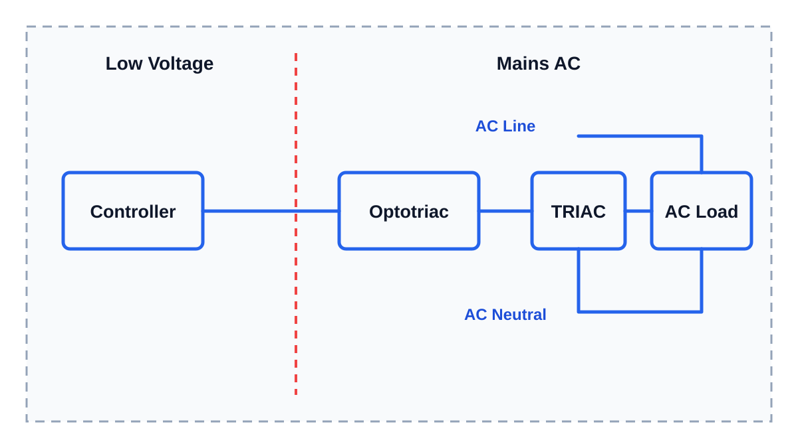

# Симистор

Симистор (TRIAC) - это силовой полупроводниковый элемент для управления переменным током.

В обычной практике он нужен там, где нужно включать или регулировать нагрузку переменного тока (AC load): например нагреватель от сетевого напряжения 110-230V AC.

Если говорить просто, симистор работает как управляемый выключатель для переменного тока. Контроллер сам не включает нагрузку 110-230V AC напрямую. Он даёт слабый управляющий сигнал, а симистор уже коммутирует силовую часть.

## Почему симистор часто разумнее для мощной AC-нагрузки

Если нагрузка мощная, не всегда разумно переводить всё в 12V или 24V.

Например, нагреватель на 200-300W можно сделать на 24V. Но тогда понадобится мощный 24V блок питания, толстые провода, мощный MOSFET-модуль, хорошие клеммы и нормальное охлаждение.

Такой блок питания:

- занимает место;
- стоит денег;
- греется;
- требует аккуратной разводки больших токов;
- увеличивает токи в низковольтной части.

Для AC-нагрузки от сети часто логичнее управлять самой сетевой нагрузкой через симисторную схему. Небольшой симистор вместе с оптопарой и несколькими пассивными элементами может нормально коммутировать мощность, которая на 24V потребовала бы гораздо более крупной низковольтной силовой части.

Это не делает схему "простой" или безопасной. Это просто другой подход: мы не делаем мощный низковольтный источник, а управляем AC-нагрузкой на её рабочем напряжении.

## Типовая схема

В реальных схемах контроллер обычно не подключают к симистору напрямую.

Часто используют:

- контроллер;
- ограничительный резистор на входе;
- оптосимистор или оптопару для развязки;
- силовой симистор;
- иногда демпфирующую цепь (snubber);
- предохранитель, клеммы, корпус и нормальную изоляцию.

Оптосимистор нужен, чтобы отделить низковольтную часть контроллера от опасной сетевой части.

Это называется гальваническая развязка. Простыми словами: между микроконтроллером и сетевым напряжением нет прямого электрического соединения. Управляющий сигнал передаётся "через свет" внутри оптопары, а опасное напряжение 110-230V AC не должно иметь пути обратно на плату контроллера, USB или компьютер.

Гальваническая развязка не делает сетевую часть безопасной для рук. Но она резко снижает риск того, что ошибка или пробой в силовой части отправит сетевое напряжение в микроконтроллер.

> **Иллюстрация для доработки**
>
> Что нарисовать: слева контроллер, дальше оптосимистор, затем симистор, справа AC-нагрузка. Отдельно показать `AC Line` и `AC Neutral`. Сетевую часть визуально отделить от низковольтной.
>
> Минимальные подписи внутри картинки: `Controller`, `Optotriac`, `TRIAC`, `AC Load`, `AC Line`, `AC Neutral`.
>
> Не переносить в картинку длинные объяснения. Главное - показать разделение низковольтной управляющей части и опасной AC-части.

## Какие нагрузки подходят

Симистор особенно часто используют с резистивными AC-нагрузками.

Пример резистивной нагрузки:

- нагреватель;
- лампа накаливания;
- простой паяльник или другой нагревательный прибор без сложной электроники внутри.

С такими нагрузками всё обычно понятнее: включили - греет, выключили - не греет.

С моторами, вентиляторами и индуктивными нагрузками сложнее. Такая нагрузка может создавать помехи, выбросы напряжения и нестабильное выключение. Для неё может понадобиться демпфирующая цепь (snubber) и более аккуратный выбор симистора.

Для блоков питания, электронных драйверов и другой сложной нагрузки симистор тоже не всегда подходит. Если внутри нагрузки есть собственная электроника, её нельзя считать обычным нагревателем.

## Что такое демпфирующая цепь

Демпфирующая цепь (snubber) - это защитная цепь, которая помогает симистору нормально работать со "сложной" нагрузкой и уменьшает помехи.

Часто демпфирующую цепь делают из резистора и конденсатора. Её задача - сгладить резкие изменения напряжения и снизить шанс ложного срабатывания или проблемного выключения.

Расчёт демпфирующей цепи выходит за рамки этой статьи. Здесь важно понять не формулы, а сам факт:

**если нагрузка не простая резистивная, готовый модуль с демпфирующей цепью часто безопаснее и практичнее, чем самодельная схема "на коленке".**

Готовые симисторные модули бывают разного качества. Но для простых задач они часто удобны как учебная и практическая база, если понимать их ограничения и не игнорировать безопасность.

## Симистор греется

Симистор не является идеальным выключателем. Когда через него идёт ток, на нём выделяется тепло.

Чем больше ток нагрузки, тем сильнее может греться симистор. Поэтому важны:

- ток нагрузки;
- корпус симистора;
- радиатор;
- вентиляция;
- температура внутри устройства;
- запас по параметрам.

В datasheet на симистор можно встретить параметры, связанные с температурой:

- `Ta` - температура окружающей среды (ambient temperature);
- `Tc` - температура корпуса компонента (case temperature);
- `Tj` - температура кристалла внутри (junction temperature);
- `Rth` - тепловое сопротивление (thermal resistance).

В этой статье не нужно глубоко считать тепловую модель. Но полезно знать, что ток "на бумаге" часто указан при определённых условиях охлаждения. Если симистор стоит в закрытом тёплом корпусе без радиатора, реальные возможности будут ниже.

## Симистор не заменяет безопасность

Симистор часто работает с сетевым напряжением 110-230V AC. Это опасное напряжение.

Поэтому обязательно нужны:

- знания электробезопасности при работе с сетевым напряжением;
- нормальные клеммы;
- изоляция;
- корпус;
- предохранитель или автомат защиты;
- заземление там, где оно требуется;
- расстояние между низковольтной и сетевой частью;
- гальваническая развязка между контроллером и сетевой нагрузкой;
- понимание, где находится фаза.

Сетевое напряжение 110-230V AC относится к области электроустановок до 1000 В. Для профессиональных работ с такими цепями обычно требуются соответствующие знания, допуск или группа по электробезопасности по местным правилам.

Если таких знаний нет, силовую часть должен проверить или собрать квалифицированный человек. 110-230V AC нельзя собирать как обычную макетку на столе.

## Главное, что нужно запомнить

- Симистор (TRIAC) - это управляемый силовой выключатель для AC-нагрузок.
- Он часто разумен для мощной сетевой нагрузки, где 24V блок питания и мощный MOSFET были бы крупными и дорогими.
- Для простых нагревателей симистор обычно подходит лучше, чем для сложной электронной нагрузки.
- Для моторов и индуктивных нагрузок может потребоваться демпфирующая цепь (snubber).
- Симистор греется, поэтому важны ток, радиатор, вентиляция и температура корпуса.
- Симистор не делает 110-230V AC безопасным. Сетевая часть требует нормальной защиты и аккуратной сборки.
- При управлении сетевой нагрузкой нужна гальваническая развязка, например через оптосимистор.
- Для силовой части 110-230V AC нужны знания электробезопасности. При сомнениях сборку и проверку должен делать квалифицированный человек.

---

## Заметки для разработки

Короткая заметка для будущей доработки статьи:

- Симистор (TRIAC) - электронный силовой выключатель для переменного тока.
- Его обычно используют внутри диммеров, регуляторов мощности и многих твердотельных реле (SSR) для AC-нагрузок.
- Объяснять не физику полупроводника, а смысл: симистор может включать и выключать 110-230V AC без механических контактов.
- Сравнить с MOSFET: MOSFET чаще используют для постоянного тока (DC), симистор - для переменного тока (AC).
- Сравнить с 24V подходом: для 200-300W на 24V нужен крупный блок питания и мощная DC-силовая часть, а симистор позволяет управлять AC-нагрузкой на её рабочем напряжении.
- Объяснить тип нагрузки:
  - резистивная нагрузка, например нагреватель, проще всего;
  - индуктивная нагрузка, например мотор, сложнее и может требовать демпфирующую цепь (snubber);
  - электронные блоки питания и драйверы не считать обычной резистивной нагрузкой.
- Расчёт демпфирующей цепи (snubber) не раскрывать глубоко в этой статье. Отметить, что часто используют готовые модули.
- Обязательно сказать про нагрев:
  - симистор греется;
  - радиатор может быть обязателен;
  - параметры из datasheet зависят от условий охлаждения.
- Коротко упомянуть термины из datasheet: `Ta`, `Tc`, `Tj`, `Rth`.
- Важно отдельно сказать: симистор не делает 110-230V AC безопасным. Все правила по изоляции, предохранителям, клеммам, расстояниям и заземлению остаются.
- При любой схеме управления 110-230V AC от микроконтроллера объяснять гальваническую развязку: оптопара или оптосимистор отделяет низковольтную сторону от сетевой.
- Указывать, что 110-230V AC относится к цепям/электроустановкам до 1000 В; для профессиональных работ могут требоваться соответствующие знания, допуск или группа по электробезопасности по местным правилам.

Нужные изображения:

- `../../../img/01-electronics-basics/03-triac-ac-load-placeholder.svg` - схема управления AC-нагрузкой через оптосимистор и симистор.
  - Что нарисовать: контроллер, оптосимистор, симистор, AC-нагрузка, линия и нейтраль, визуальное разделение low voltage / mains.
  - Минимальные подписи внутри картинки: `Controller`, `Optotriac`, `TRIAC`, `AC Load`, `AC Line`, `AC Neutral`.
  - Длинный русский текст не переносить в изображение. Он должен оставаться рядом с картинкой в статье.
