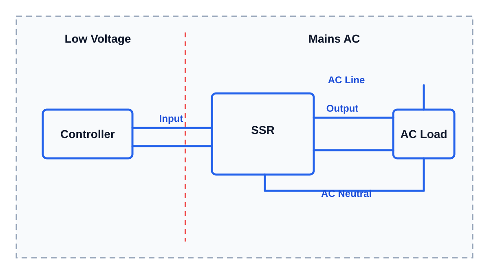

# Твердотельное реле

Твердотельное реле (SSR, solid state relay) - это реле без механических контактов.

Обычное реле щёлкает, потому что внутри физически замыкаются контакты. Твердотельное реле не щёлкает: внутри работают электронные компоненты.

Для пользователя смысл простой:

- на вход SSR подаётся слабый управляющий сигнал от контроллера;
- на выходе SSR включает или выключает мощную нагрузку;
- контроллер не питает нагрузку напрямую.

В iDryer-подобных устройствах SSR чаще всего интересно для управления нагревателем от сетевого напряжения 110-230V AC.

## Почему не обычное реле

Обычное электромагнитное реле - это понятная и полезная штука. Внутри у него есть катушка и механические контакты.

Когда на катушку подают питание, она создаёт магнитное поле и физически замыкает контакты. Через эти контакты уже идёт ток нагрузки.

Но для микроконтроллера это не так просто, как кажется:

- катушке реле нужно своё питание, часто 5V, 12V или 24V;
- GPIO-пин контроллера обычно не может питать катушку напрямую;
- для катушки часто нужен транзисторный драйвер;
- рядом с катушкой нужен защитный диод или другая защита от выброса напряжения;
- нужно соединить земли там, где это требуется схемой;
- при переключении контакты могут искрить и подгорать;
- у контактов есть механический износ;
- реле щёлкает;
- контакты могут дребезжать при переключении;
- частое включение/выключение сокращает срок службы.

Для редкого включения какой-то нагрузки обычное реле может быть нормальным решением. Например, включить питание устройства один раз и долго держать его включённым.

Но для нагревателя ситуация другая. Контроллер может включать и выключать нагреватель много раз, поддерживая температуру. В такой задаче механические контакты начинают быть слабым местом: они изнашиваются, могут искрить и не любят частое переключение.

Твердотельное реле в этом смысле удобнее:

- нет механических контактов;
- нет щелчков;
- нет дребезга контактов;
- проще управлять низковольтным сигналом;
- обычно уже есть гальваническая развязка;
- проще часто включать и выключать резистивную нагрузку, например нагреватель.

Но это не бесплатная магия. SSR - это компромисс в сторону удобства, ресурса и простоты подключения для определённых задач.

У SSR тоже есть минусы:

- оно греется;
- ему часто нужен радиатор;
- оно может пропускать небольшой ток даже в выключенном состоянии;
- оно обычно дороже простого механического реле;
- при неправильном выборе или перегрузке может выйти из строя опасным образом;
- оно не подходит для любой нагрузки просто потому, что называется "реле".

Поэтому вопрос не "что лучше всегда", а "что лучше для конкретной нагрузки". Для частого управления нагревателем 110-230V AC твердотельное реле часто оказывается удобным и практичным выбором. Для редкого включения питания обычное реле тоже может быть уместным.

## Твердотельное реле - это готовая симисторная схема в корпусе

Если говорить очень упрощённо, твердотельное реле для переменного тока (AC SSR) часто содержит внутри то, что в предыдущей статье собиралось отдельными элементами:

- входную цепь для управляющего сигнала;
- опторазвязку;
- симистор (TRIAC) или похожий силовой элемент;
- демпфирующую цепь (snubber);
- цепи согласования и защиты;
- силовые выводы для нагрузки.

То есть твердотельное реле - это готовый модуль. Его удобно использовать, когда не хочется самостоятельно разводить сетевую симисторную схему, подбирать оптосимистор, резисторы, демпфирующую цепь и силовую часть.

Это не значит, что SSR можно подключать бездумно. Оно всё равно работает с опасным напряжением и мощной нагрузкой.

## Зачем нужна гальваническая развязка

Когда микроконтроллер управляет нагрузкой 110-230V AC, низковольтная часть должна быть отделена от сетевой части.

Это называется гальваническая развязка.

В твердотельном реле эту задачу обычно выполняет оптопара или оптосимистор. Управляющий сигнал передаётся внутри через свет, а не через прямое электрическое соединение между контроллером и сетью.

Простыми словами: нормальная схема не должна давать сетевому напряжению путь на микроконтроллер, USB-порт, компьютер или руки пользователя.

Гальваническая развязка не отменяет изоляцию, корпус, предохранитель, заземление и аккуратную проводку. Она только отделяет управляющую сторону от опасной силовой стороны.

Сетевое напряжение 110-230V AC относится к области электроустановок до 1000 В. Для профессиональных работ с такими цепями обычно требуются соответствующие знания, допуск или группа по электробезопасности по местным правилам. Если таких знаний нет, силовую часть должен проверить или собрать квалифицированный человек.

## Где применяют твердотельные реле

Типичная задача здесь одна:

**коммутировать сетевую AC-нагрузку, чаще всего нагреватель, по низковольтному сигналу от контроллера.**

То есть контроллер работает со своей безопасной низковольтной стороной, а твердотельное реле включает или выключает силовую нагрузку 110-230V AC.

Для простого нагревателя твердотельное реле часто удобнее механического реле:

- нет щелчков;
- нет механического износа контактов;
- можно часто включать и выключать нагрузку;
- проще управлять от контроллера.

Но твердотельное реле не является универсальным решением для всего. Тип нагрузки всё равно важен.

## AC SSR и DC SSR - это разные устройства

Нужно сразу различать:

- SSR для переменного тока (AC SSR);
- SSR для постоянного тока (DC SSR).

Это разные устройства.

Твердотельное реле для 110-230V AC нельзя автоматически использовать для 24V DC нагрузки. И наоборот: DC SSR нельзя считать подходящим для сетевой AC-нагрузки.

Но даже этого недостаточно.

Нужно смотреть не только `AC` или `DC`, но и диапазон выходного напряжения. Можно купить твердотельное реле для переменного тока и всё равно не получить нужный результат, если оно рассчитано не на тот диапазон напряжения.

Например, в datasheet можно встретить разные варианты:

- `75-132 VAC` - для нагрузок примерно класса 100-120V AC;
- `75-264 VAC` - часто подходит для 100-240V AC сетевых нагрузок;
- `24-240 VAC` или `24-280 VAC` - другой распространённый диапазон для AC SSR;
- `48-600 VAC` - уже другой класс сетевых нагрузок.

Поэтому маркировка `AC SSR` сама по себе ничего не гарантирует. Нужно проверить именно строку `Output`, `Load voltage` или `Rated load voltage`.

Перед подключением нужно смотреть маркировку на корпусе и документацию:

- вход (input);
- выход (output);
- управляющее напряжение;
- тип выходного напряжения: AC или DC;
- диапазон выходного напряжения;
- допустимый ток;
- требования к радиатору.

Например, на корпусе может быть написано:

```text
Input: 3-32V DC
Output: 24-380V AC
```

Это значит, что управлять твердотельным реле можно низковольтным DC-сигналом, а коммутировать оно должно AC-нагрузку в указанном диапазоне.

Если твоя нагрузка питается от 230V AC, выходной диапазон SSR должен включать это напряжение. Если нагрузка питается от 110-120V AC, выходной диапазон тоже должен включать это напряжение.

## Как подключают твердотельное реле

Обычно твердотельное реле включают в разрыв силовой линии нагрузки.

Контроллер подключается к входу SSR. Нагрузка и сетевое питание подключаются к выходной силовой части SSR.



> **Иллюстрация для доработки**
>
> Что нарисовать: слева контроллер, по центру SSR, справа AC-нагрузка. Показать отдельный вход SSR от контроллера и отдельную силовую цепь `AC Line` -> `SSR` -> `AC Load` -> `AC Neutral`.
>
> Минимальные подписи внутри картинки: `Controller`, `SSR`, `AC Load`, `Input`, `Output`, `AC Line`, `AC Neutral`.
>
> Не переносить в картинку длинные объяснения. Главное - показать, что вход SSR и силовая сторона SSR не одно и то же.

## Твердотельное реле греется

Твердотельное реле не является идеальным выключателем. Когда через него идёт ток нагрузки, внутри выделяется тепло.

Если SSR управляет нагревателем, оно может греться сильно. Поэтому часто нужен радиатор.

Важно:

- маркировка `25A` не значит, что реле можно бездумно нагрузить на 25A в закрытом корпусе;
- ток из маркировки часто предполагает радиатор и нормальные условия охлаждения;
- внутри корпуса устройства температура выше, чем на открытом столе;
- плохой контакт в клемме тоже добавляет нагрев.

Для этого раздела используем то же правило:

**запас по току и мощности должен быть минимум 50%, если документация не требует больше.**

Если твердотельное реле будет работать долго, рядом с нагревателем или в закрытом корпусе, лучше закладывать ещё больший запас и нормальный радиатор.

В datasheet можно встретить температурные параметры:

- `Ta` - температура окружающей среды (ambient temperature);
- `Tc` - температура корпуса компонента (case temperature);
- `Tj` - температура кристалла внутри (junction temperature);
- `Rth` - тепловое сопротивление (thermal resistance).

Новичку не нужно сразу всё это рассчитывать. Но важно понимать: цифра тока на корпусе SSR не существует отдельно от охлаждения.

## Качество твердотельных реле и модулей

Готовые твердотельные реле и SSR-модули бывают разного качества.

Для учебных и простых задач часто используют готовые недорогие модули. Они могут работать нормально, если:

- не нагружать их на предел;
- ставить радиатор;
- не ставить в перегретый закрытый корпус;
- использовать нормальные клеммы;
- не забывать предохранитель;
- понимать тип нагрузки.

Если речь идёт о серьёзной мощности, длительной работе или устройстве, которое будет оставаться без присмотра, лучше использовать качественное SSR от понятного производителя и читать документацию.

## Типовые ошибки

Частые ошибки:

- перепутали вход и выход SSR;
- купили DC SSR вместо AC SSR или наоборот;
- купили AC SSR, но не проверили диапазон выходного напряжения;
- подключили SSR без радиатора;
- поставили SSR в закрытый корпус без вентиляции;
- выбрали SSR ровно по току нагрузки без запаса;
- решили, что SSR всегда лучше обычного реле;
- не учли, что у обычного реле катушке нужен драйвер и защита;
- забыли предохранитель или автомат защиты;
- решили, что твердотельное реле делает сетевое напряжение безопасным.

## Главное, что нужно запомнить

- Твердотельное реле (SSR) - это готовый электронный модуль для коммутации нагрузки.
- Твердотельное реле для AC-нагрузок часто содержит опторазвязку, симистор, демпфирующую цепь и согласование входа/выхода.
- Твердотельное реле удобно для управления нагревателем 110-230V AC от контроллера.
- SSR не всегда лучше обычного реле. Это удобный компромисс для частого тихого переключения и нагрузки вроде нагревателя.
- Обычное реле требует питания катушки, драйвера, защиты катушки и имеет механический износ контактов.
- AC SSR и DC SSR - разные устройства.
- У SSR нужно проверять не только AC/DC, но и диапазон выходного напряжения.
- Твердотельное реле греется и часто требует радиатор.
- По току и мощности нужен запас минимум 50%, если документация не требует больше.
- SSR не отменяет правила безопасности для сетевого напряжения.
- При управлении 110-230V AC от контроллера нужна гальваническая развязка между входом и силовой частью.
- Для работы с силовой частью 110-230V AC нужны знания электробезопасности; при сомнениях нужна проверка квалифицированным человеком.

---

## Заметки для разработки

Короткая заметка для будущей доработки статьи:

- SSR - это твердотельное реле, то есть реле без механических контактов.
- Добавить объяснение, почему не всегда обычное электромагнитное реле:
  - катушке нужно питание;
  - GPIO не должен питать катушку напрямую;
  - нужен транзисторный драйвер и защита от выброса напряжения на катушке;
  - контакты щёлкают, дребезжат, искрят, подгорают и изнашиваются;
  - для частого управления нагревателем SSR обычно удобнее.
- Не подавать SSR как универсально лучшее решение. У SSR есть минусы: нагрев, радиатор, ток утечки, цена, риск неправильного выбора под тип нагрузки.
- Внутри AC SSR часто стоит оптопара, симистор (TRIAC), демпфирующая цепь (snubber) и цепи согласования.
- Обязательно объяснить гальваническую развязку: оптопара или оптосимистор не даёт сетевой стороне иметь прямое электрическое соединение с микроконтроллером.
- Указывать, что 110-230V AC относится к цепям/электроустановкам до 1000 В; для профессиональных работ могут требоваться соответствующие знания, допуск или группа по электробезопасности по местным правилам.
- Для пользователя объяснить просто: на вход подаём слабый управляющий сигнал от контроллера, а SSR включает мощную нагрузку.
- Типичный пример: контроллер управляет нагревателем 110-230V AC через SSR.
- Обязательно разделить AC SSR и DC SSR. SSR для 110-230V AC нельзя автоматически считать подходящим для 24V DC.
- Обязательно объяснить, что AC SSR тоже бывают под разные диапазоны выходного напряжения: например `75-132 VAC`, `75-264 VAC`, `24-240 VAC`, `24-280 VAC`, `48-600 VAC`.
- Объяснить маркировку входа и выхода:
  - input: например 3-32V DC для управления;
  - output: например 24-380V AC для нагрузки.
- Обязательно предупредить: SSR греется, ему может быть нужен радиатор.
- Обязательно объяснить запас по току. SSR на 25A не значит, что его можно бездумно нагрузить на 25A в закрытом корпусе.
- Обязательно добавить типовые ошибки:
  - перепутали вход и выход;
  - купили DC SSR вместо AC SSR или наоборот;
  - подключили без радиатора;
  - поставили SSR в корпус без вентиляции;
  - забыли предохранитель или автомат защиты.

Что должен содержать файл после финальной доработки:

- что такое SSR простыми словами;
- чем SSR отличается от механического реле;
- почему обычное электромагнитное реле не всегда удобно для частого управления нагревателем;
- почему внутри часто используется симистор;
- когда SSR нужен в iDryer-подобном устройстве;
- как выбирать SSR по напряжению и току;
- почему нужно проверять диапазон выходного напряжения, а не только надпись AC/DC;
- почему SSR может греться;
- минимальные правила безопасности при работе с 110-230V AC.

Нужные изображения:

- `../../../img/01-electronics-basics/04-ssr-ac-load-placeholder.svg` - схема подключения SSR к AC-нагрузке.
  - Что нарисовать: контроллер, SSR, AC-нагрузка, вход SSR, выход SSR, линия и нейтраль.
  - Минимальные подписи внутри картинки: `Controller`, `SSR`, `AC Load`, `Input`, `Output`, `AC Line`, `AC Neutral`.
  - Длинный русский текст не переносить в изображение. Он должен оставаться рядом с картинкой в статье.
