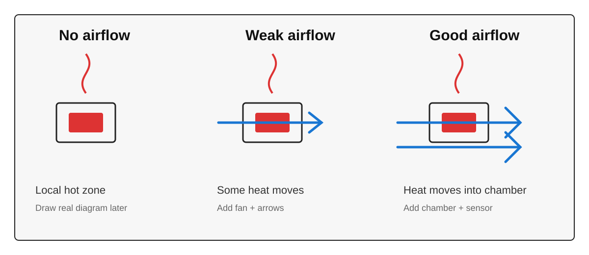

# Конвекция и воздушный поток

Конвекция - это перенос тепла потоком воздуха или другой жидкости.

В сушилке, камере принтера или iHeater-подобном устройстве нагреватель сам по себе только выделяет тепло. Чтобы это тепло попало в нужное место, его нужно передать воздуху, корпусу или детали.

Если рядом с нагревателем есть вентилятор, воздух забирает часть тепла и переносит его дальше.

## Нагреватель без обдува

Допустим, есть нагреватель на 100W.

Если он работает без обдува, вокруг него образуется горячая зона.

Что может происходить:

- сам нагреватель становится очень горячим;
- воздух рядом с ним нагревается, но плохо перемешивается;
- тепло медленно расходится по камере;
- рядом расположенные материалы могут перегреваться;
- датчик температуры может видеть не то, что происходит в другой части камеры.

Такой режим может быть опасен, если нагреватель находится рядом с пластиком, утеплителем, проводами или корпусом.

## Нагреватель со слабым обдувом

Если добавить слабый поток воздуха, часть тепла начинает уходить от нагревателя быстрее.

Становится лучше:

- воздух перемешивается;
- камера прогревается равномернее;
- локальный перегрев уменьшается;
- датчик температуры получает более честную картину.

Но слабого потока может быть недостаточно, если:

- нагреватель мощный;
- воздуховод узкий;
- есть фильтр или решётка;
- вентилятор не создаёт нужное статическое давление;
- поток проходит мимо нагревателя, а не через него.

## Нагреватель с хорошим обдувом

При хорошем обдуве поток воздуха эффективно снимает тепло с нагревателя и переносит его в камеру.

Это важно для нагревателей камеры принтера: тепловая мощность должна попадать в камеру, а не оставаться в маленькой горячей зоне рядом с нагревателем.

Хороший обдув обычно даёт:

- более равномерную температуру;
- меньший локальный перегрев;
- лучшую передачу тепла в камеру;
- более предсказуемую работу PID-регулятора;
- меньший риск перегрева креплений и соседних деталей.

## Почему один и тот же 100W работает по-разному

100W - это электрическая мощность, которую нагреватель превращает в тепло.

Но полезный результат зависит от конструкции.

Один и тот же нагреватель на 100W может вести себя по-разному:

- без обдува - перегреваться локально и плохо греть камеру;
- со слабым обдувом - греть камеру лучше, но с горячими зонами;
- с хорошим обдувом - отдавать тепло воздуху заметно эффективнее.

Это не значит, что обдув создаёт дополнительную мощность. Он помогает забрать уже выделенное тепло и доставить его туда, где оно нужно.

## Вентилятор - не только размер

Для конвекции важен не просто вентилятор "на 40 мм" или "на 60 мм".

Важны:

- воздушный поток;
- статическое давление;
- направление потока;
- расстояние до нагревателя;
- форма воздуховода;
- сопротивление решёток и фильтров;
- шум;
- балансировка;
- температура, при которой работает вентилятор.

Плохая балансировка крыльчатки может давать вибрацию и шум. Плохой воздуховод может убить почти весь полезный поток. Слишком горячее место установки может сократить срок службы вентилятора.

## Что проверять в конструкции

Перед сборкой полезно ответить на вопросы:

- откуда вентилятор забирает воздух;
- куда он его отправляет;
- проходит ли поток через нагреватель;
- нет ли тупиковых зон без циркуляции;
- где стоит датчик температуры;
- не перегреваются ли провода и пластик;
- выдерживает ли вентилятор температуру воздуха;
- можно ли безопасно обслуживать нагреватель и вентилятор.

---

## Заметки для разработки

- Позже добавить простую схему с тремя режимами: без обдува, слабый обдув, хороший обдув.
- Добавить пример для iHeater: нагреватель, вентилятор, камера, датчик температуры.
- Связать с разделом про вентиляторы и PID.
